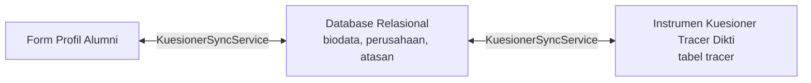

# 📋 Pemetaan Lengkap Daftar Pertanyaan & Arsitektur Form Tracer Study UKDW

Dokumen ini berisi peta komprehensif seluruh instrumen pertanyaan Tracer Study (Standar Dikti Kemendikbudristek & Kuesioner Khusus Program Studi), mencakup kode pertanyaan, tipe input, komponen Vue pengelola, tabel database, serta alur sinkronisasi otomatis dua arah antara **Profil Alumni** dan **Kuesioner Tracer Study**.

---

## 📑 Daftar Isi
1. [Struktur Alur Form & Komponen Vue](#1-struktur-alur-form--komponen-vue)
2. [Peta Pertanyaan Inti Standar Dikti (F1 s/d F18, F24)](#2-peta-pertanyaan-inti-standar-dikti-f1-sd-f18-f24)
3. [Peta Data Identitas & Biodata Alumni](#3-peta-data-identitas--biodata-alumni)
4. [Peta Kuesioner Khusus Program Studi](#4-peta-kuesioner-khusus-program-studi)
5. [Mekanisme Sinkronisasi Otomatis 2 Arah (KuesionerSyncService)](#5-mekanisme-sinkronisasi-otomatis-2-arah-kuesionersyncservice)
6. [Fitur Ekspor Kode Pertanyaan & Jawaban (Superadmin)](#6-fitur-ekspor-kode-pertanyaan--jawaban-superadmin)

---

## 1. Struktur Alur Form & Komponen Vue

Sistem Tracer Study UKDW membagi pengisian data alumni menjadi 3 pintu utama:

| Pintu Formulir | URL Halaman | Komponen Vue Utama | Sub-Komponen Terkait |
| :--- | :--- | :--- | :--- |
| **Profil Alumni** | `/alumni/profile` | `resources/js/Pages/Alumni/Profil/Index.vue` | `FormPribadi.vue` `FormKarier.vue` `FormAkademik.vue` `FormOrangTua.vue` |
| **Kuesioner Universitas (Dikti)** | `/alumni/kuesioner` | `resources/js/Pages/Alumni/Kuesioner.vue` | `Stepper.vue` `Banner.vue` `TabelF2.vue` `TabelF17.vue` `KartuPertanyaan.vue` `Navigasi.vue` |
| **Kuesioner Khusus Prodi** | `/alumni/kuesioner-prodi` | `resources/js/Pages/Alumni/KuesionerProdi.vue` | Dynamic Form Sections per Prodi |
| **Navigasi Utama Terpadu** | *(Global)* | `resources/js/Pages/Alumni/Components/Navbar.vue` | Terintegrasi seragam di semua halaman alumni |

---

## 2. Peta Pertanyaan Inti Standar Dikti (F1 s/d F18, F24)

Berikut adalah rincian setiap butir pertanyaan standar Dikti, peletakan komponen Vue, tipe input, dan tabel basis data tujuan:

| Kode | Pertanyaan / Topik | Tipe Input | Komponen Vue | Tabel & Kolom Database | Keterangan & Aturan Khusus |
| :---: | :--- | :--- | :--- | :--- | :--- |
| **F8** | Status situasi saat ini (Bekerja, Wiraswasta, Melanjutkan Studi, Mencari Kerja, Belum Memungkinkan Bekerja) | `radio` | `FormKarier.vue` `KartuPertanyaan.vue` | `biodata.kategori_pekerjaan` `tracer.answer` (F8) | Menjadi penentu logika percabangan (Jump Logic) database: Melanjutkan studi $\rightarrow$ `F18`, Belum bekerja $\rightarrow$ `F10`, Bekerja $\rightarrow$ `F3`. |
| **F10** | Apakah aktif mencari pekerjaan dalam 4 minggu terakhir | `radio` | `KartuPertanyaan.vue` | `tracer.answer` (F10) | Pilihan Ya/Tidak. Jika Tidak $\rightarrow$ lompat ke `F3`. |
| **F18** | Pertanyaan Studi Lanjut (Header) | `header` | `KartuPertanyaan.vue` | - | Header instruksi bagi alumni yang melanjutkan pendidikan. |
| **F18a** | Sumber biaya studi lanjut | `radio` | `KartuPertanyaan.vue` | `tracer.answer` (F18a) | 5 Opsi: Biaya Sendiri / Keluarga, Beasiswa Pemerintah, Beasiswa Swasta, Beasiswa Luar Negeri, Lainnya. |
| **F18b** | Perguruan Tinggi studi lanjut | `text` | `FormKarier.vue` `KartuPertanyaan.vue` | `biodata.perguruan_tinggi` `tracer.answer` (F18b) | Sinkron otomatis 2 arah dengan data Profil Alumni (`UGM`, `ITB`, dll.). |
| **F18c** | Program Studi studi lanjut | `text` | `FormKarier.vue` `KartuPertanyaan.vue` | `biodata.pendidikan_prodi` `tracer.answer` (F18c) | Sinkron otomatis 2 arah dengan data Profil Alumni (`Magister Manajemen`, dll.). |
| **F18d** | Tanggal Masuk studi lanjut | `date` | `KartuPertanyaan.vue` | `tracer.answer` (F18d) | Format tanggal standar HTML5 date picker (`YYYY-MM-DD`). |
| **F3** | Kapan mulai mencari pekerjaan (sebelum/setelah lulus) | `radio_input` | `KartuPertanyaan.vue` | `tracer.answer` `tracer.answer_json` | Opsi input bulan sebelum/sesudah lulus. Opsi 3 (Tidak mencari kerja) $\rightarrow$ lompat ke `F504`. |
| **F4** | Bagaimana cara mencari pekerjaan | `multiple_choice` / `checkbox` | `KartuPertanyaan.vue` | `tracer.answer_json` (F4) | Multi-pilihan strategi mencari kerja (iklan, bursa kerja, relasi, dll.). |
| **F504** | Apakah telah mendapatkan pekerjaan ≤ 6 bulan | `radio` | `KartuPertanyaan.vue` | `tracer.answer` (F504) | Opsi "Ya" $\rightarrow$ `jump_to: 'F502'`, Opsi "Tidak" $\rightarrow$ `jump_to: 'F506'`. |
| **F502** | Dalam berapa bulan mendapatkan pekerjaan | `number` | `KartuPertanyaan.vue` | `tracer.answer` (F502) | Satuan unit: Bulan. Dilengkapi stepper angka `+` / `-`. |
| **F505** | Rata-rata pendapatan per bulan (Take Home Pay) | `multiple_number` | `FormKarier.vue` `KartuPertanyaan.vue` | `biodata.gaji` `tracer.answer_json` (F5051..F5053) | Rincian: Pekerjaan Utama, Lembur/Tips, Pekerjaan Lainnya. Format ribuan otomatis. |
| **F505A**| Kesesuaian Gaji dengan UMR | `radio` | `KartuPertanyaan.vue` | `tracer.answer` (F505A) | Pilihan: Sesuai / Tidak Sesuai. `jump_to: 'F6'`. |
| **F506** | Dalam berapa bulan mendapatkan pekerjaan (pencarian > 6 bulan) | `number` | `KartuPertanyaan.vue` | `tracer.answer` (F506) | Satuan unit: Bulan. Dilengkapi stepper angka `+` / `-`. |
| **F6** | Berapa perusahaan/instansi yang sudah dilamar | `number` | `KartuPertanyaan.vue` | `tracer.answer` (F6) | Satuan unit: Perusahaan / Instansi. Grid 2 kolom berpasangan dengan F7. |
| **F7** | Berapa perusahaan/instansi yang merespons lamaran | `number` | `KartuPertanyaan.vue` | `tracer.answer` (F7) | Satuan unit: Perusahaan / Instansi. Grid 2 kolom berpasangan dengan F6. |
| **F7A** | Berapa perusahaan/instansi yang mengundang wawancara | `number` | `KartuPertanyaan.vue` | `tracer.answer` (F7A) | Satuan unit: Undangan Wawancara. |
| **F12** | Sumber dana dalam pembiayaan kuliah | `radio_input` | `KartuPertanyaan.vue` | `tracer.answer` `tracer.answer_json` | Biaya Sendiri/Keluarga, Beasiswa Dikti, Beasiswa UKDW, dll. |
| **F14** | Seberapa erat hubungan bidang studi dengan pekerjaan | `radio` | `KartuPertanyaan.vue` | `tracer.answer` (F14) | Skala: Sangat Erat, Erat, Cukup Erat, Kurang Erat, Tidak Sama Sekali. |
| **F15** | Tingkat pendidikan apa yang paling tepat untuk pekerjaan Anda | `radio` | `KartuPertanyaan.vue` | `tracer.answer` (F15) | Setingkat Lebih Tinggi, Tingkat yang Sama, Setingkat Lebih Rendah, Tidak Perlu PT. |
| **F16** | Alasan mengambil pekerjaan yang tidak sesuai bidang studi | `multiple_choice` | `KartuPertanyaan.vue` | `tracer.answer_json` (F16) | Pilihan majemuk alasan (prospek karier, minat, lokasi, gaji, dll.). |
| **F17** | Evaluasi Kompetensi: Saat Lulus (A) vs Diperlukan di Dunia Kerja (B) | `matrix_dual` (Tabel Komparasi) | `TabelF17.vue` | `tracer.answer` (F17a1..a7 & F17b1..b7) | 7 Aspek Kompetensi (Etika, Keahlian Bidang Ilmu, Bhs Inggris, IT, Komunikasi, Kerja Tim, Pengembangan Diri) dengan skala langsung 1 s/d 5. |
| **F2** | Penekanan metode pembelajaran selama kuliah (F21 s/d F27) | `matrix` / `table` | `TabelF2.vue` | `tracer.answer` (F21 s/d F27) | 7 Metode (Perkuliahan, Demonstrasi, Riset, Magang, Praktikum, Lapangan, Diskusi) skala 1 s/d 5. |

---

## 3. Peta Data Identitas & Biodata Alumni

Selain pertanyaan kuesioner Dikti, alumni mengisi data identitas terpadu di halaman `/alumni/profile`:

| Tab Profil | Field Data | Tipe Input | Komponen Vue | Tabel Database |
| :--- | :--- | :--- | :--- | :--- |
| **Identitas & Alamat** | Nama, NIM, NIK, NPWP (15/16 Digit UU HPP & PMK 112/2022), No HP, Email | `text`, `email`, `tel` | `FormPribadi.vue` | `biodata`, `users` |
| **Identitas & Alamat** | Alamat Domisili KTP, Provinsi, Kabupaten/Kota, Negara, Kode Pos | `select` Searchable, `text` | `FormPribadi.vue` | `biodata.provinsi_id`, `biodata.kabupaten_id`, `biodata.negara_id` |
| **Karier & Jejaring** | Kategori Peran (Pekerja, Wiraswasta, Melanjutkan Pendidikan) - *Single Choice & Auto-Reset* | `role_cards` | `FormKarier.vue` | `biodata.kategori_pekerjaan` |
| **Karier & Jejaring** | Posisi Jabatan Struktural (`F2G`) / Wiraswasta (`F5C`) | `select`, `text` | `FormKarier.vue` | `biodata.posisi_jabatan`, `biodata.posisi_wiraswasta` |
| **Karier & Jejaring** | Lokasi Perusahaan (DN/LN), Provinsi/Kabupaten atau Master Negara Dunia | `select` Searchable Modal | `FormKarier.vue` | `perusahaan.jenis_lokasi`, `perusahaan.propinsi_id`, `perusahaan.kabupaten_id`, `perusahaan.negara` |
| **Karier & Jejaring** | Take Home Pay (Gaji), Data Atasan Langsung (`F24A`, `F24B`) | `number`, `text`, `email`, `tel` | `FormKarier.vue` | `biodata.gaji`, `atasan` |
| **Akademik & Yudisium**| Program Studi, IPK, Tahun Masuk, Tahun Lulus, Tanggal Yudisium, Judul Skripsi | `text`, `readonly` | `FormAkademik.vue` | `data_akademik`, `prodi`, `yudisium` |
| **Data Orang Tua** | Nama Orang Tua, Pekerjaan, Alamat, No Telepon, Provinsi, Kabupaten | `text`, `tel`, `select` | `FormOrangTua.vue` | `data_orang_tua` |

---

## 4. Peta Kuesioner Khusus Program Studi

Kuesioner program studi dirancang modular dan independen untuk menunjang akreditasi masing-masing jurusan:

- **Halaman Form**: `resources/js/Pages/Alumni/KuesionerProdi.vue`
- **Controller**: `app/Http/Controllers/Alumni/KuesionerProdi/KuesionerProdiController.php`
- **Tabel Basis Data**:
  - `prodi_questionnaire_sections`: Pengelompokan bagian soal per prodi.
  - `prodi_questionnaire_questions`: Daftar pertanyaan per prodi (kode misal: `PSI-1-01`, `PSI-1-02`, dll.).
  - `prodi_questionnaire_options`: Opsi pilihan ganda untuk pertanyaan bertipe radio/select/checkbox.
  - `prodi_questionnaire_responses`: Menyimpan rekaman jawaban alumni per butir pertanyaan prodi.

---

## 5. Mekanisme Sinkronisasi Otomatis 2 Arah (KuesionerSyncService)

Sistem Tracer Study UKDW dilengkapi dengan **`KuesionerSyncService.php`** yang memastikan alumni tidak perlu mengetik ulang data yang sudah pernah diisi di profil maupun kuesioner.

### Aturan Sinkronisasi:
1. **Pembaruan Idempoten (Upsert)**:
   Saat alumni mengisi kuesioner (`/alumni/kuesioner`), jawaban disinkronkan dengan `updateOrCreate` berbasis kombinasi `nim` dan `kode_pertanyaan`. Hal ini mencegah terjadinya redudansi dan duplikasi baris data di tabel `tracer`.
2. **Pencegahan Error Atasan Unik**:
   Jika data Atasan Langsung (`nama`, `email`, `telepon`) diperbarui, backend mengecek apakah atasan dengan email tersebut sudah ada di tabel `atasan`. Jika sudah ada, sistem menghubungkan ID atasan ke `biodata.atasan_id` tanpa menabrak constraint unik.
3. **Penyelarasan Posisi Wiraswasta (F5C)**:
   Dropdown `F5C` di form karier langsung dipetakan ke kode instrumen `F5C` di tabel kuesioner.

---

## 6. Fitur Ekspor Kode Pertanyaan & Jawaban (Superadmin)

Bagi Superadmin dan Admin Program Studi, tersedia modul rekapitulasi data:
- **Format Ekspor**: Microsoft Excel (`.xlsx`) & CSV.
- **Isi Ekspor**:
  - Kolom Identitas: NIM, Nama, Program Studi, Tahun Lulus, No HP, Email.
  - Kolom Kode Pertanyaan Resmi Dikti: `F1`, `F21` s/d `F27`, `F2H`, `F301` s/d `F313`, `F4`, `F4A`, `F4B`, `F501` s/d `F505`, `F5C`, `F6`, `F7`, `F8`, `F9`, `F10`, `F1101` s/d `F1105`, `F12`, `F1301` s/d `F1303`, `F1701A`..`F1728A`, `F1701B`..`F1728B`, `F18`, `F24A`, `F24B`.
  - Kolom Hasil Jawaban Alumni Terformat.
- **Controller Backend**: `App\Http\Controllers\Admin\Export\TracerExportController.php`.
