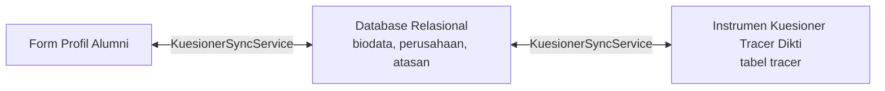

# 📋 Pemetaan Lengkap Daftar Pertanyaan & Arsitektur Form Tracer Study UKDW

Dokumen ini berisi peta komprehensif seluruh instrumen pertanyaan Tracer Study (Standar Dikti Kemendikbudristek & Kuesioner Khusus Program Studi), mencakup kode pertanyaan, tipe input, komponen Vue pengelola, tabel database, serta alur sinkronisasi otomatis dua arah antara **Profil Alumni** dan **Kuesioner Tracer Study**.

---

## 📑 Daftar Isi
1. [Struktur Alur Form & Komponen Vue](#1-struktur-alur-form--komponen-vue)
2. [Peta Pertanyaan Inti Standar Dikti (F1 s/d F18, F24)](#2-peta-pertanyaan-inti-standar-dikti-f1-sd-f18-f24)
3. [Peta Data Identitas & Biodata Alumni](#3-peta-data-identitas--biodata-alumni)
4. [Peta Kuesioner Khusus Program Studi](#4-peta-kuesioner-khusus-program-studi)
5. [Mekanisme Sinkronisasi Otomatis 2 Arah (KuesionerSyncService)](#5-mekanisme-sinkronisasi-otomatis-2-arah-kuesionersyncservice)
6. [Fitur Ekspor Kode Pertanyaan & Jawaban (Superadmin)](#6-fitur-ekspor-kode-pertanyaan--jawaban-superadmin)

---

## 1. Struktur Alur Form & Komponen Vue

Sistem Tracer Study UKDW membagi pengisian data alumni menjadi 3 pintu utama:

| Pintu Formulir | URL Halaman | Komponen Vue Utama | Sub-Komponen Terkait |
| :--- | :--- | :--- | :--- |
| **Profil Alumni** | `/alumni/profile` | `resources/js/Pages/Alumni/Profil/Index.vue` | `FormPribadi.vue` `FormKarier.vue` `FormAkademik.vue` `FormOrangTua.vue` |
| **Kuesioner Universitas (Dikti)** | `/alumni/kuesioner` | `resources/js/Pages/Alumni/Kuesioner.vue` | `Stepper.vue` `Banner.vue` `TabelF2.vue` `TabelF17.vue` `KartuPertanyaan.vue` `Navigasi.vue` |
| **Kuesioner Khusus Prodi** | `/alumni/kuesioner-prodi` | `resources/js/Pages/Alumni/KuesionerProdi.vue` | Dynamic Form Sections per Prodi |
| **Navigasi Utama Terpadu** | *(Global)* | `resources/js/Pages/Alumni/Components/Navbar.vue` | Terintegrasi seragam di semua halaman alumni |

---

## 2. Peta Pertanyaan Inti Standar Dikti (F1 s/d F18, F24)

Berikut adalah rincian setiap butir pertanyaan standar Dikti, peletakan komponen Vue, tipe input, dan tabel basis data tujuan:

| Kode | Pertanyaan / Topik | Tipe Input | Komponen Vue | Tabel & Kolom Database | Keterangan & Aturan Khusus |
| :---: | :--- | :--- | :--- | :--- | :--- |
| **F1** | Masa tunggu mendapatkan pekerjaan pertama | `radio_input` / `number` | `KartuPertanyaan.vue` `FormKarier.vue` | `tracer.jawaban` `biodata.lama_menganggur` | Menyimpan bulan sebelum/sesudah lulus. |
| **F2** | Penekanan metode pembelajaran selama kuliah (Matriks A-H) | `matrix` / `table` | `TabelF2.vue` `KartuPertanyaan.vue` | `tracer.jawaban` (sub: F21 s/d F27) | Skala 1-5 (Sangat Besar s/d Tidak Sama Sekali). |
| **F2H** | Skala Perusahaan / Instansi Tempat Bekerja | `select` / `radio` | `FormKarier.vue` `KartuPertanyaan.vue` | `perusahaan.kategori` `tracer.jawaban` (F2H) | Pilihan: Lokal/Non-Profit, Nasional, Multinasional/Internasional. Auto-sync ke tabel `perusahaan`. |
| **F3** | Sumber pencarian pekerjaan (relasi, internet, job fair, dll.) | `checkbox` / `multiple_choice` | `KartuPertanyaan.vue` | `tracer.jawaban` (sub: F301 s/d F313) | Multi-pilihan strategi mencari kerja. |
| **F4** | Jumlah perusahaan/instansi yang dilamar | `number` / `text` | `KartuPertanyaan.vue` `FormKarier.vue` | `tracer.jawaban` `biodata.jumlah_instansi_dilamar` | Total instansi yang dilamar alumni. |
| **F4A** | Jumlah respon panggilan wawancara kerja | `number` | `KartuPertanyaan.vue` `FormKarier.vue` | `tracer.jawaban` `biodata.jumlah_instansi_merespon` | Total instansi yang mengundang wawancara. |
| **F4B** | Jumlah tawaran kerja yang diterima | `number` | `KartuPertanyaan.vue` `FormKarier.vue` | `tracer.jawaban` `biodata.jumlah_instansi_mengundang` | Total offering letter yang didapat. |
| **F5** | Status situasi saat ini (Bekerja, Wiraswasta, Melanjutkan Studi, Mencari Kerja, Belum Memungkinkan Bekerja) | `select` / `radio` | `FormKarier.vue` `KartuPertanyaan.vue` | `biodata.status_pekerjaan` `tracer.jawaban` (F501 s/d F505) | Menjadi penentu logika percabangan (Jump Logic) form kuesioner. |
| **F5A** | Melanjutkan studi (Nama Universitas, Jurusan, dll.) | `text` / `select` | `FormKarier.vue` `KartuPertanyaan.vue` | `biodata.tempat_studi` `tracer.jawaban` | Khusus status melanjutkan pendidikan. |
| **F5B** | Alasan belum memungkinkan bekerja | `radio_text` | `KartuPertanyaan.vue` | `tracer.jawaban` | Pilihan: mengurus keluarga, kesehatan, dll. |
| **F5C** | Posisi / Jabatan Wiraswasta & Startup | `select` (Dropdown) + `input` Lainnya | `FormKarier.vue` `KartuPertanyaan.vue` | `biodata.posisi_wiraswasta` `tracer.jawaban` (F5C) | **Standard Dropdown**: Owner, Founder, Co-Founder, Direktur Utama, Pengelola Usaha, Freelancer, Lainnya. |
| **F5D** | Tingkat tempat kerja / wiraswasta | `select` / `radio` | `FormKarier.vue` `KartuPertanyaan.vue` | `biodata.tingkat_tempat_kerja` `tracer.jawaban` | Lokal / Nasional / Multinasional. |
| **F6** | Hubungan bidang studi dengan pekerjaan | `radio` (Skala 1-5) | `KartuPertanyaan.vue` `FormKarier.vue` | `biodata.hubungan_bidang_studi` `tracer.jawaban` | Sangat Erat s/d Tidak Sama Sekali. |
| **F7** | Kesesuaian tingkat pendidikan dengan pekerjaan | `radio` (Skala 1-4) | `KartuPertanyaan.vue` `FormKarier.vue` | `biodata.tingkat_pendidikan_pekerjaan` `tracer.jawaban` | Setingkat Lebih Tinggi, Sama, Lebih Rendah. |
| **F7A** | Kebutuhan kompetensi tambahan | `radio_text` | `KartuPertanyaan.vue` | `tracer.jawaban` | Isian kompetensi yang dirasa kurang. |
| **F8** | Kriteria utama dalam mencari pekerjaan | `checkbox` / `radio` | `KartuPertanyaan.vue` | `tracer.jawaban` | Gaji, lokasi, prospek karier, minat, dll. |
| **F9** | Cara mendapatkan pekerjaan saat ini | `radio_text` | `KartuPertanyaan.vue` | `tracer.jawaban` | Iklan, jejaring alumni, magang, dll. |
| **F10** | Berapa bulan sebelum/setelah lulus mulai mencari kerja | `radio_input` / `number` | `KartuPertanyaan.vue` `FormKarier.vue` | `tracer.jawaban` `biodata.waktu_mulai_mencari_pekerjaan` | Satuan bulan. |
| **F11** | Jenis perusahaan / instansi tempat kerja | `select` (Dropdown) + `input` Lainnya | `FormKarier.vue` `KartuPertanyaan.vue` | `perusahaan.jenis_perusahaan` `tracer.jawaban` (F1101 s/d F1105) | BUMN, Swasta, Pemerintah, Organisasi Non-Profit, Wiraswasta, Lainnya. |
| **F12** | Lokasi Tempat Bekerja (Dalam Negeri / Luar Negeri) | `select` + searchable modal/dropdown | `FormKarier.vue` `KartuPertanyaan.vue` | `perusahaan.lokasi_kantor` `perusahaan.provinsi_id` `perusahaan.kabupaten_id` `perusahaan.negara_id` | Auto filter: Dalam Negeri (pilih Prov & Kab) vs Luar Negeri (pilih Negara non-Indonesia). |
| **F13** | Rata-rata Pendapatan / Take Home Pay per Bulan | `multiple_number` / `number` (Ribuan) | `FormKarier.vue` `KartuPertanyaan.vue` | `biodata.gaji_pertama` / `biodata.gaji_sekarang` `tracer.jawaban` (F1301 s/d F1303) | Format ribuan dinamis, memisahkan gaji pokok, lembur, dan pemasukan lain. |
| **F14** | Seberapa besar informasi dari kampus membantu | `radio` (Skala 1-5) | `KartuPertanyaan.vue` | `tracer.jawaban` | Evaluasi peran pusat karier kampus. |
| **F15** | Keterlibatan dalam kegiatan kemahasiswaan/organisasi | `checkbox` / `radio` | `KartuPertanyaan.vue` `FormAkademik.vue` | `tracer.jawaban` | BEM, UKM, HMP, Kegiatan Sosial. |
| **F16** | Sumber pembiayaan kuliah | `radio_text` | `KartuPertanyaan.vue` `FormAkademik.vue` | `tracer.jawaban` `biodata.biaya_kuliah` | Orang Tua, Beasiswa Pemerintah, Beasiswa UKDW, Bekerja Sendiri. |
| **F17** | Evaluasi Kompetensi: Saat Lulus (A) vs Diperlukan di Dunia Kerja (B) | `matrix_dual` (Tabel Perbandingan 1-5) | `TabelF17.vue` | `tracer.jawaban` (sub: F1701A..F1728A & F1701B..F1728B) | 28 Aspek Kompetensi (Etika, Bahasa Inggris, IT, Komunikasi, dll.). |
| **F18** | Saran dan masukan perbaikan untuk UKDW | `textarea` | `KartuPertanyaan.vue` | `biodata.saran` `tracer.jawaban` | Teks terbuka umpan balik kurikulum dan fasilitas. |
| **F24A** | Data Atasan Langsung (Nama & Jabatan Atasan) | `text` | `FormKarier.vue` `KartuPertanyaan.vue` | `atasan.nama` `atasan.jabatan` | Digunakan untuk survei pengguna lulusan (User Survey). |
| **F24B** | Kontak Atasan Langsung (Email & Nomor HP Atasan) | `text` / `email` / `tel` | `FormKarier.vue` `KartuPertanyaan.vue` | `atasan.email` `atasan.telepon` | Sistem mencegah error duplicate key jika atasan sama disupervisi banyak alumni. |

---

## 3. Peta Data Identitas & Biodata Alumni

Selain pertanyaan kuesioner Dikti, alumni mengisi data identitas terpadu di halaman `/alumni/profile`:

| Tab Profil | Field Data | Tipe Input | Komponen Vue | Tabel Database |
| :--- | :--- | :--- | :--- | :--- |
| **Identitas & Alamat** | Nama, NIM, NIK, NPWP, No HP, Email | `text`, `email`, `tel` | `FormPribadi.vue` | `biodata`, `users` |
| **Identitas & Alamat** | Alamat Domisili KTP, Provinsi, Kabupaten/Kota, Negara, Kode Pos | `select` Searchable, `text` | `FormPribadi.vue` | `biodata.provinsi_id`, `biodata.kabupaten_id`, `biodata.negara_id` |
| **Karier & Jejaring** | Status Pekerjaan, Jenis Pekerjaan, Jabatan, Nama Perusahaan | `select`, `text` | `FormKarier.vue` | `biodata`, `perusahaan`, `atasan` |
| **Karier & Jejaring** | Lokasi Perusahaan (DN/LN), Provinsi/Kabupaten atau Negara Luar | `select` Searchable Modal | `FormKarier.vue` | `perusahaan.lokasi_kantor`, `perusahaan.negara_id` |
| **Karier & Jejaring** | Take Home Pay (Gaji), Posisi Wiraswasta (`F5C`), Data Atasan Langsung (`F24A`, `F24B`) | `select`, `number`, `text` | `FormKarier.vue` | `biodata`, `atasan` |
| **Akademik & Yudisium**| Program Studi, IPK, Tahun Masuk, Tahun Lulus, Tanggal Yudisium, Judul Skripsi | `text`, `readonly` | `FormAkademik.vue` | `data_akademik`, `prodi` |
| **Data Orang Tua** | Nama Ayah/Ibu, Pekerjaan, Alamat, No Telepon | `text` | `FormOrangTua.vue` | `biodata.nama_ayah`, `biodata.alamat_orangtua` |

---

## 4. Peta Kuesioner Khusus Program Studi

Kuesioner program studi dirancang modular dan independen untuk menunjang akreditasi masing-masing jurusan:

- **Halaman Form**: `resources/js/Pages/Alumni/KuesionerProdi.vue`
- **Controller**: `app/Http/Controllers/Alumni/KuesionerProdi/KuesionerProdiController.php`
- **Tabel Basis Data**:
  - `prodi_questionnaire_sections`: Pengelompokan bagian soal per prodi.
  - `prodi_questionnaire_questions`: Daftar pertanyaan per prodi (kode misal: `PSI-1-01`, `PSI-1-02`, dll.).
  - `prodi_questionnaire_options`: Opsi pilihan ganda untuk pertanyaan bertipe radio/select/checkbox.
  - `prodi_questionnaire_responses`: Menyimpan rekaman jawaban alumni per butir pertanyaan prodi.

---

## 5. Mekanisme Sinkronisasi Otomatis 2 Arah (KuesionerSyncService)

Sistem Tracer Study UKDW dilengkapi dengan **`KuesionerSyncService.php`** yang memastikan alumni tidak perlu mengetik ulang data yang sudah pernah diisi di profil maupun kuesioner.

### Aturan Sinkronisasi:
1. **Pembaruan Idempoten (Upsert)**:
   Saat alumni mengisi kuesioner (`/alumni/kuesioner`), jawaban disinkronkan dengan `updateOrCreate` berbasis kombinasi `nim` dan `kode_pertanyaan`. Hal ini mencegah terjadinya redudansi dan duplikasi baris data di tabel `tracer`.
2. **Pencegahan Error Atasan Unik**:
   Jika data Atasan Langsung (`nama`, `email`, `telepon`) diperbarui, backend mengecek apakah atasan dengan email tersebut sudah ada di tabel `atasan`. Jika sudah ada, sistem menghubungkan ID atasan ke `biodata.atasan_id` tanpa menabrak constraint unik.
3. **Penyelarasan Posisi Wiraswasta (F5C)**:
   Dropdown `F5C` di form karier langsung dipetakan ke kode instrumen `F5C` di tabel kuesioner.

---

## 6. Fitur Ekspor Kode Pertanyaan & Jawaban (Superadmin)

Bagi Superadmin dan Admin Program Studi, tersedia modul rekapitulasi data:
- **Format Ekspor**: Microsoft Excel (`.xlsx`) & CSV.
- **Isi Ekspor**:
  - Kolom Identitas: NIM, Nama, Program Studi, Tahun Lulus, No HP, Email.
  - Kolom Kode Pertanyaan Resmi Dikti: `F1`, `F21` s/d `F27`, `F2H`, `F301` s/d `F313`, `F4`, `F4A`, `F4B`, `F501` s/d `F505`, `F5C`, `F6`, `F7`, `F8`, `F9`, `F10`, `F1101` s/d `F1105`, `F12`, `F1301` s/d `F1303`, `F1701A`..`F1728A`, `F1701B`..`F1728B`, `F18`, `F24A`, `F24B`.
  - Kolom Hasil Jawaban Alumni Terformat.
- **Controller Backend**: `App\Http\Controllers\Admin\Export\TracerExportController.php`.
