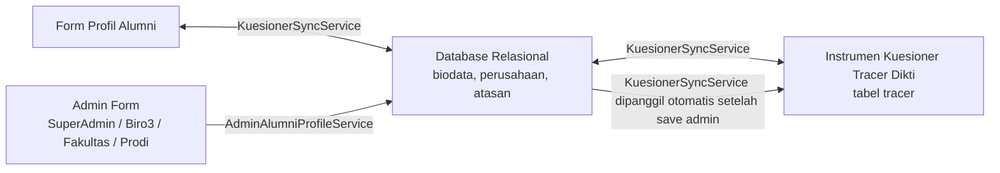

# 📋 Pemetaan Lengkap Daftar Pertanyaan & Arsitektur Form Tracer Study UKDW

Dokumen ini berisi peta komprehensif seluruh instrumen pertanyaan Tracer Study (Standar Dikti Kemendikbudristek & Kuesioner Khusus Program Studi), mencakup kode pertanyaan, tipe input, komponen Vue pengelola, tabel database, serta alur sinkronisasi otomatis dua arah antara **Profil Alumni** dan **Kuesioner Tracer Study**.

---

## 📑 Daftar Isi
1. [Struktur Alur Form & Komponen Vue](#1-struktur-alur-form--komponen-vue)
2. [Peta Pertanyaan Inti Standar Dikti (F1 s/d F18, F24)](#2-peta-pertanyaan-inti-standar-dikti-f1-sd-f18-f24)
3. [Peta Data Identitas & Biodata Alumni](#3-peta-data-identitas--biodata-alumni)
4. [Peta Kuesioner Khusus Program Studi](#4-peta-kuesioner-khusus-program-studi)
5. [Mekanisme Sinkronisasi Otomatis 2 Arah (KuesionerSyncService)](#5-mekanisme-sinkronisasi-otomatis-2-arah-kuesionersyncservice)
6. [AdminAlumniProfileService — Persistensi Terpusat oleh Admin](#6-adminalumniprofileservice--persistensi-terpusat-oleh-admin)
7. [Fitur Ekspor Kode Pertanyaan & Jawaban (Superadmin)](#7-fitur-ekspor-kode-pertanyaan--jawaban-superadmin)

---

## 1. Struktur Alur Form & Komponen Vue

Sistem Tracer Study UKDW membagi pengisian data alumni menjadi 3 pintu utama:

| Pintu Formulir | URL Halaman | Komponen Vue Utama | Sub-Komponen Terkait |
| :--- | :--- | :--- | :--- |
| **Profil Alumni** | `/alumni/profile` | `resources/js/Pages/Alumni/Profil/Index.vue` | `FormPribadi.vue`<br>`FormKarier.vue`<br>`FormAkademik.vue`<br>`FormOrangTua.vue` |
| **Kuesioner Universitas (Dikti)** | `/alumni/kuesioner` | `resources/js/Pages/Alumni/Kuesioner.vue` | `Stepper.vue`<br>`Banner.vue`<br>`TabelF2.vue`<br>`TabelF17.vue`<br>`KartuPertanyaan.vue`<br>`Navigasi.vue` |
| **Kuesioner Khusus Prodi** | `/alumni/kuesioner-prodi` | `resources/js/Pages/Alumni/KuesionerProdi.vue` | Dynamic Form Sections per Prodi |
| **Navigasi Utama Terpadu** | *(Global)* | `resources/js/Pages/Alumni/Components/Navbar.vue` | Terintegrasi seragam di semua halaman alumni |

> **Catatan untuk Admin**: Seluruh pembaruan profil melalui halaman admin (Super Admin, Biro 3, Admin Fakultas, Admin Prodi) dilayani oleh satu service terpusat: [`AdminAlumniProfileService`](app/Services/Alumni/AdminAlumniProfileService.php). Lihat [Bagian 6](#6-adminalumniprofileservice--persistensi-terpusat-oleh-admin) untuk detail.

---

## 2. Peta Pertanyaan Inti Standar Dikti (F1 s/d F18, F24)

Berikut adalah rincian setiap butir pertanyaan standar Dikti, peletakan komponen Vue, tipe input, dan tabel basis data tujuan:

| Kode | Pertanyaan / Topik | Tipe Input | Komponen Vue | Tabel & Kolom Database | Keterangan & Aturan Khusus |
| :---: | :--- | :--- | :--- | :--- | :--- |
| **F8** | Status situasi saat ini (Bekerja, Wiraswasta, Melanjutkan Studi, Mencari Kerja, Belum Memungkinkan Bekerja) | `radio` | `FormKarier.vue`<br>`KartuPertanyaan.vue` | `biodata.kategori_pekerjaan`<br>`tracer.answer` (F8) | Menjadi penentu logika percabangan (Jump Logic) database: Melanjutkan studi $\rightarrow$ `F18`, Belum bekerja $\rightarrow$ `F10`, Bekerja $\rightarrow$ `F3`. **Jika diubah via admin, `posisi_jabatan` / `posisi_wiraswasta` diset null secara otomatis oleh `AdminAlumniProfileService`.** |
| **F10** | Apakah aktif mencari pekerjaan dalam 4 minggu terakhir | `radio` | `KartuPertanyaan.vue` | `tracer.answer` (F10) | Pilihan Ya/Tidak. Jika Tidak $\rightarrow$ lompat ke `F3`. |
| **F18** | Pertanyaan Studi Lanjut (Header) | `header` | `KartuPertanyaan.vue` | - | Header instruksi bagi alumni yang melanjutkan pendidikan. |
| **F18a** | Sumber biaya studi lanjut | `radio` | `KartuPertanyaan.vue` | `tracer.answer` (F18a) | 5 Opsi: Biaya Sendiri / Keluarga, Beasiswa Pemerintah, Beasiswa Swasta, Beasiswa Luar Negeri, Lainnya. |
| **F18b** | Perguruan Tinggi studi lanjut | `text` | `FormKarier.vue`<br>`KartuPertanyaan.vue` | `biodata.perguruan_tinggi`<br>`tracer.answer` (F18b) | Sinkron otomatis 2 arah dengan data Profil Alumni (`UGM`, `ITB`, dll.). |
| **F18c** | Program Studi studi lanjut | `text` | `FormKarier.vue`<br>`KartuPertanyaan.vue` | `biodata.pendidikan_prodi`<br>`tracer.answer` (F18c) | Sinkron otomatis 2 arah dengan data Profil Alumni (`Magister Manajemen`, dll.). |
| **F18d** | Tanggal Masuk studi lanjut | `date` | `KartuPertanyaan.vue` | `tracer.answer` (F18d) | Format tanggal standar HTML5 date picker (`YYYY-MM-DD`). |
| **F3** | Kapan mulai mencari pekerjaan (sebelum/setelah lulus) | `radio_input` | `KartuPertanyaan.vue` | `tracer.answer`<br>`tracer.answer_json` | Opsi input bulan sebelum/sesudah lulus. Opsi 3 (Tidak mencari kerja) $\rightarrow$ lompat ke `F504`. |
| **F4** | Bagaimana cara mencari pekerjaan | `multiple_choice` / `checkbox` | `KartuPertanyaan.vue` | `tracer.answer_json` (F4) | Multi-pilihan strategi mencari kerja (iklan, bursa kerja, relasi, dll.). |
| **F504** | Apakah telah mendapatkan pekerjaan ≤ 6 bulan | `radio` | `KartuPertanyaan.vue` | `tracer.answer` (F504) | Opsi "Ya" $\rightarrow$ `jump_to: 'F502'`, Opsi "Tidak" $\rightarrow$ `jump_to: 'F506'`. |
| **F502** | Dalam berapa bulan mendapatkan pekerjaan | `number` | `KartuPertanyaan.vue` | `tracer.answer` (F502) | Satuan unit: Bulan. Dilengkapi stepper angka `+` / `-`. |
| **F505** | Rata-rata pendapatan per bulan (Take Home Pay) | `multiple_number` | `FormKarier.vue`<br>`KartuPertanyaan.vue` | `biodata.gaji`<br>`tracer.answer_json` (F5051..F5053) | Rincian: Pekerjaan Utama, Lembur/Tips, Pekerjaan Lainnya. Format ribuan otomatis. **Input gaji dari admin disanitasi oleh `AdminAlumniProfileService`: separator ribuan dibersihkan, hasil dibulatkan ke integer agar tidak berlipat ganda.** |
| **F505A**| Kesesuaian Gaji dengan UMR | `radio` | `KartuPertanyaan.vue` | `tracer.answer` (F505A) | Pilihan: Sesuai / Tidak Sesuai. `jump_to: 'F6'`. |
| **F506** | Dalam berapa bulan mendapatkan pekerjaan (pencarian > 6 bulan) | `number` | `KartuPertanyaan.vue` | `tracer.answer` (F506) | Satuan unit: Bulan. Dilengkapi stepper angka `+` / `-`. |
| **F5C** | Posisi/jabatan wiraswasta | `select`, `text` | `FormKarier.vue`<br>`KartuPertanyaan.vue` | `biodata.posisi_wiraswasta`<br>`tracer.answer` (F5C) | **Eksklusif**: Hanya diisi jika `biodata.kategori_pekerjaan = 'Wiraswasta'`. Jika alumni bukan wiraswasta, field ini di-`null`-kan otomatis oleh `AdminAlumniProfileService::updateProfile()`. |
| **F5a1** | Provinsi tempat bekerja | `text` | `KartuPertanyaan.vue` | `perusahaan.propinsi_id` → `propinsis.nama_provinsi`<br>`tracer.answer` (F5a1) | Dipetakan otomatis dari relasi `perusahaan.propinsi` melalui view `v_alumni_kuesioner_autofill`. |
| **F5a2** | Kabupaten/Kota tempat bekerja | `text` | `KartuPertanyaan.vue` | `perusahaan.kabupaten_id` → `kabupatens.nama_kabupaten`<br>`tracer.answer` (F5a2) | Dipetakan otomatis dari relasi `perusahaan.kabupaten` melalui view `v_alumni_kuesioner_autofill`. |
| **F6** | Berapa perusahaan/instansi yang sudah dilamar | `number` | `KartuPertanyaan.vue` | `tracer.answer` (F6) | Satuan unit: Perusahaan / Instansi. Grid 2 kolom berpasangan dengan F7. |
| **F7** | Berapa perusahaan/instansi yang merespons lamaran | `number` | `KartuPertanyaan.vue` | `tracer.answer` (F7) | Satuan unit: Perusahaan / Instansi. Grid 2 kolom berpasangan dengan F6. |
| **F7A** | Berapa perusahaan/instansi yang mengundang wawancara | `number` | `KartuPertanyaan.vue` | `tracer.answer` (F7A) | Satuan unit: Undangan Wawancara. |
| **F12** | Sumber dana dalam pembiayaan kuliah | `radio_input` | `KartuPertanyaan.vue` | `tracer.answer`<br>`tracer.answer_json` | Biaya Sendiri/Keluarga, Beasiswa Dikti, Beasiswa UKDW, dll. |
| **F14** | Seberapa erat hubungan bidang studi dengan pekerjaan | `radio` | `KartuPertanyaan.vue` | `tracer.answer` (F14) | Skala: Sangat Erat, Erat, Cukup Erat, Kurang Erat, Tidak Sama Sekali. |
| **F15** | Tingkat pendidikan apa yang paling tepat untuk pekerjaan Anda | `radio` | `KartuPertanyaan.vue` | `tracer.answer` (F15) | Setingkat Lebih Tinggi, Tingkat yang Sama, Setingkat Lebih Rendah, Tidak Perlu PT. |
| **F16** | Alasan mengambil pekerjaan yang tidak sesuai bidang studi | `multiple_choice` | `KartuPertanyaan.vue` | `tracer.answer_json` (F16) | Pilihan majemuk alasan (prospek karier, minat, lokasi, gaji, dll.). |
| **F17** | Evaluasi Kompetensi: Saat Lulus (A) vs Diperlukan di Dunia Kerja (B) | `matrix_dual` (Tabel Komparasi) | `TabelF17.vue` | `tracer.answer` (F17a1..a7 & F17b1..b7) | 7 Aspek Kompetensi (Etika, Keahlian Bidang Ilmu, Bhs Inggris, IT, Komunikasi, Kerja Tim, Pengembangan Diri) dengan skala langsung 1 s/d 5. |
| **F2** | Penekanan metode pembelajaran selama kuliah (F21 s/d F27) | `matrix` / `table` | `TabelF2.vue` | `tracer.answer` (F21 s/d F27) | 7 Metode (Perkuliahan, Demonstrasi, Riset, Magang, Praktikum, Lapangan, Diskusi) skala 1 s/d 5. |

---

## 3. Peta Data Identitas & Biodata Alumni

Selain pertanyaan kuesioner Dikti, alumni mengisi data identitas terpadu di halaman `/alumni/profile`:

| Tab Profil | Field Data | Tipe Input | Komponen Vue | Tabel Database |
| :--- | :--- | :--- | :--- | :--- |
| **Identitas & Alamat** | Nama, NIM, NIK, NPWP (15/16 Digit UU HPP & PMK 112/2022), No HP, Email | `text`, `email`, `tel` | `FormPribadi.vue` | `biodata`, `users` |
| **Identitas & Alamat** | Alamat Domisili KTP, Provinsi, Kabupaten/Kota, Negara, Kode Pos | `select` Searchable, `text` | `FormPribadi.vue` | `biodata.provinsi_id`, `biodata.kabupaten_id`, `biodata.negara_id` |
| **Karier & Jejaring** | Kategori Peran (Pekerja, Wiraswasta, Melanjutkan Pendidikan) - *Single Choice & Auto-Reset* | `role_cards` | `FormKarier.vue` | `biodata.kategori_pekerjaan` |
| **Karier & Jejaring** | Posisi Jabatan Struktural (`F2G`) / Wiraswasta (`F5C`) | `select`, `text` | `FormKarier.vue` | `biodata.posisi_jabatan`, `biodata.posisi_wiraswasta` |
| **Karier & Jejaring** | Lokasi Perusahaan (DN/LN), Provinsi/Kabupaten atau Master Negara Dunia | `select` Searchable Modal | `FormKarier.vue` | `perusahaan.jenis_lokasi`, `perusahaan.propinsi_id`, `perusahaan.kabupaten_id`, `perusahaan.negara` |
| **Karier & Jejaring** | Take Home Pay (Gaji), Data Atasan Langsung (`F24A`, `F24B`) | `number`, `text`, `email`, `tel` | `FormKarier.vue` | `biodata.gaji`, `atasan` |
| **Akademik & Yudisium**| Program Studi, IPK, Tahun Masuk, Tahun Lulus, Tanggal Yudisium, Judul Skripsi | `text`, `readonly` | `FormAkademik.vue` | `data_akademik`, `prodi`, `yudisium` |
| **Data Orang Tua** | Nama Orang Tua, Pekerjaan, Alamat, No Telepon, Provinsi, Kabupaten | `text`, `tel`, `select` | `FormOrangTua.vue` | `data_orang_tua` |

---

## 4. Peta Kuesioner Khusus Program Studi

Kuesioner program studi dirancang modular dan independen untuk menunjang akreditasi masing-masing jurusan:

- **Halaman Form**: `resources/js/Pages/Alumni/KuesionerProdi.vue`
- **Controller**: `app/Http/Controllers/Alumni/KuesionerProdi/KuesionerProdiController.php`
- **Tabel Basis Data**:
  - `prodi_questionnaire_sections`: Pengelompokan bagian soal per prodi.
  - `prodi_questionnaire_questions`: Daftar pertanyaan per prodi (kode misal: `PSI-1-01`, `PSI-1-02`, dll.).
  - `prodi_questionnaire_options`: Opsi pilihan ganda untuk pertanyaan bertipe radio/select/checkbox.
  - `prodi_questionnaire_responses`: Menyimpan rekaman jawaban alumni per butir pertanyaan prodi.

---

## 5. Mekanisme Sinkronisasi Otomatis 2 Arah (KuesionerSyncService)

Sistem Tracer Study UKDW dilengkapi dengan **`KuesionerSyncService.php`** yang memastikan alumni tidak perlu mengetik ulang data yang sudah pernah diisi di profil maupun kuesioner.



### Aturan Sinkronisasi:
1. **Pembaruan Idempoten (Upsert)**:
   Saat alumni mengisi kuesioner (`/alumni/kuesioner`), jawaban disinkronkan dengan `updateOrCreate` berbasis kombinasi `nim` dan `kode_pertanyaan`. Hal ini mencegah terjadinya redudansi dan duplikasi baris data di tabel `tracer`.
2. **Pencegahan Error Atasan Unik**:
   Jika data Atasan Langsung (`nama`, `email`, `telepon`) diperbarui, backend mengecek apakah atasan dengan email tersebut sudah ada di tabel `atasan`. Jika sudah ada, sistem menghubungkan ID atasan ke `biodata.atasan_id` tanpa menabrak constraint unik.
3. **Penyelarasan Posisi Wiraswasta (F5C)**:
   Dropdown `F5C` di form karier langsung dipetakan ke kode instrumen `F5C` di tabel kuesioner. Jika `kategori_pekerjaan` bukan `Wiraswasta`, field `posisi_wiraswasta` di-null-kan secara otomatis oleh `AdminAlumniProfileService` sebelum sinkronisasi dijalankan.
4. **Autofill F5a1 & F5a2 dari View**:
   View database `v_alumni_kuesioner_autofill` menyediakan kolom `F5a1` (nama provinsi perusahaan) dan `F5a2` (nama kabupaten perusahaan) yang di-join dari tabel `propinsis` dan `kabupatens` melalui relasi `perusahaan.propinsi_id` / `perusahaan.kabupaten_id`. `KuesionerSyncService` kemudian memetakan nilai ini ke baris `tracer` dengan kode pertanyaan yang sesuai.

### Source of Truth per Kode Pertanyaan:
| Kode | Sumber Autofill (v_alumni_kuesioner_autofill) | Kolom Tujuan (tracer) |
| :---: | :--- | :--- |
| F1 | `biodata.nim` | `tracer.answer` |
| F5a1 | `propinsis.nama_provinsi` (via `perusahaan.propinsi_id`) | `tracer.answer` |
| F5a2 | `kabupatens.nama_kabupaten` (via `perusahaan.kabupaten_id`) | `tracer.answer` |
| F5C | `biodata.posisi_wiraswasta` (hanya jika kategori = Wiraswasta) | `tracer.answer` |
| F505 | `biodata.gaji` (dibulatkan ke integer) | `tracer.answer` + `answer_json` |
| F8 | `biodata.kategori_pekerjaan` | `tracer.answer` |
| F18b | `biodata.perguruan_tinggi` | `tracer.answer` |
| F18c | `biodata.pendidikan_prodi` | `tracer.answer` |
| F2G | `biodata.posisi_jabatan` | `tracer.answer` |
| F24A | `atasan.nama` | `tracer.answer` |
| F24B | `atasan.email` | `tracer.answer` |

---

## 6. AdminAlumniProfileService — Persistensi Terpusat oleh Admin

**File**: [`app/Services/Alumni/AdminAlumniProfileService.php`](app/Services/Alumni/AdminAlumniProfileService.php)

Service ini adalah **Single Source of Truth** untuk seluruh operasi baca dan tulis data profil alumni oleh administrator (Super Admin, Biro 3, Admin Fakultas, Admin Prodi). Sebelumnya, logika ini tersebar di 4 controller yang berbeda dengan implementasi berbeda-beda.

### Method Publik

#### `buildFormData(Biodata $alumni): array`
Menyusun array `formData` lengkap dengan 150+ field untuk dikirim ke frontend Vue. Mendukung multi-level fallback:
```
biodata → dataAkademik → yudisium → perusahaan → atasan → orangTua
```
Field yang dihasilkan mencakup:
- **Identitas Pribadi**: nim, nama, nik, npwp, no_kk, no_bpjs, nisn, agama, jenis_kelamin, golongan_darah, warga_negara, tempat_lahir, tanggal_lahir
- **Kontak & Alamat**: nomor_telepon, email, email_pribadi, alamat, kelurahan, kecamatan, kabupaten_id, propinsi_id, kode_pos
- **Akademik**: prodi_id, program_studi, fakultas, angkatan_masuk, ipk, total_sks, strata, no_ijazah
- **Yudisium**: judul_ta, dosen_pembimbing_1/2, dosen_penguji_1/2, status_yudisium, tahun_lulus, url_publikasi
- **Orang Tua**: nama_orang_tua, pekerjaan_orang_tua, alamat_orang_tua, nomor_telepon_orang_tua
- **Karier**: kategori_pekerjaan, posisi_jabatan, posisi_wiraswasta, gaji, jenis_pekerjaan, pendidikan_tingkat, perguruan_tinggi
- **Perusahaan**: nama_perusahaan, perusahaan_jenis_lokasi, perusahaan_negara, perusahaan_propinsi_id, perusahaan_kabupaten_id, skala, jenis_perusahaan
- **Atasan**: nama_atasan, email_atasan, telepon_atasan
- **Sosial Media**: instagram_url, facebook_url, linkedin_url, linkedin_username

#### `getRefOptions(): array`
Mengambil opsi dropdown referensi dari tabel `ref_subpertanyaan_detil` untuk kode pertanyaan: `F2G`, `F2H`, `F5D`, `F11`, `F8`. Digunakan oleh `FormKarier.vue` untuk mengisi pilihan posisi jabatan, jenis pekerjaan, dll.

#### `updateProfile(Biodata $biodata, array $data): void`
Menyimpan seluruh pembaruan profil secara atomik dalam 7 langkah berurutan:
1. **DataOrangTua** — `updateOrCreate` by NIM
2. **Yudisium** — `updateOrCreate` by NIM
3. **Perusahaan** — `firstOrCreate` by `nama_perusahaan`, lalu update atribut
4. **Atasan** — update jika sudah ada (by `atasan_id`), atau `create` baru
5. **Sanitasi Gaji** — strip separator ribuan + desimal, round ke integer
6. **Biodata** — `update()` dengan eksklusivitas posisi berdasarkan `kategori_pekerjaan`
7. **Sinkronisasi Kuesioner** — panggil `KuesionerSyncService::syncProfileResponses()`

### Aturan Eksklusivitas Posisi
| `kategori_pekerjaan` | `posisi_jabatan` | `posisi_wiraswasta` |
| :--- | :--- | :--- |
| `Pekerja` | ✅ Diisi dari input | `null` (dihapus) |
| `Wiraswasta` | `null` (dihapus) | ✅ Diisi dari input |
| `Melanjutkan Pendidikan` | `null` (dihapus) | `null` (dihapus) |

### Controller yang Menggunakan Service Ini
| Controller | Role | Aksi |
| :--- | :--- | :--- |
| [`DetailAlumniSuperAdminController`](app/Http/Controllers/SuperAdmin/KelolaAlumni/DetailAlumniSuperAdminController.php) | Super Admin | `show()`, `updateProfile()` |
| [`DetailAlumniController`](app/Http/Controllers/AdminBiroTiga/KelolaAlumni/DetailAlumniController.php) | Biro 3 | `tampilkanDetailAlumni()`, `updateProfile()` |
| [`DetailAlumniFakultasController`](app/Http/Controllers/AdminFakultas/KelolaAlumni/DetailAlumniFakultasController.php) | Admin Fakultas | `show()`, `updateProfile()` |
| [`DaftarAlumniProdiController`](app/Http/Controllers/AdminProdi/KelolaAlumni/DaftarAlumniProdiController.php) | Admin Prodi | `show()`, `updateProfile()` |

---

## 7. Fitur Ekspor Kode Pertanyaan & Jawaban (Superadmin)

Bagi Superadmin dan Admin Program Studi, tersedia modul rekapitulasi data:
- **Format Ekspor**: Microsoft Excel (`.xls`) berformat HTML kaya gaya.
- **Service Backend**: [`AlumniTracerExcelExporter`](app/Services/Export/AlumniTracerExcelExporter.php) — digunakan seragam oleh seluruh stakeholder admin.
- **Isi Ekspor**:
  - **Blok Identitas Lengkap (4 Sub-Bagian)**:
    1. Data Diri & Kontak Pribadi (NIM, NIK, NPWP, No KK, No BPJS, NISN, Telepon, Email, LinkedIn, dll.)
    2. Data Akademik & Kelulusan (Prodi, Fakultas, IPK, SKS, Tahun Lulus, Asal Sekolah, dll.)
    3. Data Orang Tua / Wali (Nama, Pekerjaan, Alamat, Telepon)
    4. Data Karier, Perusahaan & Atasan (Kategori pekerjaan, Gaji, Perusahaan, Skala, Lokasi, Atasan)
  - **Tabel Kuesioner Universitas**: Semua butir pertanyaan Dikti dengan kolom Kode, Pertanyaan, Tipe, Sifat (Wajib/Opsional), Status (`v`/`x`), dan Jawaban Alumni.
  - **Tabel Kuesioner Prodi**: Butir pertanyaan prodi dengan format sama.
- **Proteksi Format Numerik**: Semua cell data sensitif (NIK, NIM, NPWP, No KK, No BPJS, Telepon) dilindungi dengan `style="mso-number-format:'\\@';"` untuk mencegah Excel mengonversi ke notasi ilmiah eksponensial.
- **Multi-Column Fallback Jawaban**: Eksporter membaca jawaban dari `answer_text` terlebih dahulu, jika kosong fallback ke `answer`, jika keduanya kosong coba `answer_json`.
