# Entity Relationship Diagram (ERD) - Tracer Study UKDW (SERU)

Dokumentasi lengkap skema basis data, kamus data (*data dictionary*), relasi entitas, dan diagram hubungan (*Entity Relationship Diagram*) untuk sistem informasi **SERU (Sistem Ekosistem Rekam Jejak Alumni) - Universitas Kristen Duta Wacana**.

---

## 1. Diagram ERD (Mermaid Visual)

```mermaid
erDiagram
    %% ==========================================
    %% 1. AUTENTIKASI & PENGGUNA
    %% ==========================================
    users ||--o| biodata : "memiliki profil (user_id)"
    prodi ||--o{ users : "menaungi admin prodi (prodi_id)"

    users {
        bigint id PK
        string name
        string email UK
        string role "superadmin, admin_biro3, admin_prodi, alumni"
        bigint prodi_id FK "nullable"
        string password
        boolean must_change_password
        timestamp created_at
        timestamp updated_at
    }

    %% ==========================================
    %% 2. MASTER DATA & WILAYAH
    %% ==========================================
    propinsi ||--o{ kabupaten : "memiliki (propinsi_id)"
    propinsi ||--o| ump : "memiliki standar UMP (kode_provinsi)"
    prodi ||--o{ biodata : "memiliki alumni (prodi_id)"
    propinsi ||--o{ biodata : "domisili alumni (provinsi_id)"
    kabupaten ||--o{ biodata : "domisili alumni (kabupaten_id)"

    propinsi {
        bigint id PK
        string kode_provinsi UK
        string nama_provinsi
        timestamp created_at
        timestamp updated_at
    }

    kabupaten {
        bigint id PK
        bigint propinsi_id FK
        string nama_kabupaten
        timestamp created_at
        timestamp updated_at
    }

    prodi {
        bigint id PK
        string kode_prodi UK
        string nama_prodi
        string jenjang "S1, S2, Profesi"
        timestamp created_at
        timestamp updated_at
    }

    ump {
        bigint id PK
        string kode_provinsi FK "references propinsi.kode_provinsi"
        int tahun "2026"
        decimal besaran "12,2"
        string catatan "nullable"
        timestamp created_at
        timestamp updated_at
    }

    %% ==========================================
    %% 3. ENTITAS BIODATA & PROFIL ALUMNI
    %% ==========================================
    data_akademik ||--|| biodata : "sinkronisasi data (nim)"
    biodata ||--o| yudisium : "status yudisium (nim)"
    biodata ||--o| data_orang_tua : "kontak wali (nim)"
    perusahaan ||--o{ biodata : "tempat bekerja (perusahaan_id)"
    atasan ||--o{ biodata : "atasan langsung (atasan_id)"

    biodata {
        bigint id PK
        bigint user_id FK "references users.id"
        string nim UK "references data_akademik.nim"
        bigint prodi_id FK "nullable"
        string kode_prodi "nullable"
        string tahun_lulus "nullable"
        string nama "nullable"
        string nomor_telepon "nullable"
        string email "nullable"
        string email_pribadi "nullable"
        text alamat "nullable"
        bigint kabupaten_id FK "nullable"
        bigint provinsi_id FK "nullable"
        string kelurahan "nullable"
        string kecamatan "nullable"
        string kode_pos "nullable"
        string agama "nullable"
        string nik "nullable"
        string no_kk "nullable"
        string no_bpjs "nullable"
        string npwp "nullable"
        string instagram_url "nullable"
        string facebook_url "nullable"
        string linkedin_url "nullable"
        string linkedin_username "nullable"
        string expert "nullable"
        string minat "nullable"
        bigint perusahaan_id FK "nullable"
        bigint atasan_id FK "nullable"
        string posisi_jabatan "nullable"
        string jenis_pekerjaan "nullable"
        string zipcode "nullable"
        timestamp created_at
        timestamp updated_at
    }

    data_akademik {
        string nim PK
        string nirm "nullable"
        string nama
        string tempat_lahir "nullable"
        date tanggal_lahir "nullable"
        string jenis_kelamin "nullable"
        string agama "nullable"
        string jalur_penerimaan "nullable"
        string program_studi "nullable"
        string fakultas "nullable"
        string strata "S1"
        string status_mahasiswa "AR"
        decimal ip_kumulatif "3,2"
        string angkatan_masuk "nullable"
        string tahun_akademik_masuk "nullable"
        string tahun_akademik_lulus "nullable"
        string tahun_lulus "nullable"
        string nomor_telepon "nullable"
        string email_pribadi "nullable"
        string alamat_saat_ini "nullable"
        string nik "nullable"
        string no_ijazah "nullable"
        string asal_sekolah "nullable"
        string alamat_asal_sekolah "nullable"
        string kota_kabupaten_asal_sekolah "nullable"
        string provinsi_asal_sekolah "nullable"
        string jurusan_asal_sekolah "nullable"
        timestamp created_at
        timestamp updated_at
    }

    yudisium {
        bigint id PK
        string nim FK "references biodata.nim"
        string nama_mahasiswa
        string judul_ta "nullable"
        string status_yudisium "Lulus, Belum Lulus"
        string proses_yudisium "Lulus, Belum Lulus"
        string tahun_akademik_lulus "nullable"
        string tahun_lulus "nullable"
        timestamp created_at
        timestamp updated_at
    }

    data_orang_tua {
        bigint id PK
        string nim FK "references biodata.nim"
        string nama_orang_tua "nullable"
        string pekerjaan "nullable"
        string nomor_telepon "nullable"
        string alamat "nullable"
        timestamp created_at
        timestamp updated_at
    }

    perusahaan {
        bigint id PK
        string nama_perusahaan
        text alamat "nullable"
        bigint propinsi_id FK "nullable"
        bigint kabupaten_id FK "nullable"
        string kode_pos "nullable"
        string nomor_telepon "nullable"
        string email "nullable"
        string skala "Regional, Nasional, Multinasional"
        string status_verifikasi "draft, verified, rejected"
        timestamp created_at
        timestamp updated_at
    }

    atasan {
        bigint id PK
        bigint perusahaan_id FK "nullable"
        string nama
        string posisi "nullable"
        string telepon "nullable"
        string email "nullable"
        timestamp created_at
        timestamp updated_at
    }

    %% ==========================================
    %% 4. KUESIONER TRACER STUDY UNIVERSITAS
    %% ==========================================
    kuesioner ||--o{ kelompok_pertanyaan : "memiliki seksi (kuesioner_id)"
    kelompok_pertanyaan ||--o{ ref_subpertanyaan2021 : "memuat pertanyaan (kelompok_pertanyaan_id)"
    ref_subpertanyaan2021 ||--o{ ref_subpertanyaan_detil : "memiliki opsi (pertanyaan_id)"
    biodata ||--o{ tracer : "menjawab (biodata_id)"
    ref_subpertanyaan2021 ||--o{ tracer : "direferensikan (question_id)"

    kuesioner {
        bigint id PK
        string title
        text description "nullable"
        int year "2026"
        boolean is_active
        timestamp created_at
        timestamp updated_at
    }

    kelompok_pertanyaan {
        bigint id PK
        bigint kuesioner_id FK
        string title
        text description "nullable"
        int order
        timestamp created_at
        timestamp updated_at
    }

    ref_subpertanyaan2021 {
        bigint id PK
        bigint kelompok_pertanyaan_id FK
        string kelompok "nullable"
        string kode_pertanyaan "varchar(50)"
        text subpertanyaan
        string type "single_choice, multiple_choice, text, number, rating_5, multiple_number, radio_input, matrix, dll"
        boolean wajib
        string keterangan "nullable"
        int order
        timestamp created_at
        timestamp updated_at
    }

    ref_subpertanyaan_detil {
        bigint id PK
        bigint pertanyaan_id FK "references ref_subpertanyaan2021.id"
        string kode_pertanyaan "nullable"
        string kode_opsi "nullable"
        text option_text
        string jump_to "nullable, kode pertanyaan tujuan branching"
        int order
        timestamp created_at
        timestamp updated_at
    }

    tracer {
        bigint id PK
        bigint biodata_id FK "references biodata.id"
        bigint question_id FK "references ref_subpertanyaan2021.id"
        string nim
        string kelompok "char(3), misal: BIO, F1, F2, F17"
        string kode_pertanyaan "varchar(50)"
        text subpertanyaan "nullable"
        text answer "nullable"
        json answer_json "nullable"
        string keterangan "nullable"
        string tahun_lulus "nullable"
        timestamp created_at
        timestamp updated_at
    }

    %% ==========================================
    %% 5. KUESIONER KHUSUS PROGRAM STUDI
    %% ==========================================
    prodi ||--o{ prodi_question_section : "mengelola seksi (prodi_id)"
    prodi_question_section ||--o{ prodi_question : "memuat pertanyaan (prodi_question_section_id)"
    prodi_question ||--o{ prodi_question_option : "memiliki opsi (prodi_question_id)"
    biodata ||--o{ prodi_response : "menjawab kuesioner prodi (biodata_id)"
    prodi_question ||--o{ prodi_response : "jawaban butir (prodi_question_id)"

    prodi_question_section {
        bigint id PK
        bigint prodi_id FK "references prodi.id"
        string title
        text description "nullable"
        int order
        timestamp created_at
        timestamp updated_at
    }

    prodi_question {
        bigint id PK
        bigint prodi_id FK "references prodi.id"
        bigint prodi_question_section_id FK
        string code "varchar(50)"
        text question_text
        string type "single_choice, multiple_choice, text, number, rating_5, radio_input"
        boolean is_required
        int order
        timestamp created_at
        timestamp updated_at
    }

    prodi_question_option {
        bigint id PK
        bigint prodi_question_id FK
        string code "nullable"
        text option_text
        string jump_to "nullable"
        int order
        timestamp created_at
        timestamp updated_at
    }

    prodi_response {
        bigint id PK
        bigint biodata_id FK "references biodata.id"
        bigint prodi_question_id FK "references prodi_question.id"
        text answer_text "nullable"
        json answer_json "nullable"
        timestamp created_at
        timestamp updated_at
    }
```

---

## 2. Kelompok Entitas & Kamus Data (*Data Dictionary*)

### A. Modul Akun & Wilayah Master
1. **`users`**: Menyimpan kredensial autentikasi, role pengguna (`superadmin`, `admin_biro3`, `admin_prodi`, `alumni`), status wajib ubah password, dan referensi `prodi_id` untuk admin program studi.
2. **`prodi`**: Master data program studi di lingkungan UKDW (misal: Sistem Informasi, Informatika, Teologi, Manajemen, dll.).
3. **`propinsi`** & **`kabupaten`**: Master data batas wilayah administratif Republik Indonesia (38 Provinsi dan ratusan Kabupaten/Kota).
4. **`ump`**: Data Upah Minimum Provinsi (UMP) tahun 2026 terhubung via foreign key `kode_provinsi` untuk evaluasi kesesuaian gaji `F505A`.

---

### B. Modul Profil Alumni & Akademik
1. **`biodata`**:
   - Entitas utama profil alumni.
   - Menyimpan field profil pribadi (NIK, No KK, BPJS, NPWP, Agama, Kontak, Domisili, Media Sosial) serta data karier (Perusahaan, Atasan Langsung, Posisi/Jabatan, Jenis Pekerjaan).
   - Terhubung dengan `users.id` (1:1), `data_akademik.nim` (1:1), `prodi.id`, `perusahaan.id`, `atasan.id`, `yudisium.nim`, dan `data_orang_tua.nim`.
2. **`data_akademik`**:
   - Pangkalan data akademik statis bersumber dari Biro Akademik (NIM, NIRM, Nama, TTL, IPK Kumulatif `ip_kumulatif`, Status Mahasiswa `AR`, No Ijazah, Asal Sekolah & Alamat Sekolah).
3. **`yudisium`**:
   - Status kelulusan resmi mahasiswa (`Lulus` / `Belum Lulus`), Judul Tugas Akhir / Skripsi, dan Tahun Kelulusan (`tahun_akademik_lulus`, `tahun_lulus`).
4. **`data_orang_tua`**:
   - Profil kontak orang tua atau wali alumni (Nama, No Telepon, Pekerjaan, Alamat).
5. **`perusahaan`** & **`atasan`**:
   - Profil instansi/perusahaan tempat alumni bekerja beserta data kontak atasan langsung (Nama, Jabatan, Telepon, Email).

---

### C. Modul Kuesioner Tracer Study Universitas (Standar 2021)
1. **`kuesioner`**: Header master instrumen kuesioner tingkat universitas.
2. **`kelompok_pertanyaan`**: Bagian atau seksi kuesioner universitas (misal: *Identitas, Status Bekerja, Penilaian Proses Pembelajaran, Kompetensi Lulusan*).
3. **`ref_subpertanyaan2021`**: Butir pertanyaan kuesioner universitas (`F1` s.d. `F22`, `BIO_TEMPAT_LAHIR`, `BIO_TANGGAL_LAHIR`, dll.).
4. **`ref_subpertanyaan_detil`**: Pilihan opsi jawaban butir kuesioner universitas beserta kolom `jump_to` untuk alur percabangan (*branching logic*).
5. **`tracer`**:
   - Tabel penyimpanan jawaban kuesioner universitas milik alumni.
   - Kolom: `biodata_id`, `question_id`, `nim`, `kelompok` (`char(3)`), `kode_pertanyaan`, `subpertanyaan`, `answer`, `answer_json`, `keterangan`, `tahun_lulus`.

---

### D. Modul Kuesioner Khusus Program Studi (Mandiri)
1. **`prodi_question_section`**: Seksi kuesioner yang dikelola mandiri oleh masing-masing Program Studi (`prodi_id`).
2. **`prodi_question`**: Butir pertanyaan kuesioner evaluasi prodi (misal: Konsentrasi Peminatan, Kurikulum, Fasilitas Lab, Saran Akreditasi).
3. **`prodi_question_option`**: Opsi pilihan jawaban kuesioner prodi.
4. **`prodi_response`**:
   - Tabel penyimpanan jawaban alumni untuk kuesioner khusus program studinya.
   - Kolom: `biodata_id`, `prodi_question_id`, `answer_text`, `answer_json`.
   - Mengisi otomatis data identitas dari profil/akademik (`PSI-1-01` Nama, `PSI-1-02` NIM, `PSI-1-03` Tahun Lulus).

---

### E. Database Views & Mappings
- **`v_question_mappings`**:
   Database VIEW yang memetakan kolom profil `biodata`, `data_akademik`, `yudisium`, `perusahaan`, dan `atasan` ke butir pertanyaan `ref_subpertanyaan2021` untuk sinkronisasi otomatis via `KuesionerSyncService`.
- **`question_mappings`**:
   Tabel konfigurasi pemetaan kolom data profil ke butir kuesioner.

---

## 3. Matriks Relasi Antar Tabel

| Entitas Sumber (Parent) | Relasi | Entitas Tujuan (Child) | Foreign Key / Pivot | Keterangan |
|---|:---:|---|---|---|
| `users` | 1 : 1 | `biodata` | `biodata.user_id` | Setiap user alumni memiliki 1 baris biodata profil. |
| `prodi` | 1 : N | `users` | `users.prodi_id` | Admin prodi terikat ke prodi tertentu. |
| `prodi` | 1 : N | `biodata` | `biodata.prodi_id` | Alumni terikat ke prodi kelulusannya. |
| `data_akademik` | 1 : 1 | `biodata` | `biodata.nim = data_akademik.nim` | Relasi identitas akademik via NIM. |
| `biodata` | 1 : 1 | `yudisium` | `yudisium.nim = biodata.nim` | Relasi data kelulusan & status yudisium. |
| `biodata` | 1 : 1 | `data_orang_tua` | `data_orang_tua.nim = biodata.nim` | Relasi data orang tua/wali. |
| `perusahaan` | 1 : N | `biodata` | `biodata.perusahaan_id` | Tempat bekerja alumni. |
| `atasan` | 1 : N | `biodata` | `biodata.atasan_id` | Atasan langsung alumni di perusahaan. |
| `propinsi` | 1 : N | `kabupaten` | `kabupaten.propinsi_id` | Hirarki wilayah provinsi ke kabupaten/kota. |
| `propinsi` | 1 : 1 | `ump` | `ump.kode_provinsi` | Standar UMP per provinsi. |
| `kuesioner` | 1 : N | `kelompok_pertanyaan` | `kelompok_pertanyaan.kuesioner_id` | Seksi dalam instrumen universitas. |
| `kelompok_pertanyaan` | 1 : N | `ref_subpertanyaan2021` | `ref_subpertanyaan2021.kelompok_pertanyaan_id` | Butir soal per bagian universitas. |
| `ref_subpertanyaan2021` | 1 : N | `ref_subpertanyaan_detil` | `ref_subpertanyaan_detil.pertanyaan_id` | Pilihan opsi & jump logic soal univ. |
| `biodata` | 1 : N | `tracer` | `tracer.biodata_id` | Jawaban kuesioner universitas alumni. |
| `ref_subpertanyaan2021` | 1 : N | `tracer` | `tracer.question_id` | Referensi butir pertanyaan universitas. |
| `prodi` | 1 : N | `prodi_question_section` | `prodi_question_section.prodi_id` | Seksi kuesioner mandiri prodi. |
| `prodi_question_section` | 1 : N | `prodi_question` | `prodi_question.prodi_question_section_id` | Butir pertanyaan mandiri prodi. |
| `prodi_question` | 1 : N | `prodi_question_option` | `prodi_question_option.prodi_question_id` | Pilihan opsi pertanyaan prodi. |
| `biodata` | 1 : N | `prodi_response` | `prodi_response.biodata_id` | Jawaban kuesioner prodi alumni. |
| `prodi_question` | 1 : N | `prodi_response` | `prodi_response.prodi_question_id` | Referensi butir pertanyaan prodi. |
