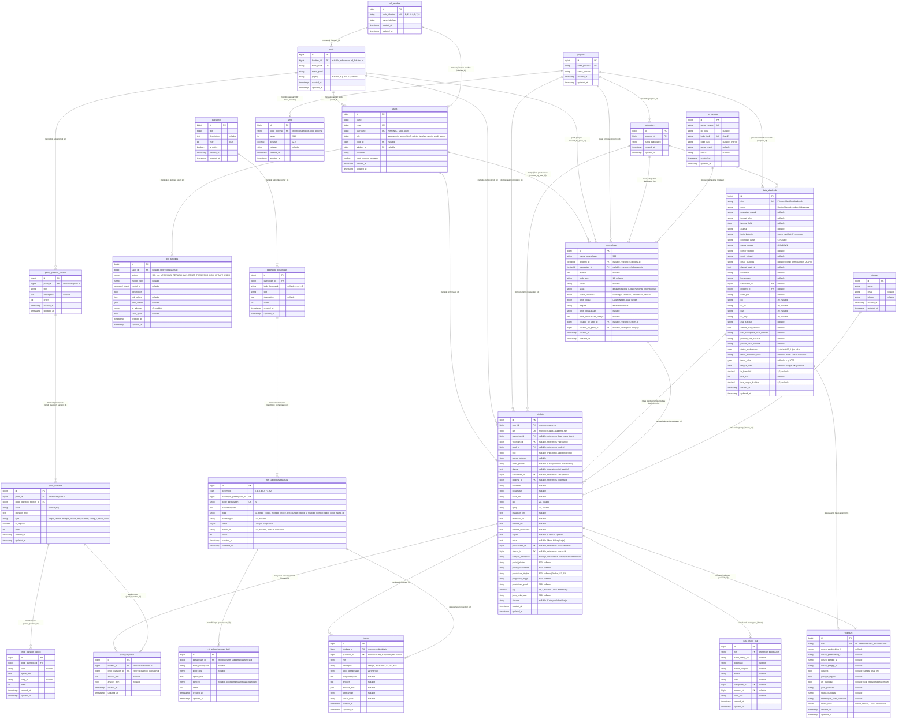

# Entity Relationship Diagram (ERD) - Tracer Study UKDW (SERU)

Dokumentasi lengkap skema basis data, kamus data (*data dictionary*), relasi entitas, dan diagram hubungan (*Entity Relationship Diagram*) untuk sistem informasi **SERU (Sistem Ekosistem Rekam Jejak Alumni) - Universitas Kristen Duta Wacana**.

---

## 1. Diagram ERD (Mermaid Visual)

```mermaid
erDiagram
    %% ==========================================
    %% 1. AUTENTIKASI, PENGGUNA & AUDIT TRAIL
    %% ==========================================
    users ||--o| biodata : "memiliki profil (user_id)"
    users ||--o{ perusahaan : "mengajukan perusahaan (created_by_user_id)"
    prodi ||--o{ users : "menaungi admin prodi (prodi_id)"
    prodi ||--o{ perusahaan : "prodi pengaju (created_by_prodi_id)"
    ref_fakultas ||--o{ users : "menaungi admin fakultas (fakultas_id)"
    users ||--o{ log_activities : "melakukan aktivitas (user_id)"

    users {
        bigint id PK
        string name
        string email UK
        string username UK "NIM / NIK / Kode Akun"
        string role "superadmin, admin_biro3, admin_fakultas, admin_prodi, alumni"
        bigint prodi_id FK "nullable"
        bigint fakultas_id FK "nullable"
        string password
        boolean must_change_password
        timestamp created_at
        timestamp updated_at
    }

    log_activities {
        bigint id PK
        bigint user_id FK "nullable, references users.id"
        string action "100, e.g. VERIFIKASI_PERUSAHAAN, RESET_PASSWORD_DOB, UPDATE_USER"
        string model_type "nullable"
        unsigned_bigint model_id "nullable"
        text description
        json old_values "nullable"
        json new_values "nullable"
        string ip_address "45, nullable"
        text user_agent "nullable"
        timestamp created_at
        timestamp updated_at
    }

    %% ==========================================
    %% 2. MASTER DATA, FAKULTAS & WILAYAH
    %% ==========================================
    ref_fakultas ||--o{ prodi : "menaungi (fakultas_id)"
    propinsi ||--o{ kabupaten : "memiliki (propinsi_id)"
    propinsi ||--o| ump : "memiliki standar UMP (kode_provinsi)"
    propinsi ||--o{ perusahaan : "lokasi provinsi (propinsi_id)"
    kabupaten ||--o{ perusahaan : "lokasi kabupaten (kabupaten_id)"
    ref_negara ||--o{ perusahaan : "lokasi internasional (negara)"
    prodi ||--o{ biodata : "memiliki alumni (prodi_id)"
    propinsi ||--o{ biodata : "domisili alumni (propinsi_id)"
    kabupaten ||--o{ biodata : "domisili alumni (kabupaten_id)"
    propinsi ||--o{ data_akademik : "provinsi domisili akademik (propinsi_id)"
    kabupaten ||--o{ data_akademik : "kabupaten domisili akademik (kabupaten_id)"

    ref_fakultas {
        bigint id PK
        string kode_fakultas UK "1, 2, 3, 4, 6, 7, 8"
        string nama_fakultas
        timestamp created_at
        timestamp updated_at
    }

    ref_negara {
        bigint id PK
        string nama_negara UK
        string ibu_kota "nullable"
        string kode_iso2 UK "char(2)"
        string kode_iso3 "nullable, char(3)"
        string nama_resmi "nullable"
        string benua "nullable"
        timestamp created_at
        timestamp updated_at
    }

    propinsi {
        bigint id PK
        string kode_provinsi UK
        string nama_provinsi
        timestamp created_at
        timestamp updated_at
    }

    kabupaten {
        bigint id PK
        bigint propinsi_id FK
        string nama_kabupaten
        timestamp created_at
        timestamp updated_at
    }

    prodi {
        bigint id PK
        bigint fakultas_id FK "nullable, references ref_fakultas.id"
        string kode_prodi UK
        string nama_prodi
        string jenjang "nullable, e.g. S1, S2, Profesi"
        timestamp created_at
        timestamp updated_at
    }

    ump {
        bigint id PK
        string kode_provinsi FK "references propinsi.kode_provinsi"
        int tahun "2026"
        decimal besaran "12,2"
        string catatan "nullable"
        timestamp created_at
        timestamp updated_at
    }

    %% ==========================================
    %% 3. ENTITAS AKADEMIK, YUDISIUM & PROFIL BIODATA
    %% ==========================================
    data_akademik ||--|| biodata : "relasi identitas tunggal bebas duplikasi (nim)"
    data_akademik ||--o| yudisium : "kelulusan & tugas akhir (nim)"
    biodata ||--o| yudisium : "referensi yudisium (yudisium_id)"
    biodata ||--o| data_orang_tua : "kontak wali (orang_tua_id/nim)"
    perusahaan ||--o{ biodata : "tempat bekerja (perusahaan_id)"
    atasan ||--o{ biodata : "atasan langsung (atasan_id)"

    data_akademik {
        bigint id PK
        string nim UK "Primary Identifier Akademik"
        string nama "Master Nama Lengkap Mahasiswa"
        string angkatan_masuk "nullable"
        string tempat_lahir "nullable"
        date tanggal_lahir "nullable"
        string agama "nullable"
        string jenis_kelamin "enum: Laki-laki, Perempuan"
        string golongan_darah "5, nullable"
        string warga_negara "default WNI"
        string nomor_telepon "nullable"
        string email_pribadi "nullable"
        string email_students "nullable (Email resmi kampus UKDW)"
        text alamat_saat_ini "nullable"
        string kelurahan "nullable"
        string kecamatan "nullable"
        bigint kabupaten_id FK "nullable"
        bigint propinsi_id FK "nullable"
        string kode_pos "nullable"
        string nik "20, nullable"
        string no_kk "20, nullable"
        string nisn "20, nullable"
        string no_bpjs "30, nullable"
        string asal_sekolah "nullable"
        text alamat_asal_sekolah "nullable"
        string kota_kabupaten_asal_sekolah "nullable"
        string provinsi_asal_sekolah "nullable"
        string jurusan_asal_sekolah "nullable"
        char status_mahasiswa "2, default AR, L jika lulus"
        string tahun_akademik_lulus "nullable, misal: Gasal 2026/2027"
        year tahun_lulus "nullable, e.g. 2026"
        date tanggal_lulus "nullable, tanggal SK yudisium"
        decimal ip_kumulatif "3,2, nullable"
        int total_sks "nullable"
        decimal total_angka_kualitas "8,2, nullable"
        timestamp created_at
        timestamp updated_at
    }

    yudisium {
        bigint id PK
        string nim UK "FK references data_akademik.nim"
        string dosen_pembimbing_1 "nullable"
        string dosen_pembimbing_2 "nullable"
        string dosen_penguji_1 "nullable"
        string dosen_penguji_2 "nullable"
        text judul_ta "nullable (Skripsi/Tesis/TA)"
        text judul_ta_inggris "nullable"
        text url_publikasi "nullable (Link repositori/jurnal ilmiah)"
        string jenis_publikasi "nullable"
        string status_publikasi "nullable"
        string keterangan_hasil_yudisium "nullable"
        enum status_lulus "Belum, Proses, Lulus, Tidak Lulus"
        timestamp created_at
        timestamp updated_at
    }

    biodata {
        bigint id PK
        bigint user_id FK "references users.id"
        string nim UK "references data_akademik.nim"
        bigint orang_tua_id FK "nullable, references data_orang_tua.id"
        bigint yudisium_id FK "nullable, references yudisium.id"
        bigint prodi_id FK "nullable, references prodi.id"
        string foto "nullable (Path file di /uploads/profile)"
        string nomor_telepon "nullable"
        string email_pribadi "nullable (Korespondensi aktif alumni)"
        text alamat "nullable (Alamat domisili saat ini)"
        bigint kabupaten_id FK "nullable, references kabupaten.id"
        bigint propinsi_id FK "nullable, references propinsi.id"
        string kelurahan "nullable"
        string kecamatan "nullable"
        string kode_pos "nullable"
        string nik "20, nullable"
        string npwp "30, nullable"
        text instagram_url "nullable"
        text facebook_url "nullable"
        text linkedin_url "nullable"
        text linkedin_username "nullable"
        text expert "nullable (Keahlian spesifik)"
        text minat "nullable (Minat bidang kerja)"
        bigint perusahaan_id FK "nullable, references perusahaan.id"
        bigint atasan_id FK "nullable, references atasan.id"
        string kategori_pekerjaan "Pekerja, Wiraswasta, Melanjutkan Pendidikan"
        string posisi_jabatan "500, nullable"
        string posisi_wiraswasta "500, nullable"
        string pendidikan_tingkat "500, nullable (Profesi, S2, S3)"
        string perguruan_tinggi "500, nullable"
        string pendidikan_prodi "500, nullable"
        decimal gaji "15,2, nullable (Take Home Pay)"
        string jenis_pekerjaan "500, nullable"
        string zipcode "nullable (Kode pos lokasi kerja)"
        timestamp created_at
        timestamp updated_at
    }

    data_orang_tua {
        bigint id PK
        string nim FK "references biodata.nim"
        string nama_orang_tua "nullable"
        string pekerjaan "nullable"
        string nomor_telepon "nullable"
        string alamat "nullable"
        string kota "nullable"
        bigint kabupaten_id FK "nullable"
        bigint propinsi_id FK "nullable"
        string kode_pos "nullable"
        timestamp created_at
        timestamp updated_at
    }

    perusahaan {
        bigint id PK
        string nama_perusahaan "500"
        foreignId propinsi_id FK "nullable, references propinsi.id"
        foreignId kabupaten_id FK "nullable, references kabupaten.id"
        text alamat "nullable"
        string kode_pos "15, nullable"
        string sektor "nullable"
        string skala "default Nasional (Lokal, Nasional, Internasional)"
        enum status_verifikasi "Menunggu Verifikasi, Terverifikasi, Ditolak"
        enum jenis_lokasi "Dalam Negeri, Luar Negeri"
        string negara "default Indonesia"
        string jenis_perusahaan "nullable"
        text jenis_perusahaan_lainnya "nullable"
        bigint created_by_user_id FK "nullable, references users.id"
        bigint created_by_prodi_id FK "nullable, index prodi pengaju"
        timestamp created_at
        timestamp updated_at
    }

    atasan {
        bigint id PK
        string nama
        string email "nullable"
        string telepon "nullable"
        timestamp created_at
        timestamp updated_at
    }

    %% ==========================================
    %% 4. KUESIONER TRACER STUDY UNIVERSITAS
    %% ==========================================
    kuesioner ||--o{ kelompok_pertanyaan : "memiliki seksi (kuesioner_id)"
    kelompok_pertanyaan ||--o{ ref_subpertanyaan2021 : "memuat pertanyaan (kelompok_pertanyaan_id)"
    ref_subpertanyaan2021 ||--o{ ref_subpertanyaan_detil : "memiliki opsi (pertanyaan_id)"
    biodata ||--o{ tracer : "menjawab (biodata_id)"
    ref_subpertanyaan2021 ||--o{ tracer : "direferensikan (question_id)"

    kuesioner {
        bigint id PK
        string title
        text description "nullable"
        int year "2026"
        boolean is_active
        timestamp created_at
        timestamp updated_at
    }

    kelompok_pertanyaan {
        bigint id PK
        bigint kuesioner_id FK
        string kode_kelompok "nullable, e.g. 1..9"
        string title
        text description "nullable"
        int order
        timestamp created_at
        timestamp updated_at
    }

    ref_subpertanyaan2021 {
        bigint id PK
        char kelompok "3, e.g. BIO, F1, F2"
        bigint kelompok_pertanyaan_id FK
        string kode_pertanyaan UK "20"
        text subpertanyaan
        string type "50, single_choice, multiple_choice, text, number, rating_5, multiple_number, radio_input, matrix, dll"
        string keterangan "100, nullable"
        tinyint wajib "1=wajib, 0=opsional"
        string tampil_di "100, nullable, profil vs kuesioner"
        int order
        timestamp created_at
        timestamp updated_at
    }

    ref_subpertanyaan_detil {
        bigint id PK
        bigint pertanyaan_id FK "references ref_subpertanyaan2021.id"
        string kode_pertanyaan "nullable"
        string kode_opsi "nullable"
        text option_text
        string jump_to "nullable, kode pertanyaan tujuan branching"
        int order
        timestamp created_at
        timestamp updated_at
    }

    tracer {
        bigint id PK
        bigint biodata_id FK "references biodata.id"
        bigint question_id FK "references ref_subpertanyaan2021.id"
        string nim
        string kelompok "char(3), misal: BIO, F1, F2, F17"
        string kode_pertanyaan "varchar(50)"
        text subpertanyaan "nullable"
        text answer "nullable"
        json answer_json "nullable"
        string keterangan "nullable"
        string tahun_lulus "nullable"
        timestamp created_at
        timestamp updated_at
    }

    %% ==========================================
    %% 5. KUESIONER KHUSUS PROGRAM STUDI
    %% ==========================================
    prodi ||--o{ prodi_question_section : "mengelola seksi (prodi_id)"
    prodi_question_section ||--o{ prodi_question : "memuat pertanyaan (prodi_question_section_id)"
    prodi_question ||--o{ prodi_question_option : "memiliki opsi (prodi_question_id)"
    biodata ||--o{ prodi_response : "menjawab kuesioner prodi (biodata_id)"
    prodi_question ||--o{ prodi_response : "jawaban butir (prodi_question_id)"

    prodi_question_section {
        bigint id PK
        bigint prodi_id FK "references prodi.id"
        string title
        text description "nullable"
        int order
        timestamp created_at
        timestamp updated_at
    }

    prodi_question {
        bigint id PK
        bigint prodi_id FK "references prodi.id"
        bigint prodi_question_section_id FK
        string code "varchar(50)"
        text question_text
        string type "single_choice, multiple_choice, text, number, rating_5, radio_input"
        boolean is_required
        int order
        timestamp created_at
        timestamp updated_at
    }

    prodi_question_option {
        bigint id PK
        bigint prodi_question_id FK
        string code "nullable"
        text option_text
        string jump_to "nullable"
        int order
        timestamp created_at
        timestamp updated_at
    }

    prodi_response {
        bigint id PK
        bigint biodata_id FK "references biodata.id"
        bigint prodi_question_id FK "references prodi_question.id"
        text answer_text "nullable"
        json answer_json "nullable"
        timestamp created_at
        timestamp updated_at
    }
```

---

## 2. Kelompok Entitas & Kamus Data (*Data Dictionary*)

### A. Modul Akun, Autentikasi & Audit Trail
1. **`users`**:
   - Menyimpan kredensial autentikasi pengguna.
   - Kolom: `id`, `name`, `email` (UK), `username` (UK), `password`, `role` (`superadmin`, `admin_biro3`, `admin_fakultas`, `admin_prodi`, `alumni`), `must_change_password` (boolean), `prodi_id` (FK nullable), `fakultas_id` (FK nullable).
   - Fitur Manajemen Akun: Reset password instan ke format tanggal lahir alumni (`DDMMYYYY`) dan konfirmasi langsung ke `email` pribadi yang terdaftar.
2. **`log_activities`**:
   - Menyimpan seluruh rekaman audit trail (*audit logging*) sistem secara komprehensif.
   - Kolom: `id`, `user_id` (FK ke `users`, nullable), `action` (e.g. `ACC_VERIFIKASI_PERUSAHAAN`, `GANTI_PERUSAHAAN`, `REJECT_PERUSAHAAN`, `RESET_PASSWORD_DOB`, `UPDATE_USER`, `UPDATE_PROFIL_ALUMNI`), `model_type`, `model_id`, `description`, `old_values` (JSON), `new_values` (JSON), `ip_address`, `user_agent`.

---

### B. Modul Wilayah & Master Institusi
1. **`prodi`**: Master program studi di lingkungan UKDW (Sistem Informasi, Informatika, Arsitektur, Desain Produk, Manajemen, Akuntansi, Biologi, Kedokteran, Teologi, dll.).
2. **`ref_fakultas`**: Master fakultas di UKDW yang menaungi program studi terkait.
3. **`ref_negara`**: Master data 194 negara resmi dunia (kode ISO 2 unik, nama negara unik, ibu kota, benua) untuk lokasi perusahaan internasional dan kewarganegaraan alumni. Disinkronkan dari berkas [`data/daftar_negara_dunia.csv`](file:///c:/study/tracerstudy/data/daftar_negara_dunia.csv).
4. **`propinsi`** & **`kabupaten`**: Master data wilayah administratif Republik Indonesia (38 Provinsi dan 514 Kabupaten/Kota). Disinkronkan dari berkas [`data/provinsi.csv`](file:///c:/study/tracerstudy/data/provinsi.csv) dan [`data/kabupaten_kota.csv`](file:///c:/study/tracerstudy/data/kabupaten_kota.csv).
5. **`ump`**: Data Upah Minimum Provinsi (UMP) tahun 2026 terhubung via `kode_provinsi` untuk evaluasi kesesuaian gaji standar kelayakan hidup.

---

### C. Modul Data Akademik, Kelulusan & Profil Biodata Alumni
1. **`data_akademik`** (*Single Source of Truth* Master Identitas & Akademik):
   - Menyimpan seluruh data resmi mahasiswa/alumni yang bersumber dari Pangkalan Data Akademik universitas:
     - Kunci Utama: `id`, `nim` (Unique).
     - Identitas Kependudukan & Pribadi: `nama`, `angkatan_masuk`, `tempat_lahir`, `tanggal_lahir`, `agama`, `jenis_kelamin`, `golongan_darah`, `warga_negara`, `nik`, `no_kk`, `nisn`, `no_bpjs`.
     - Riwayat Pendidikan Menengah: `asal_sekolah`, `alamat_asal_sekolah`, `kota_kabupaten_asal_sekolah`, `provinsi_asal_sekolah`, `jurusan_asal_sekolah`.
     - Kontak & Alamat Resmi: `nomor_telepon`, `email_students` (email kampus `@students.ukdw.ac.id`), `email_pribadi`, `alamat_saat_ini`, `kelurahan`, `kecamatan`, `kabupaten_id`, `propinsi_id`, `kode_pos`.
     - Parameter Kelulusan: `status_mahasiswa` (`AR`, `L`, dll.), `tahun_akademik_lulus`, `tahun_lulus`, `tanggal_lulus`, `ip_kumulatif`, `total_sks`, `total_angka_kualitas`.
   - **Karakteristik**: Seluruh field identitas kependudukan & akademik dikunci permanen (*read-only/disabled*) di halaman profil untuk semua role (Alumni, SuperAdmin, Fakultas, Prodi, Biro 3).
2. **`yudisium`**:
   - Menyimpan data penyelesaian tugas akhir dan kelulusan yudisium:
     - `nim` (Unique FK ke `data_akademik.nim`).
     - Dosen Pembimbing (`dosen_pembimbing_1`, `dosen_pembimbing_2`) & Dosen Penguji (`dosen_penguji_1`, `dosen_penguji_2`).
     - Judul Tugas Akhir (`judul_ta`, `judul_ta_inggris`).
     - Publikasi Ilmiah (`url_publikasi`, `jenis_publikasi`, `status_publikasi`).
     - Hasil & Status Yudisium: `keterangan_hasil_yudisium`, `status_lulus` (`Belum`, `Proses`, `Lulus`, `Tidak Lulus`).
   - **Otomasi Siklus Kelulusan**: Ketika `status_lulus` bernilai `'Lulus'`, sistem (via Model Event `Yudisium::saved`) otomatis:
     - Mengubah status mahasiswa di `data_akademik` menjadi `'L'` (Lulus).
     - Mengisi tanggal, tahun, dan periode kelulusan di `data_akademik`.
     - Membuatkan akun `users` baru (username: NIM, role: alumni, password awal: tgl lahir `DDMMYYYY`) jika belum ada.
     - Menginisialisasi kerangka record `biodata` (skeleton profile) dengan data identitas, prodi, dan ortu terisi otomatis dari data akademik, sementara kolom karier (`perusahaan_id`, `posisi_jabatan`, `gaji`, dll.) dibiarkan kosong/null untuk diisi alumni atau disinkronkan melalui LinkedIn.
3. **`biodata`** (Profil Dinamis & Pelacak Tracer Karier):
   - Menyimpan profil aktif alumni, kontak pribadi, domisili terkini, media sosial, dan data karier tanpa duplikasi data master akademik:
     - Relasi: `user_id` (1:1 ke `users`), `nim` (1:1 ke `data_akademik`), `prodi_id`, `orang_tua_id`, `yudisium_id`, `perusahaan_id`, `atasan_id`.
     - Foto: `foto` (Path foto di `/uploads/profile`).
     - Kontak Pribadi: `email_pribadi` (digunakan untuk login dan notifikasi reset password), `nomor_telepon`.
     - Domisili Terkini: `alamat`, `kelurahan`, `kecamatan`, `kabupaten_id`, `propinsi_id`, `kode_pos`.
     - Perpajakan & Medsos: `nik`, `npwp`, `instagram_url`, `facebook_url`, `linkedin_url`, `linkedin_username`.
     - Portofolio & Karier: `expert`, `minat`, `kategori_pekerjaan` (`Pekerja`, `Wiraswasta`, `Melanjutkan Pendidikan`), `posisi_jabatan`, `posisi_wiraswasta`, `pendidikan_tingkat`, `perguruan_tinggi`, `pendidikan_prodi`, `gaji`, `jenis_pekerjaan`, `zipcode`.
4. **`data_orang_tua`**: Kontak dan domisili orang tua/wali alumni (`nama_orang_tua`, `pekerjaan`, `nomor_telepon`, `alamat`, `kota`, `kabupaten_id`, `propinsi_id`, `kode_pos`).
5. **`perusahaan`** & **`atasan`**:
   - Master data entitas institusi/perusahaan dan atasan alumni.
   - Kolom verifikasi: `status_verifikasi` (`Menunggu Verifikasi`, `Terverifikasi`, `Ditolak`), `created_by_user_id` (FK ke `users.id` pengaju), `created_by_prodi_id` (FK ke `prodi.id` pengaju).
   - Setiap pendaftaran baru perusahaan (baik manual maupun hasil sinkronisasi LinkedIn) selalu berstatus default `'Menunggu Verifikasi'`.

---

### D. Modul Kuesioner Tracer Study Universitas (Standar 2021)
1. **`kuesioner`**: Master paket kuesioner tracer study tingkat universitas yang aktif (`title`, `year`, `is_active`).
2. **`kelompok_pertanyaan`**: Seksi instrumen kuesioner universitas (`kuesioner_id`, `kode_kelompok`, `title`, `order`).
3. **`ref_subpertanyaan2021`**:
   - Butir pertanyaan kuesioner universitas (`kode_pertanyaan`, `subpertanyaan`, `type`, `wajib`, `order`).
   - Kolom `tampil_di`:
     - `'profil'`: Ditampilkan pada halaman Profil Alumni (Seksi 1 / Identitas & Biodata Mahasiswa).
     - `'kuesioner'`: Ditampilkan pada alur Kuesioner Universitas (Seksi 2 s.d. 9).
4. **`ref_subpertanyaan_detil`**: Opsi pilihan jawaban butir pertanyaan universitas dengan kolom `jump_to` untuk alur percabangan (*branching/skip logic*).
5. **`tracer`**: Tabel jawaban kuesioner universitas per alumni (`biodata_id`, `question_id`, `nim`, `kode_pertanyaan`, `answer`, `answer_json`, `keterangan`, `tahun_lulus`).

---

### E. Modul Kuesioner Khusus Program Studi
1. **`prodi_question_section`**: Seksi pertanyaan kuesioner yang dikelola mandiri oleh masing-masing Program Studi (`prodi_id`, `title`, `order`).
2. **`prodi_question`**: Butir pertanyaan kuesioner prodi (`code`, `question_text`, `type`, `is_required`, `order`).
3. **`prodi_question_option`**: Opsi jawaban butir pertanyaan prodi (`code`, `option_text`, `jump_to`, `order`).
4. **`prodi_response`**: Tabel jawaban kuesioner prodi alumni (`biodata_id`, `prodi_question_id`, `answer_text`, `answer_json`).

---

### F. Database Views Terkonsolidasi
1. **`v_alumni_audit_rekap`** (Model: [`AlumniAuditRekap`](file:///c:/study/tracerstudy/app/Models/AlumniAuditRekap.php)): View agregat utama 89 kolom yang menyatukan profil biodata, status kuesioner universitas, dan status kuesioner prodi untuk direktori alumni tanpa masalah query N+1.
2. **`v_alumni_profile_summary`** (Model: [`AlumniProfileSummary`](file:///c:/study/tracerstudy/app/Models/AlumniProfileSummary.php)): View ringkasan profil lengkap 4 sub-tab (Pribadi, Akademik, Orang Tua, Karier).
3. **`v_alumni_tracer_univ_status`** (Model: [`AlumniTracerUnivStatus`](file:///c:/study/tracerstudy/app/Models/AlumniTracerUnivStatus.php)): Menghitung persentase dan progres kelengkapan kuesioner universitas (otomatis mengecualikan butir identitas Seksi 1).
4. **`v_alumni_tracer_prodi_status`** (Model: [`AlumniTracerProdiStatus`](file:///c:/study/tracerstudy/app/Models/AlumniTracerProdiStatus.php)): Menghitung status pengisian kuesioner mandiri program studi.
5. **`v_alumni_kuesioner_autofill`** (Model: [`AlumniKuesionerAutofill`](file:///c:/study/tracerstudy/app/Models/AlumniKuesionerAutofill.php)): Pemetaan data profil alumni ke kode pertanyaan kuesioner untuk pengisian otomatis.

---

## 3. Matriks Relasi Antar Tabel

| Entitas Sumber (Parent) | Relasi | Entitas Tujuan (Child) | Foreign Key / Constraint | Deskripsi & Perilaku Relasi |
|---|:---:|---|---|---|
| `users` | 1 : 1 | `biodata` | `biodata.user_id` | Setiap user akun alumni terhubung ke 1 entitas biodata profil. |
| `users` | 1 : N | `log_activities` | `log_activities.user_id` | Jejak audit mencatat user pelaku aksi sistem. |
| `prodi` | 1 : N | `users` | `users.prodi_id` | Admin Program Studi terikat pada 1 program studi. |
| `ref_fakultas` | 1 : N | `users` | `users.fakultas_id` | Admin Fakultas terikat pada 1 fakultas. |
| `prodi` | 1 : N | `biodata` | `biodata.prodi_id` | Alumni terafiliasi dengan program studi kelulusannya. |
| `data_akademik` | 1 : 1 | `biodata` | `biodata.nim = data_akademik.nim` | Relasi identitas akademik master bebas duplikasi data. |
| `data_akademik` | 1 : 1 | `yudisium` | `yudisium.nim = data_akademik.nim` | Relasi data kelulusan, skripsi/TA, dan repositori publikasi. |
| `biodata` | 1 : 1 | `yudisium` | `biodata.yudisium_id` | Referensi langsung hasil yudisium pada profil alumni. |
| `biodata` | 1 : 1 | `data_orang_tua` | `data_orang_tua.nim = biodata.nim` | Kontak wali dan data orang tua alumni. |
| `users` | 1 : N | `perusahaan` | `perusahaan.created_by_user_id` | Pengguna pengaju pendaftaran institusi/perusahaan baru. |
| `prodi` | 1 : N | `perusahaan` | `perusahaan.created_by_prodi_id` | Program studi pengaju untuk pembatasan verifikasi prodi & fakultas. |
| `propinsi` | 1 : N | `perusahaan` | `perusahaan.propinsi_id` | Provinsi kantor perusahaan di Indonesia. |
| `kabupaten` | 1 : N | `perusahaan` | `perusahaan.kabupaten_id` | Kabupaten/Kota kantor perusahaan di Indonesia. |
| `ref_negara` | 1 : N | `perusahaan` | `perusahaan.negara = ref_negara.nama_negara` | Negara domisili kantor perusahaan internasional. |
| `perusahaan` | 1 : N | `biodata` | `biodata.perusahaan_id` | Tempat instansi/perusahaan alumni bekerja. |
| `atasan` | 1 : N | `biodata` | `biodata.atasan_id` | Atasan langsung alumni di tempat kerja. |
| `propinsi` | 1 : N | `kabupaten` | `kabupaten.propinsi_id` | Hierarki kewilayahan provinsi ke kabupaten/kota. |
| `propinsi` | 1 : 1 | `ump` | `ump.kode_provinsi` | Standar UMP ketetapan pemerintah provinsi. |
| `kuesioner` | 1 : N | `kelompok_pertanyaan` | `kelompok_pertanyaan.kuesioner_id` | Seksi/bagian dalam instrumen tracer study universitas. |
| `kelompok_pertanyaan` | 1 : N | `ref_subpertanyaan2021` | `ref_subpertanyaan2021.kelompok_pertanyaan_id` | Butir soal per seksi instrumen universitas. |
| `ref_subpertanyaan2021` | 1 : N | `ref_subpertanyaan_detil` | `ref_subpertanyaan_detil.pertanyaan_id` | Opsi pilihan jawaban & branching logic kuesioner. |
| `biodata` | 1 : N | `tracer` | `tracer.biodata_id` | Rekaman jawaban butir kuesioner universitas. |
| `ref_subpertanyaan2021` | 1 : N | `tracer` | `tracer.question_id` | Referensi butir soal kuesioner universitas. |
| `prodi` | 1 : N | `prodi_question_section` | `prodi_question_section.prodi_id` | Seksi instrumen kuesioner mandiri program studi. |
| `prodi_question_section` | 1 : N | `prodi_question` | `prodi_question.prodi_question_section_id` | Butir soal instrumen mandiri program studi. |
| `prodi_question` | 1 : N | `prodi_question_option` | `prodi_question_option.prodi_question_id` | Pilihan opsi kuesioner mandiri program studi. |
| `biodata` | 1 : N | `prodi_response` | `prodi_response.biodata_id` | Rekaman jawaban butir kuesioner mandiri program studi. |
| `prodi_question` | 1 : N | `prodi_response` | `prodi_response.prodi_question_id` | Referensi butir soal kuesioner program studi. |
