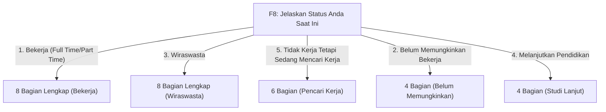

# PANDUAN STRUKTUR & LOGIKA PERCABANGAN KUESIONER TRACER STUDY

Dokumen ini menjelaskan struktur lengkap 8 bagian kuesioner tracer study universitas, daftar pertanyaan di setiap bagian, serta **aturan percabangan (*branching/jump logic*)** berdasarkan status pekerjaan alumni (**F8**) standar Kemendikbud Dikti.

---

## 1. Daftar 8 Bagian Kuesioner & Butir Pertanyaannya

| No | Nama Bagian / Seksi | Kode Pertanyaan | Deskripsi Butir Pertanyaan | Tipe Input |
| :---: | :--- | :---: | :--- | :--- |
| **1** | **Status Pekerjaan & Aktivitas Saat Ini** | **F8** | Jelaskan status Anda saat ini (*Wajib*) | Radio (Pilihan Tunggal) |
| | | **F10** | Apakah anda aktif mencari pekerjaan dalam 4 minggu terakhir? | Radio (Pilihan Tunggal) |
| | | **F18** | Pertanyaan studi lanjut (Header) | Header |
| | | **F18a** | Sumber biaya studi lanjut | Radio |
| | | **F18b** | Perguruan Tinggi studi lanjut | Teks / Autocomplete |
| | | **F18c** | Program Studi studi lanjut | Teks / Autocomplete |
| | | **F18d** | Tanggal Masuk studi lanjut | Tanggal |
| **2** | **Waktu Mulai & Cara Mencari Pekerjaan** | **F3** | Kapan anda mulai mencari pekerjaan? (Sebelum lulus ... bulan / Sesudah lulus ... bulan / Tidak mencari kerja) | Radio Input (Eksklusif) |
| | | **F4** | Bagaimana anda mencari pekerjaan tersebut? | Checkbox (Pilihan Ganda) |
| **3** | **Mendapatkan Pekerjaan & Data Pekerjaan** | **F504** | Apakah Anda telah mendapatkan pekerjaan ≤ 6 bulan, termasuk bekerja sebelum lulus? | Radio (Ya / Tidak) |
| | | **F502** | Dalam berapa bulan anda mendapatkan pekerjaan? (*Jika F504 = Ya*) | Angka (Bulan) |
| | | **F506** | Dalam berapa bulan anda mendapatkan pekerjaan? (*Jika F504 = Tidak*) | Angka (Bulan) |
| **4** | **Riwayat Lamaran Pekerjaan** | **F6** | Berapa perusahaan/instansi yang sudah Anda lamar sebelum memperoleh pekerjaan pertama? | Angka |
| | | **F7** | Berapa banyak perusahaan/instansi yang merespons lamaran Anda? | Angka |
| | | **F7A** | Berapa banyak perusahaan/instansi yang mengundang Anda untuk wawancara? | Angka |
| **5** | **Pembiayaan Kuliah** | **F12** | Sebutkan sumber dana dalam pembiayaan kuliah | Checkbox (Pilihan Ganda) |
| **6** | **Keselarasan & Relevansi Pekerjaan** | **F14** | Seberapa erat hubungan antara bidang studi dengan pekerjaan Anda? | Rating Skala 1-5 |
| | | **F15** | Tingkat pendidikan apa yang paling tepat/sesuai untuk pekerjaan Anda saat ini? | Radio (Pilihan Tunggal) |
| | | **F16** | Jika pekerjaan saat ini tidak sesuai, mengapa Anda mengambilnya? | Checkbox (Pilihan Ganda) |
| **7** | **Evaluasi Kompetensi Lulusan** | **F17** | Evaluasi 7 Aspek Kompetensi Dual Matrix (A: Dikuasai vs B: Diperlukan): 1. Etika 2. Keahlian Bidang Ilmu 3. Bahasa Inggris 4. Teknologi Informasi 5. Komunikasi 6. Kerja Sama Tim 7. Pengembangan Diri | Matriks Dual Skala 1-5 |
| **8** | **Penekanan Metode Pembelajaran** | **F2** | Evaluasi penekanan 7 metode pembelajaran prodi: 1. Perkuliahan 2. Demonstrasi 3. Proyek Riset 4. Magang 5. Praktikum 6. Kerja Lapangan 7. Diskusi | Matriks Skala 1-5 |

> **Catatan Pertanyaan Profil (F1, F2A-F2H, F5a-F5D, F11, F505)**:
> Pertanyaan identitas diri, data kontak, nama perusahaan, posisi jabatan, dan gaji telah dikelola secara terpusat di halaman **Profil Alumni** (`/alumni/profile`) dan otomatis tersinkronisasi ke database kuesioner.

---

## 2. Matriks Percabangan Berdasarkan Pilihan F8

Setiap pilihan pada status pekerjaan alumni (**F8**) menentukan bagian dan butir pertanyaan mana saja yang **Wajib Diisi (Muncul)** atau **Dilewati (Disembunyikan)**:

### Tabel Rincian Bagian yang Muncul per Status F8:

| Bagian Kuesioner | 1. Bekerja | 3. Wiraswasta | 5. Mencari Kerja | 2. Belum Bekerja | 4. Studi Lanjut |
| :--- | :---: | :---: | :---: | :---: | :---: |
| **Bagian 1: Status & Aktivitas** | ✅ (F8 saja) | ✅ (F8 saja) | ✅ (F8 & F10) | ✅ (F8 & F10) | ✅ (F8 & F18) |
| **Bagian 2: Waktu & Cara Mencari** (F3, F4) | ✅ | ✅ | ✅ | ❌ Dilewati | ❌ Dilewati |
| **Bagian 3: Mendapatkan Pekerjaan** (F504, F502/F506) | ✅ | ✅ | ❌ Dilewati | ❌ Dilewati | ❌ Dilewati |
| **Bagian 4: Riwayat Lamaran** (F6, F7, F7A) | ✅ | ✅ | ✅ | ❌ Dilewati | ❌ Dilewati |
| **Bagian 5: Pembiayaan Kuliah** (F12) | ✅ | ✅ | ✅ | ✅ | ✅ |
| **Bagian 6: Keselarasan Pekerjaan** (F14..F16) | ✅ | ✅ | ❌ Dilewati | ❌ Dilewati | ❌ Dilewati |
| **Bagian 7: Evaluasi Kompetensi** (F17) | ✅ | ✅ | ✅ | ✅ | ✅ |
| **Bagian 8: Penekanan Metode** (F2) | ✅ | ✅ | ✅ | ✅ | ✅ |
| **TOTAL TAHAPAN STEPPER** | **8 Bagian** | **8 Bagian** | **6 Bagian** | **4 Bagian** | **4 Bagian** |

---

## 3. Penjelasan Detail Tiap Status

### A. Status 1 & 3: "Bekerja (full time/part time)" atau "Wiraswasta"
* **Target Alumni**: Alumni yang sudah memiliki pekerjaan atau berwirausaha.
* **Jumlah Bagian**: **8 Bagian**.
* **Aturan Khusus**:
  * Pertanyaan **`F10`** (*Mencari kerja 4 minggu terakhir*) dan **`F18`** (*Studi lanjut*) disembunyikan karena alumni sudah bekerja.
  * Alumni mengisi seluruh riwayat pencarian kerja ($F3, F4$), waktu mendapatkan kerja ($F504$), jumlah lamaran ($F6, F7, F7A$), biaya kuliah ($F12$), keselarasan ($F14..F16$), serta evaluasi kompetensi ($F17$) dan metode ($F2$).

---

### B. Status 5: "Tidak Kerja tetapi sedang mencari kerja"
* **Target Alumni**: Alumni yang sedang aktif melamar pekerjaan namun belum mulai bekerja.
* **Jumlah Bagian**: **6 Bagian** (Bagian 1, 2, 4, 5, 7, 8).
* **Aturan Khusus**:
  * Pertanyaan **`F10`** (*Aktif mencari kerja 4 minggu terakhir*) **ditampilkan**.
  * Bagian 2 ($F3, F4$) dan Bagian 4 ($F6, F7, F7A$) **ditampilkan** untuk merekam riwayat lamaran yang sudah dikirim.
  * Bagian 3 ($F504, F502, F506$) dan Bagian 6 ($F14..F16$) **dilewati** karena belum memiliki tempat kerja tetap.

---

### C. Status 2: "Belum memungkinkan bekerja"
* **Target Alumni**: Alumni yang belum memungkinkan untuk bekerja (misal: mengurus keluarga, kondisi kesehatan, istirahat).
* **Jumlah Bagian**: **4 Bagian** (Bagian 1, 5, 7, 8).
* **Aturan Khusus**:
  * Pertanyaan **`F10`** (*Aktif mencari kerja 4 minggu terakhir*) **ditampilkan**.
  * Seluruh pertanyaan riwayat pencarian kerja dan data pekerjaan ($F3..F16$) **dilewati**.
  * Alumni hanya mengisi Bagian 1 (Status & F10), Bagian 5 (Biaya Kuliah F12), Bagian 7 (Kompetensi F17), dan Bagian 8 (Metode F2).

---

### D. Status 4: "Melanjutkan Pendidikan"
* **Target Alumni**: Alumni yang sedang menempuh studi lanjut (S2 / Profesi / Spesialis).
* **Jumlah Bagian**: **4 Bagian** (Bagian 1, 5, 7, 8).
* **Aturan Khusus**:
  * Pertanyaan **`F10`** dan seluruh pertanyaan pekerjaan ($F3..F16$) **dilewati**.
  * Pertanyaan studi lanjut **`F18a, F18b, F18c, F18d`** pada Bagian 1 **ditampilkan**.
  * Alumni selanjutnya langsung diarahkan ke Bagian 5 (Biaya Kuliah), Bagian 7 (Kompetensi), dan Bagian 8 (Metode).

---

## 4. Aturan Khusus Butir Pertanyaan

### Aturan Pertanyaan F3 (Waktu Mulai Mencari Kerja):
Pilihan pada butir **F3** bersifat **eksklusif tunggal**:
1. *Sebelum lulus ... bulan*
2. *Sesudah lulus ... bulan*
3. *Saya tidak mencari kerja*

> Memilih salah satu opsi akan secara otomatis mengosongkan/menghapus isian angka pada opsi lainnya.

### Aturan Pertanyaan F504 (Mendapatkan Pekerjaan ≤ 6 Bulan):
* Jika memilih **"Ya"** $\rightarrow$ Pertanyaan **`F502`** (*Berapa bulan dapat kerja*) muncul, **`F506`** disembunyikan.
* Jika memilih **"Tidak"** $\rightarrow$ Pertanyaan **`F506`** (*Berapa bulan dapat kerja*) muncul, **`F502`** disembunyikan.

---

## 5. Ringkasan Teknis

* **Frontend Wizard**: [`resources/js/Pages/Alumni/Kuesioner.vue`](file:///c:/study/tracerstudy/resources/js/Pages/Alumni/Kuesioner.vue)
* **Logika Evaluasi Stepper**: [`resources/js/Pages/Alumni/Components/Kuesioner/Stepper.vue`](file:///c:/study/tracerstudy/resources/js/Pages/Alumni/Components/Kuesioner/Stepper.vue)
* **Penghitungan Kelengkapan & Persentase Dashboard**: [`app/Services/Kuesioner/KelengkapanTracerService.php`](file:///c:/study/tracerstudy/app/Services/Kuesioner/KelengkapanTracerService.php)
* **Penyimpanan Jawaban**: [`app/Http/Controllers/Alumni/Kuesioner/SimpanJawabanController.php`](file:///c:/study/tracerstudy/app/Http/Controllers/Alumni/Kuesioner/SimpanJawabanController.php)
