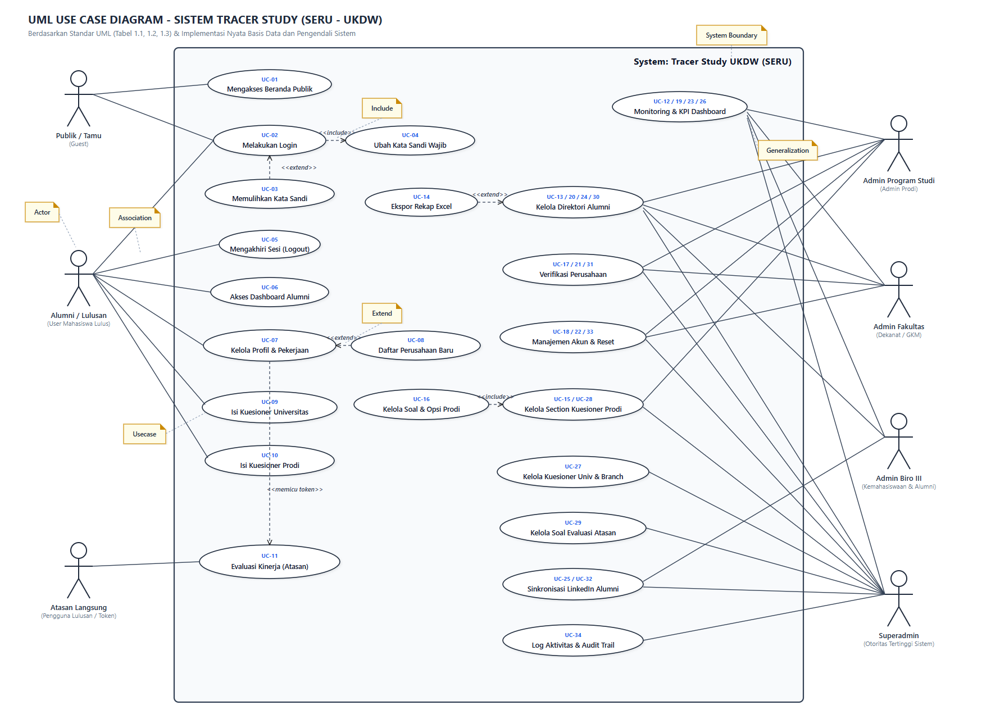

# Dokumen Spesifikasi Use Case Sistem Tracer Study (SERU - UKDW)

Dokumen ini merupakan spesifikasi lengkap Use Case (*Use Case Specification*) untuk sistem informasi **Tracer Study / SERU (Sistem Ekosistem Rekam Jejak Alumni)** pada **Universitas Kristen Duta Wacana (UKDW)**. Seluruh aktor, use case, alur kejadian (*flow of events*), prakondisi, pascakondisi, dan relasi disusun secara akurat berdasarkan arsitektur, rute, pengendali (*controller*), model, dan basis data aktual yang aktif pada aplikasi.

---

## 1. Landasan Teori & Komponen UML Use Case

Berdasarkan standar Unified Modeling Language (UML), use case digunakan untuk memodelkan interaksi antara pengguna eksternal (*actor*) dengan fungsionalitas di dalam batas sistem (*system boundary*).

### Tabel 1.1 Daftar Diagram UML Terkait
| No | Diagram UML | Tujuan (*Purpose of the UML Diagram*) |
| :---: | :--- | :--- |
| 1 | **UML Use Case Diagram** | Memvisualisasikan fungsionalitas bisnis diskret sistem dari perspektif aktor eksternal serta menggambarkan batasan sistem (*system boundary*). |
| 2 | **UML Component Diagram** | Menunjukkan hubungan, ketergantungan (*dependencies*), dan organisasi antarkomponen perangkat lunak dalam sistem (seperti Controller, Service, Middleware, Provider LinkedIn API/MCP, dan Database). |
| 3 | **UML Deployment Diagram** | Menggambarkan topologi perangkat keras dan lingkungan *runtime* tempat komponen perangkat lunak dijalankan (Web Server Nginx/Apache, PHP 8.3 Runtime, MariaDB Database Server, dan Layanan Cloud). |

### Tabel 1.2 Komponen UML Use Case Diagram
| No | Nama Komponen | Notasi UML | Tujuan / Fungsi (*Purpose*) |
| :---: | :--- | :---: | :--- |
| 1 | **System Boundary** | Kotak Persegi Panjang (*Rectangle Box*) | • Mewakili batas dan cakupan (*scope*) dari sistem aplikasi Tracer Study. • Merangkum seluruh fungsionalitas diskret yang disediakan oleh sistem. • Memisahkan lingkungan internal sistem dari aktor eksternal. |
| 2 | **Actors** | *Stick Figure* | • Pengguna atau entitas luar yang berinteraksi dengan sistem. • Aktor dapat berupa manusia (Alumni, Admin, Pengguna Lulusan), organisasi, maupun sistem eksternal (LinkedIn Apify Provider). • Berinteraksi langsung dengan satu atau lebih use case melalui asosiasi. |
| 3 | **Usecases** | Elips / Oval | • Representasi visual dari fungsionalitas bisnis diskret dalam sistem. • Menjamin setiap proses bisnis terdefinisi secara independen, terukur, dan bermakna bagi pengguna. • Menjelaskan urutan tindakan yang menghasilkan nilai bagi aktor. |

### Tabel 1.3 Relasi Use Case UML (*Usecase Relationships*)
| No | Relasi Use Case | Notasi UML | Fungsionalitas & Penjelasan |
| :---: | :--- | :---: | :--- |
| 1 | **Association** | Garis Lurus Padat (*Solid Line*) | Menghubungkan aktor dengan use case yang diaksesnya tanpa arah spesifik. |
| 2 | **Directed Association** | Garis Panah Padat (*Solid Directed Line*) | Menunjukkan hubungan satu arah di mana aktor secara eksplisit memicu atau mengendalikan jalannya use case. |
| 3 | **Include** | Garis Putus-putus Berpanah dengan stereotipe `<<include>>` | Menunjukkan bahwa eksekusi use case dasar secara mutlak menyertakan fungsionalitas dari use case lain yang dituju (*mandatory inclusion*). |
| 4 | **Extend** | Garis Putus-putus Berpanah dengan stereotipe `<<extend>>` | Menunjukkan perluasan opsional di mana use case tambahan menyisipkan perilakunya ke use case dasar hanya jika kondisi tertentu terpenuhi (*optional branch*). |
| 5 | **Generalization** | Garis Panah Kosong / Segitiga (*Hollow Arrow*) | Hubungan hierarki antara use case induk (*parent*) dan satu atau lebih use case anak (*child*), di mana child mewarisi struktur dan menambahkan perilaku spesifik. |
| 6 | **Dependency** | Garis Putus-putus Berpanah (*Dashed Arrow*) | Menunjukkan dependensi fungsional di mana perubahan atau keberadaan suatu use case bergantung pada use case lain. |

---

## 2. Identifikasi Aktor Sistem (*Actors Identification*)

Sistem Tracer Study UKDW melibatkan 7 (tujuh) kategori aktor riil:

1. **Publik / Tamu (Guest)**  
   Pengunjung umum tanpa autentikasi yang dapat mengakses halaman utama (*Landing Page*), membaca informasi tracer study, dan mengakses halaman login.
2. **Alumni / Lulusan**  
   Mahasiswa UKDW yang telah lulus yudisium dan terdaftar di sistem. Bertugas memutakhirkan biodata, riwayat karir, mendaftarkan data instansi/atasan, serta mengisi kuesioner tracer study universitas dan program studi.
3. **Pengguna Lulusan / Atasan Langsung (Employer/Supervisor)**  
   Pimpinan atau atasan langsung di tempat alumni bekerja. Mengisi instrumen survei evaluasi kinerja lulusan secara aman melalui tautan khusus ber-token 64-karakter unik tanpa perlu proses pendaftaran akun.
4. **Admin Program Studi (Admin Prodi)**  
   Pengelola akademik pada masing-masing Program Studi. Bertugas mengelola instrumen kuesioner khusus prodi (bagian, butir pertanyaan, opsi), memantau capaian alumni prodi, memverifikasi usulan perusahaan dari alumni prodi, dan mengelola akun mahasiswa se-prodi.
5. **Admin Fakultas**  
   Pengelola tingkat Dekanat / Gugus Kendali Mutu Fakultas. Bertugas memantau statistik kelengkapan tracer study lintas program studi dalam fakultas, mengaudit direktori alumni fakultas, memverifikasi perusahaan se-fakultas, dan mengelola akun mahasiswa tingkat fakultas.
6. **Admin Biro III (Kemahasiswaan, Alumni & Pengembangan Karir)**  
   Pengelola eksekutif universitas. Memantau KPI partisipasi dan *response rate* kampus, mengaudit data alumni se-universitas, mengekspor laporan, serta menjalankan integrasi sinkronisasi data karir alumni dari LinkedIn.
7. **Superadmin**  
   Administrator sistem teknis tertinggi. Mengendalikan instrumen kuesioner universitas (Kemdikbudristek), kuesioner prodi, kuesioner evaluasi atasan, verifikasi perusahaan seluruh universitas, sinkronisasi massal (*batch*) LinkedIn, manajemen akun seluruh peran, dan audit *log activities*.

---

## 3. Diagram UML Use Case Sistem

### 3.1 Visual Diagram UML Use Case (Standar Notasi UML & Komponen Lengkap)

Berikut adalah gambar visual UML Use Case Diagram sistem Tracer Study UKDW (SERU) yang memuat batas sistem (*system boundary*), aktor (*stick figure*), use case (*ellipse*), relasi (*association, include, extend, generalization*), dan catatan callout (*notes*) sesuai standar referensi:

> **File Asset Gambar Diagram**:
> - Format Gambar PNG (Resolusi Tinggi): [docs/images/use_case_diagram.png](file:///c:/study/tracerstudy/docs/images/use_case_diagram.png)
> - Format Vektor SVG (Scalable Vector Graphics): [docs/images/use_case_diagram.svg](file:///c:/study/tracerstudy/docs/images/use_case_diagram.svg)

---

### 3.2 Diagram Use Case Interaktif (Mermaid Code Representation)

```mermaid
flowchart LR
    %% Actors
    subgraph Actors [Aktor Sistem]
        A_Guest["Publik / Tamu"]
        A_Alumni["Alumni / Lulusan"]
        A_Atasan["Atasan Langsung (Employer)"]
        A_Prodi["Admin Program Studi"]
        A_Fakultas["Admin Fakultas"]
        A_Biro3["Admin Biro III"]
        A_Super["Superadmin"]
    end

    %% System Boundary
    subgraph SystemBoundary ["System Boundary: Sistem Tracer Study UKDW (SERU)"]
        %% Public & Auth
        UC01(["UC-01: Mengakses Beranda Publik"])
        UC02(["UC-02: Melakukan Autentikasi (Login)"])
        UC03(["UC-03: Memulihkan Kata Sandi (Reset Password)"])
        UC04(["UC-04: Mengubah Kata Sandi Wajib"])
        UC05(["UC-05: Mengakhiri Sesi (Logout)"])

        %% Alumni
        UC06(["UC-06: Mengakses Dashboard Alumni"])
        UC07(["UC-07: Mengelola Profil & Pekerjaan Alumni"])
        UC08(["UC-08: Mendaftarkan Instansi Perusahaan Baru"])
        UC09(["UC-09: Mengisi Kuesioner Universitas (Kemdikbud)"])
        UC10(["UC-10: Mengisi Kuesioner Khusus Prodi"])

        %% Employer
        UC11(["UC-11: Mengisi Evaluasi Kinerja Lulusan (Token-Based)"])

        %% Management Base (Generalization Parent)
        UC_VCorp(["UC-GEN-01: Memverifikasi Pengajuan Perusahaan"])
        UC_MgtUser(["UC-GEN-02: Mengelola Akun & Reset Password"])
        UC_DirAlumni(["UC-GEN-03: Mengelola Direktori Alumni & Ekspor"])

        %% Monitoring Dashboards
        UC12(["UC-12: Dashboard Kinerja Prodi"])
        UC19(["UC-19: Dashboard Kinerja Fakultas"])
        UC23(["UC-23: Dashboard KPI Biro III"])
        UC26(["UC-26: Dashboard Pusat Superadmin"])

        %% Instruments & Configuration
        UC15(["UC-15: Mengelola Kuesioner Prodi (Section, Soal, Opsi)"])
        UC27(["UC-27: Mengelola Kuesioner Universitas & Branching"])
        UC29(["UC-29: Mengelola Instrumen Evaluasi Atasan"])
        UC32(["UC-32: Melakukan Sinkronisasi Profil LinkedIn"])
        UC34(["UC-34: Memantau Log Aktivitas & Audit Trail"])
    end

    %% Relationships - Guest
    A_Guest --> UC01
    A_Guest --> UC02

    %% Relationships - Employer
    A_Atasan --> UC11

    %% Relationships - Alumni
    A_Alumni --> UC02
    A_Alumni --> UC05
    A_Alumni --> UC06
    A_Alumni --> UC07
    A_Alumni --> UC09
    A_Alumni --> UC10

    %% Relationships - Admin Prodi
    A_Prodi --> UC02
    A_Prodi --> UC05
    A_Prodi --> UC12
    A_Prodi --> UC15
    A_Prodi --> UC_DirAlumni
    A_Prodi --> UC_VCorp
    A_Prodi --> UC_MgtUser

    %% Relationships - Admin Fakultas
    A_Fakultas --> UC02
    A_Fakultas --> UC05
    A_Fakultas --> UC19
    A_Fakultas --> UC_DirAlumni
    A_Fakultas --> UC_VCorp
    A_Fakultas --> UC_MgtUser

    %% Relationships - Admin Biro III
    A_Biro3 --> UC02
    A_Biro3 --> UC05
    A_Biro3 --> UC23
    A_Biro3 --> UC_DirAlumni
    A_Biro3 --> UC32

    %% Relationships - Superadmin
    A_Super --> UC02
    A_Super --> UC05
    A_Super --> UC26
    A_Super --> UC27
    A_Super --> UC15
    A_Super --> UC29
    A_Super --> UC_DirAlumni
    A_Super --> UC_VCorp
    A_Super --> UC_MgtUser
    A_Super --> UC32
    A_Super --> UC34

    %% Include & Extend
    UC03 -.->|"<<extend>>"| UC02
    UC04 -.->|"<<include>>"| UC02
    UC08 -.->|"<<extend>>"| UC07
    UC07 -.->|"<<extend: memicu token>>"| UC11
```

---

## 4. Daftar Ringkasan Use Case (*Use Case Master Index*)

| ID Use Case | Nama Use Case | Aktor Terlibat | Relasi UML |
| :--- | :--- | :--- | :--- |
| **UC-01** | Mengakses Beranda Publik (*Landing Page*) | Publik / Tamu, Seluruh Pengguna | Association |
| **UC-02** | Melakukan Autentikasi Pengguna (*Login*) | Alumni, Admin Prodi, Admin Fak, Biro III, Superadmin | Association |
| **UC-03** | Memulihkan Kata Sandi (*Forgot & Reset Password*) | Alumni, Seluruh Staf Admin | `<<extend>>` ke UC-02 |
| **UC-04** | Mengubah Kata Sandi Bawaan Wajib (*Must Change Password*) | Alumni (Password Default Lahir) | `<<include>>` dari UC-02 |
| **UC-05** | Mengakhiri Sesi Akun (*Logout*) | Seluruh Pengguna Terautentikasi | Association |
| **UC-06** | Mengakses Dashboard Alumni | Alumni | Association |
| **UC-07** | Mengelola Profil Biodata & Riwayat Karir | Alumni | Association |
| **UC-08** | Mendaftarkan Entitas Perusahaan Baru | Alumni | `<<extend>>` ke UC-07 |
| **UC-09** | Mengisi Kuesioner Tracer Study Universitas (Kemdikbud) | Alumni | Association |
| **UC-10** | Mengisi Kuesioner Khusus Program Studi | Alumni | Association |
| **UC-11** | Mengisi Evaluasi Kinerja Lulusan (Token-Based) | Pengguna Lulusan / Atasan Langsung | Dependency dari UC-07 |
| **UC-12** | Mengakses Dashboard Kinerja Program Studi | Admin Program Studi | Association |
| **UC-13** | Mengelola Direktori & Detail Alumni Prodi | Admin Program Studi | Generalization dari UC-GEN-03 |
| **UC-14** | Mengekspor Rekapitulasi Data Alumni ke Excel | Admin Prodi, Fak, Biro III, Superadmin | `<<extend>>` ke Direktori Alumni |
| **UC-15** | Mengelola Bagian (*Section*) Kuesioner Prodi | Admin Prodi, Superadmin | Association |
| **UC-16** | Mengelola Pertanyaan & Opsi Kuesioner Prodi | Admin Prodi, Superadmin | `<<include>>` ke UC-15 |
| **UC-17** | Memverifikasi Perusahaan Lingkup Program Studi | Admin Program Studi | Generalization dari UC-GEN-01 |
| **UC-18** | Mengelola Akun Alumni & Reset Sandi Lingkup Prodi | Admin Program Studi | Generalization dari UC-GEN-02 |
| **UC-19** | Mengakses Dashboard Statistik Fakultas | Admin Fakultas | Association |
| **UC-20** | Mengelola Direktori & Detail Alumni Fakultas | Admin Fakultas | Generalization dari UC-GEN-03 |
| **UC-21** | Memverifikasi Perusahaan Lingkup Fakultas | Admin Fakultas | Generalization dari UC-GEN-01 |
| **UC-22** | Mengelola Akun Alumni & Reset Sandi Se-Fakultas | Admin Fakultas | Generalization dari UC-GEN-02 |
| **UC-23** | Mengakses Dashboard Eksekutif Tracer Biro III | Admin Biro III | Association |
| **UC-24** | Mengelola Direktori Alumni Universitas (Biro III) | Admin Biro III | Generalization dari UC-GEN-03 |
| **UC-25** | Melakukan Sinkronisasi Profil LinkedIn Alumni (Biro III) | Admin Biro III | Generalization dari UC-32 |
| **UC-26** | Mengakses Dashboard Pusat Superadmin | Superadmin | Association |
| **UC-27** | Mengelola Kuesioner Universitas, Section, Soal & Branching | Superadmin | Association |
| **UC-28** | Mengelola Kuesioner Prodi Terpusat (*Override*) | Superadmin | Generalization dari UC-15 / UC-16 |
| **UC-29** | Mengelola Instrumen Evaluasi Pengguna Lulusan | Superadmin | Association |
| **UC-30** | Mengelola Direktori & Audit Seluruh Alumni Universitas | Superadmin | Generalization dari UC-GEN-03 |
| **UC-31** | Memverifikasi Pengajuan Perusahaan Terpusat | Superadmin | Generalization dari UC-GEN-01 |
| **UC-32** | Melakukan Sinkronisasi LinkedIn Terpusat (Batch/Single) | Superadmin | Association |
| **UC-33** | Mengelola Akun Multi-Peran & Reset Sandi Terpadu | Superadmin | Generalization dari UC-GEN-02 |
| **UC-34** | Memantau Log Aktivitas & Audit Trail Sistem | Superadmin | Association |

---

## 5. Spesifikasi Rinci Deskripsi Use Case (*Use Case Specifications*)

---

### UC-01. Mengakses Beranda Publik (Landing Page)
- **Usecase ID**: UC-01
- **Usecase Name**: Mengakses Beranda Publik (*Landing Page*)
- **Actors Involved**: Publik / Tamu (Guest), Seluruh Pengguna
- **Description**: Menampilkan profil sistem informasi Tracer Study UKDW (SERU), statistik ringkas, pengumuman urgensi pelacakan jejak alumni bagi akreditasi, serta navigasi menuju halaman login.
- **Preconditions**: Perangkat pengguna terhubung ke jaringan internet dan dapat mengakses alamat URL sistem (`/`).
- **Main Flow (Basic Flow)**:
  1. Pengguna membuka URL utama aplikasi (`GET /`).
  2. Sistem merespons dengan menampilkan *Landing Page* beranda publik yang memuat sambutan, panduan pengisian, dan tombol "Masuk / Login".
  3. Pengguna membaca informasi yang disajikan.
- **Alternate Flow (Alternative Flow)**:
  - Jika pengguna memilih tombol "Masuk / Login", sistem mengarahkan pengguna ke halaman Login (`GET /login`) [Menuju UC-02].
  - Jika pengguna adalah atasan yang membuka tautan dari email, pengguna langsung diarahkan ke form evaluasi [Menuju UC-11].
- **Post Conditions**: Pengguna mendapatkan informasi umum mengenai kegiatan Tracer Study UKDW.

---

### UC-02. Melakukan Autentikasi Pengguna (Login)
- **Usecase ID**: UC-02
- **Usecase Name**: Melakukan Autentikasi Pengguna (*Login*)
- **Actors Involved**: Alumni / Lulusan, Admin Program Studi, Admin Fakultas, Admin Biro III, Superadmin
- **Description**: Memverifikasi identitas pengguna berdasarkan kredensial (Username/NIM dan Kata Sandi) untuk memberikan hak akses sesi ke menu dan modul sesuai perannya (*Role-Based Access Control*).
- **Preconditions**: Pengguna sudah memiliki akun terdaftar di sistem Tracer Study dan membuka halaman `/login`.
- **Main Flow (Basic Flow)**:
  1. Pengguna memasukkan `username` (NIM untuk alumni, NIP/Username untuk admin) dan `password`.
  2. Pengguna menekan tombol "Masuk".
  3. Sistem memvalidasi kredensial terhadap tabel `users`.
  4. Sistem memeriksa flag `must_change_password`:
     - Jika bernilai `false`, sistem mengarahkan pengguna ke Dashboard sesuai peran masing-masing:
       - Alumni $\rightarrow$ `/alumni/dashboard`
       - Admin Prodi $\rightarrow$ `/prodi/dashboard`
       - Admin Fakultas $\rightarrow$ `/fakultas/dashboard`
       - Admin Biro III $\rightarrow$ `/biro3/dashboard`
       - Superadmin $\rightarrow$ `/superadmin/dashboard`
  5. Sesi login pengguna resmi aktif.
- **Alternate Flow (Alternative Flow)**:
  - **A1. Kredensial Tidak Cocok**: Sistem menampilkan pesan kesalahan "Kombinasi username atau password salah" dan pengguna diminta mengisi ulang.
  - **A2. Password Bawaan Pertama Kali (`must_change_password = true`)**: Sistem mengarahkan paksa pengguna ke rute `/change-password` [Menuju UC-04].
  - **A3. Lupa Kata Sandi**: Pengguna mengklik tautan "Lupa Kata Sandi" [Menuju UC-03].
- **Post Conditions**: Pengguna berhasil masuk ke dalam sistem dengan token sesi yang valid dan diarahkan ke antarmuka kerja sesuai perannya.

---

### UC-03. Memulihkan Kata Sandi (Forgot & Reset Password)
- **Usecase ID**: UC-03
- **Usecase Name**: Memulihkan Kata Sandi (*Forgot & Reset Password*)
- **Actors Involved**: Alumni / Lulusan, Seluruh Pengguna Terdaftar
- **Description**: Fasilitas pemulihan kata sandi mandiri melalui pengiriman tautan token acak ke alamat email terdaftar pengguna.
- **Preconditions**: Pengguna berada pada halaman login (`/login`) dan tidak mengingat kata sandinya.
- **Main Flow (Basic Flow)**:
  1. Pengguna mengklik opsi "Lupa Kata Sandi" dan diarahkan ke form `/forgot-password`.
  2. Pengguna memasukkan alamat email terdaftar dan menekan tombol "Kirim Link Reset".
  3. Sistem memeriksa keberadaan email di database `users`.
  4. Sistem menghasilkan token reset acak, menyimpannya di tabel pemulihan sandi, dan mengirimkan email resmi berisi URL tautan reset (`/reset-password/{token}`).
  5. Pengguna membuka email, mengklik tautan, dan mengisi formulir kata sandi baru.
  6. Sistem memverifikasi token, mengupdate sandi terenkripsi di database, dan menghapus token reset yang telah dipakai.
  7. Sistem mengarahkan pengguna kembali ke halaman Login dengan pesan sukses.
- **Alternate Flow (Alternative Flow)**:
  - **A1. Email Tidak Ditemukan**: Sistem menampilkan notifikasi bahwa alamat email tidak terdaftar di sistem.
  - **A2. Token Kedaluwarsa / Tidak Valid**: Sistem menolak akses form reset sandi dan meminta pengguna mengirimkan ulang permintaan pemulihan.
- **Post Conditions**: Kata sandi akun berhasil diperbarui dan pengguna dapat login dengan kata sandi yang baru.

---

### UC-04. Mengubah Kata Sandi Bawaan Wajib (Force Change Password)
- **Usecase ID**: UC-04
- **Usecase Name**: Mengubah Kata Sandi Bawaan Wajib (*Must Change Password*)
- **Actors Involved**: Alumni / Lulusan
- **Description**: Memaksa alumni yang baru pertama kali login menggunakan password bawaan tanggal lahir (`DDMMYYYY`) atau setelah direset oleh admin untuk menentukan kata sandi pribadi yang aman sebelum dapat mengakses fitur aplikasi.
- **Preconditions**: Alumni berhasil login, namun atribut `must_change_password` pada akun bernilai `true`.
- **Main Flow (Basic Flow)**:
  1. *Middleware* `must_change_password` mencegat navigasi dan mengarahkan alumni ke halaman `/change-password`.
  2. Alumni memasukkan kata sandi saat ini (*current password*), kata sandi baru minimal 8 karakter, dan konfirmasi kata sandi baru.
  3. Alumni menekan tombol "Simpan Kata Sandi".
  4. Sistem memvalidasi kesesuaian sandi lama dan kecocokan konfirmasi sandi baru.
  5. Sistem memperbarui hash password di tabel `users` dan menyetel `must_change_password = false`.
  6. Sistem mengalihkan pengguna langsung ke Dashboard Alumni (`/alumni/dashboard`).
- **Alternate Flow (Alternative Flow)**:
  - **A1. Kata Sandi Baru Lemah atau Konfirmasi Tidak Sama**: Sistem menampilkan pesan validasi dan meminta alumni memperbaiki isian.
- **Post Conditions**: Atribut `must_change_password` berubah menjadi `false`, kata sandi baru tersimpan, dan alumni memperoleh akses penuh ke fitur tracer study.

---

### UC-05. Mengakhiri Sesi Akun (Logout)
- **Usecase ID**: UC-05
- **Usecase Name**: Mengakhiri Sesi Akun (*Logout*)
- **Actors Involved**: Alumni, Admin Prodi, Admin Fakultas, Admin Biro III, Superadmin
- **Description**: Menutup sesi pengguna yang sedang aktif, menghapus token autentikasi, serta mencegah akses kembali tanpa proses login ulang.
- **Preconditions**: Pengguna dalam kondisi login (*authenticated*).
- **Main Flow (Basic Flow)**:
  1. Pengguna menekan tombol "Logout" pada navigasi bar atas.
  2. Dialog konfirmasi SweetAlert2 muncul meminta persetujuan keluar.
  3. Pengguna mengonfirmasi tindakan logout.
  4. Sistem mengeksekusi rute `POST /logout`, menghapus sesi server, meregenerasi token CSRF, dan memusnahkan sesi autentikasi.
  5. Pengguna dialihkan kembali ke Landing Page Beranda (`/`).
- **Alternate Flow (Alternative Flow)**:
  - Pengguna membatalkan konfirmasi SweetAlert2; sistem tetap mempertahankan sesi login pada halaman saat ini.
- **Post Conditions**: Sesi pengguna hancur di server dan hak akses terhadap seluruh menu privat dicabut.

---

### UC-06. Mengakses Dashboard Alumni
- **Usecase ID**: UC-06
- **Usecase Name**: Mengakses Dashboard Alumni
- **Actors Involved**: Alumni / Lulusan
- **Description**: Menyajikan ringkasan visual mengenai status pengisian tracer study alumni melalui tiga indikator utama: kelengkapan profil, kuesioner universitas, dan kuesioner program studi.
- **Preconditions**: Alumni telah login dan menyelesaikan kewajiban ganti password.
- **Main Flow (Basic Flow)**:
  1. Alumni membuka menu Dashboard (`GET /alumni/dashboard`).
  2. Sistem menghitung persentase progres dari tabel `biodata`, `tracer`, dan `prodi_response`.
  3. Sistem menampilkan 3 kartu progres:
     - Kartu Kelengkapan Biodata & Profil Karir (persentase & jumlah atribut terisi).
     - Kartu Kuesioner Universitas Kemdikbudristek (persentase butir terjawab).
     - Kartu Kuesioner Program Studi (persentase butir terjawab).
  4. Alumni dapat mengklik tombol navigasi langsung menuju instrumen yang belum selesai.
- **Alternate Flow (Alternative Flow)**:
  - Dari dashboard, alumni dapat memilih menuju Profil [UC-07], Kuesioner Univ [UC-09], atau Kuesioner Prodi [UC-10].
- **Post Conditions**: Alumni memahami status kelengkapan data survei yang harus diselesaikannya.

---

### UC-07. Mengelola Profil Biodata dan Riwayat Pekerjaan Alumni
- **Usecase ID**: UC-07
- **Usecase Name**: Mengelola Profil Biodata dan Riwayat Pekerjaan Alumni
- **Actors Involved**: Alumni / Lulusan
- **Description**: Fitur untuk mengisi dan memperbarui kontak aktif, alamat tempat tinggal, tautan media sosial/LinkedIn, bidang keahlian, status pekerjaan saat ini, detail instansi, serta data atasan langsung.
- **Preconditions**: Alumni telah login ke sistem.
- **Main Flow (Basic Flow)**:
  1. Alumni membuka halaman `/alumni/profile`.
  2. Sistem menampilkan data profil yang tersimpan pada tabel `biodata` dan referensi `data_akademik`.
  3. Alumni memperbarui nomor telepon/WhatsApp, email korespondensi, alamat, media sosial, keahlian (*expert*), dan minat.
  4. Alumni memilih kategori status saat ini (Bekerja, Wiraswasta, atau Melanjutkan Pendidikan).
  5. Jika bekerja: Alumni memilih instansi dari daftar master `perusahaan` yang sudah terverifikasi, memasukkan jabatan, besaran gaji, dan mengisi nama serta email atasan langsung.
  6. Alumni menekan tombol "Simpan Perubahan".
  7. Sistem menyimpan data ke tabel `biodata` dan `atasan`.
  8. Jika data email atasan baru diisi, sistem menerbitkan record `evaluasi_atasan` ber-token 64 karakter dan memicu pengiriman email undangan evaluasi [Memicu UC-11].
  9. Sistem menampilkan notifikasi berhasil (SweetAlert2).
- **Alternate Flow (Alternative Flow)**:
  - **A1. Perusahaan Belum Terdaftar**: Jika perusahaan alumni belum ada di daftar pilihan master, alumni mengklik opsi "Tambah Perusahaan Baru" [Menuju UC-08].
- **Post Conditions**: Data biodata, riwayat pekerjaan, dan kontak alumni diperbarui di database.

---

### UC-08. Mendaftarkan Entitas Perusahaan Baru
- **Usecase ID**: UC-08
- **Usecase Name**: Mendaftarkan Entitas Perusahaan Baru
- **Actors Involved**: Alumni / Lulusan
- **Description**: Memungkinkan alumni mengajukan tempat kerja baru yang belum terdaftar di basis data master universitas, lengkap dengan alamat, provinsi, skala usaha, dan kontak instansi.
- **Preconditions**: Alumni berada pada form profil (`/alumni/profile`) dan tidak menemukan nama instansi kerjanya di daftar master.
- **Main Flow (Basic Flow)**:
  1. Alumni membuka modal form tambah perusahaan baru.
  2. Alumni mengisi nama perusahaan, jenis lokasi (Dalam/Luar Negeri), negara, provinsi, kabupaten, alamat kantor, kode pos, situs web/homepage, nomor telepon/fax, skala (Lokal/Nasional/Internasional), bentuk badan usaha (PT, CV, BUMN, dll.), serta jumlah pegawai.
  3. Alumni menekan tombol "Simpan Perusahaan" (`POST /alumni/company`).
  4. Sistem menyimpan record ke tabel `perusahaan` dengan status `Menunggu Verifikasi`, mencatat `created_by_user_id` dan `created_by_prodi_id`.
  5. Sistem secara otomatis memilih perusahaan baru tersebut sebagai tempat kerja aktif di profil alumni.
- **Alternate Flow (Alternative Flow)**:
  - Form gagal divalidasi jika nama instansi kosong; sistem menampilkan pesan kesalahan input.
- **Post Conditions**: Entitas perusahaan baru tercatat di tabel `perusahaan` dengan status `Menunggu Verifikasi` untuk ditinjau oleh Admin Prodi / Fakultas / Superadmin.

---

### UC-09. Mengisi Kuesioner Tracer Study Universitas (Kemdikbudristek)
- **Usecase ID**: UC-09
- **Usecase Name**: Mengisi Kuesioner Tracer Study Universitas (Kemdikbudristek)
- **Actors Involved**: Alumni / Lulusan
- **Description**: Pengisian instrumen survei standar pelacakan jejak alumni tingkat universitas (mengacu pada standar Ditjen Diktiristek Kemdikbudristek) yang mencakup masa tunggu, relevansi kurikulum, metode pencarian kerja, dan pendapatan.
- **Preconditions**: Alumni telah login dan mengakses rute `/alumni/kuesioner`.
- **Main Flow (Basic Flow)**:
  1. Sistem memuat kuesioner aktif (`kuesioner.is_active = true`), grup section (`kelompok_pertanyaan`), daftar soal (`ref_subpertanyaan2021`), serta opsi jawaban (`ref_subpertanyaan_detil`).
  2. Sistem menampilkan pertanyaan secara berurutan sesuai konfigurasi `order`.
  3. Alumni memilih jawaban (pilihan ganda, checkbox, teks, skala likert, atau nominal angka).
  4. Jika butir memiliki logika percabangan (*branching jump_to*), antarmuka secara dinamis menyembunyikan atau menampilkan pertanyaan turunan yang relevan.
  5. Alumni menekan tombol "Simpan Jawaban Kuesioner" (`POST /alumni/kuesioner`).
  6. Sistem memvalidasi kewajiban isian (*required fields*), lalu memperbarui atau menginsert respon ke tabel `tracer`.
  7. Sistem menampilkan notifikasi sukses dan memperbarui persentase keterisian di dashboard alumni.
- **Alternate Flow (Alternative Flow)**:
  - **A1. Butir Wajib Terlewat**: Sistem menahan pengiriman form dan menandai butir pertanyaan wajib yang belum diisi.
- **Post Conditions**: Respon kuesioner universitas tersimpan di database `tracer` dan status keterisian alumni diperbarui.

---

### UC-10. Mengisi Kuesioner Khusus Program Studi
- **Usecase ID**: UC-10
- **Usecase Name**: Mengisi Kuesioner Khusus Program Studi
- **Actors Involved**: Alumni / Lulusan
- **Description**: Pengisian instrumen kuesioner evaluasi kurikulum, kompetensi capaian pembelajaran, fasilitas lab, dan kepuasan akademik yang dirancang secara mandiri oleh Program Studi tempat alumni lulus.
- **Preconditions**: Alumni telah login dan prodi asal alumni telah mengonfigurasi minimal satu butir pertanyaan kuesioner prodi aktif.
- **Main Flow (Basic Flow)**:
  1. Alumni membuka menu Kuesioner Prodi (`GET /alumni/kuesioner-prodi`).
  2. Sistem mendeteksi `prodi_id` alumni dari tabel `biodata`, lalu mengambil data dari `prodi_question_section` dan `prodi_question` milik prodi tersebut.
  3. Alumni mengisi tanggapan untuk setiap butir pertanyaan yang disajikan.
  4. Alumni mengklik tombol "Simpan Kuesioner Prodi" (`POST /alumni/kuesioner-prodi`).
  5. Sistem memvalidasi kelengkapan respon dan menyimpan jawaban ke tabel `prodi_response`.
  6. Sistem memberikan umpan balik notifikasi berhasil dan memperbarui progres kuesioner prodi di dashboard.
- **Alternate Flow (Alternative Flow)**:
  - Jika Program Studi belum menyusun kuesioner khusus, sistem menampilkan status informasi bahwa instrumen belum dibuka atau tidak ada pertanyaan prodi.
- **Post Conditions**: Jawaban evaluasi prodi tersimpan aman pada tabel `prodi_response`.

---

### UC-11. Mengisi Evaluasi Kinerja Lulusan oleh Atasan Langsung (Token-Based)
- **Usecase ID**: UC-11
- **Usecase Name**: Mengisi Evaluasi Kinerja Lulusan oleh Atasan Langsung (Token-Based)
- **Actors Involved**: Pengguna Lulusan / Atasan Langsung (*Employer*)
- **Description**: Mengisi instrumen evaluasi kinerja, etika, dan kompetensi alumni di dunia kerja secara langsung melalui tautan publik ber-token unik 64 karakter tanpa memerlukan akun atau login.
- **Preconditions**: Alumni telah menginput data nama & email atasan di profilnya, dan atasan menerima email resmi berisi tautan unik `/evaluasi-atasan/{token}`.
- **Main Flow (Basic Flow)**:
  1. Atasan mengklik tautan token dari email (`GET /evaluasi-atasan/{token}`).
  2. Sistem memverifikasi validitas token pada tabel `evaluasi_atasan`:
     - Token ditemukan dan belum pernah disubmit (`is_submitted = false`).
  3. Sistem merender halaman survei lengkap dengan identitas nama alumni dan instansi yang dinilai.
  4. **Bagian I (Profil Instansi)**: Atasan melengkapi atau mengonfirmasi profil perusahaan (alamat, sektor, skala, jumlah lulusan UKDW, dan standar gaji lulusan baru).
  5. **Bagian II (Penilaian Kinerja)**: Atasan menilai tingkat kesiapan alumni dalam bekerja serta memberikan skor pada butir matriks evaluasi (integritas, keahlian bidang, bahasa asing, kerja tim, komunikasi, pemanfaatan TI, dll.) yang dimuat dari tabel `pertanyaan_evaluasi_atasan`.
  6. Atasan dapat menuliskan saran perbaikan kurikulum pada kolom saran terbuka.
  7. Atasan menekan tombol "Kirim Evaluasi Kinerja" (`POST /evaluasi-atasan/{token}`).
  8. Sistem memvalidasi kelengkapan data, memperbarui data perusahaan/atasan, menyimpan jawaban ke tabel `respon_evaluasi_atasan`, serta menandai `is_submitted = true` dan mencatat `submitted_at = now()`.
  9. Sistem menampilkan halaman ucapan terima kasih resmi UKDW.
- **Alternate Flow (Alternative Flow)**:
  - **A1. Token Tidak Ditemukan / Salah**: Sistem menampilkan halaman error 404.
  - **A2. Survei Sudah Pernah Diisi**: Sistem menampilkan pesan bahwa kuesioner untuk alumni tersebut sudah selesai diserahkan sebelumnya.
  - **A3. Butir Penilaian Terlewat**: Sistem memberikan alert SweetAlert2 yang menandai butir matriks yang belum terisi.
- **Post Conditions**: Evaluasi tersimpan di `respon_evaluasi_atasan`, status kuesioner terkunci (`is_submitted = true`), dan pimpinan instansi selesai mengevaluasi.

---

### UC-12. Mengakses Dashboard Kinerja Program Studi
- **Usecase ID**: UC-12
- **Usecase Name**: Mengakses Dashboard Kinerja Program Studi
- **Actors Involved**: Admin Program Studi
- **Description**: Menampilkan statistik partisipasi tracer study spesifik untuk mahasiswa/alumni pada program studi yang dikelola.
- **Preconditions**: Admin Prodi telah terotentikasi dan memiliki peran `admin_prodi`.
- **Main Flow (Basic Flow)**:
  1. Admin Prodi membuka URL `/prodi/dashboard`.
  2. Sistem menghitung data agregat khusus prodi: Total Alumni Prodi, Responden Kuesioner Prodi, Responden Kuesioner Universitas, dan Persentase Partisipasi (*Response Rate*).
  3. Sistem menyajikan tabel 5 alumni terbaru beserta status kelengkapan kuesioner masing-masing.
- **Alternate Flow (Alternative Flow)**:
  - Admin Prodi dapat mengklik pintasan menuju menu Kelola Alumni [UC-13], Kuesioner Prodi [UC-15/UC-16], atau Verifikasi Perusahaan [UC-17].
- **Post Conditions**: Admin Prodi memperoleh wawasan data real-time mengenai ketercapaian target tracer study di tingkat prodinya.

---

### UC-13. Mengelola Direktori dan Detail Alumni Program Studi
- **Usecase ID**: UC-13
- **Usecase Name**: Mengelola Direktori dan Detail Alumni Program Studi
- **Actors Involved**: Admin Program Studi
- **Description**: Menelusuri daftar alumni prodi, memfilter berdasarkan tahun lulus/status kerja, melihat rincian riwayat jawaban kuesioner, serta membantu mengoreksi profil alumni jika diperlukan.
- **Preconditions**: Admin Prodi login ke sistem (`/prodi/alumni`).
- **Main Flow (Basic Flow)**:
  1. Admin Prodi membuka halaman direktori alumni prodi.
  2. Sistem menampilkan tabel data alumni yang terikat pada `prodi_id` akun admin.
  3. Admin dapat mencari berdasarkan nama/NIM atau memfilter status pekerjaan.
  4. Admin mengklik salah satu baris alumni untuk membuka rincian lengkap (`/prodi/alumni/{id}`).
  5. Sistem memuat profil biodata, riwayat pekerjaan, detail kuesioner universitas, dan kuesioner prodi.
  6. Jika terdapat koreksi, Admin Prodi dapat memperbarui profil melalui `POST /prodi/alumni/{id}/profile`.
- **Alternate Flow (Alternative Flow)**:
  - Admin Prodi dapat mengklik tombol "Ekspor Excel" [Menuju UC-14].
- **Post Conditions**: Informasi alumni dapat ditinjau dan dikoreksi secara akurat.

---

### UC-14. Mengekspor Rekapitulasi Data Alumni ke Excel
- **Usecase ID**: UC-14
- **Usecase Name**: Mengekspor Rekapitulasi Data Alumni ke Excel
- **Actors Involved**: Admin Program Studi, Admin Fakultas, Admin Biro III, Superadmin
- **Description**: Menghasilkan dan mengunduh berkas spreadsheet Microsoft Excel (`.xlsx`) yang merangkum data biodata, kontak, riwayat pekerjaan, dan hasil isian tracer study alumni sesuai lingkup wewenang aktor.
- **Preconditions**: Pengguna berada pada halaman direktori/detail alumni dengan hak akses yang sesuai.
- **Main Flow (Basic Flow)**:
  1. Pengguna menekan tombol "Export Excel".
  2. Sistem memproses permintaan rute `/export-excel` sesuai filter dan otorisasi peran:
     - Admin Prodi $\rightarrow$ Data alumni khusus prodi yang bersangkutan.
     - Admin Fakultas $\rightarrow$ Data alumni seluruh prodi dalam fakultas.
     - Admin Biro III / Superadmin $\rightarrow$ Data alumni komprehensif seluruh universitas.
  3. Sistem mengompilasi lembar data Excel dan mengirimkannya sebagai unduhan biner berkas ke browser pengguna.
- **Alternate Flow (Alternative Flow)**:
  - Jika data kosong, file Excel yang terunduh berisi baris header tanpa baris data.
- **Post Conditions**: File laporan Excel terunduh ke perangkat lokal pengguna untuk keperluan akreditasi atau pelaporan Dikti.

---

### UC-15. Mengelola Bagian (Section) Kuesioner Program Studi
- **Usecase ID**: UC-15
- **Usecase Name**: Mengelola Bagian (*Section*) Kuesioner Program Studi
- **Actors Involved**: Admin Program Studi, Superadmin
- **Description**: Menyusun, mengubah nama, mendeskripsikan, menghapus, serta mengatur urutan (*reorder*) kelompok bagian pada kuesioner mandiri prodi.
- **Preconditions**: Aktor membuka modul kelola section prodi (`/prodi/sections` atau `/superadmin/prodi-kuesioner`).
- **Main Flow (Basic Flow)**:
  1. Sistem menampilkan daftar section yang ada pada tabel `prodi_question_section`.
  2. Aktor dapat melakukan:
     - **Tambah**: Mengisi judul section dan deskripsi lalu menyimpan (`POST /prodi/sections`).
     - **Ubah**: Mengedit judul atau deskripsi section (`PUT /prodi/sections/{id}`).
     - **Reorder**: Menyeret atau mengatur urutan bobot nomor urut section (`POST /prodi/sections/reorder`).
     - **Hapus**: Menghapus section yang tidak lagi dipakai (`DELETE /prodi/sections/{id}`).
  3. Sistem memperbarui database dan menampilkan notifikasi berhasil.
- **Alternate Flow (Alternative Flow)**:
  - Hapus dibatalkan jika terdapat butir pertanyaan yang masih aktif di dalam section tersebut.
- **Post Conditions**: Struktur seksi kuesioner prodi terorganisir di database.

---

### UC-16. Mengelola Butir Pertanyaan dan Opsi Jawaban Kuesioner Prodi
- **Usecase ID**: UC-16
- **Usecase Name**: Mengelola Butir Pertanyaan dan Opsi Jawaban Kuesioner Prodi
- **Actors Involved**: Admin Program Studi, Superadmin
- **Description**: Mengelola butir-butir pertanyaan survei prodi (kode soal, teks soal, tipe respon: single choice, multiple choice, text, number, rating skala 5, radio) serta pilihan opsinya.
- **Preconditions**: Section kuesioner prodi telah dibuat sebelumnya.
- **Main Flow (Basic Flow)**:
  1. Aktor membuka menu `/prodi/pertanyaan`.
  2. Aktor memilih section induk tempat pertanyaan bernaung.
  3. Aktor menambahkan butir pertanyaan baru: mengisi kode unik, teks pertanyaan, memilih tipe input, status wajib diisi (*is_required*), dan urutan (`POST /prodi/pertanyaan`).
  4. Untuk tipe pilihan ganda/checkbox: Aktor menambahkan pilihan opsi pada tabel `prodi_question_option` (`POST /prodi/opsi`).
  5. Aktor dapat mengubah, menyusun ulang (*reorder*), atau menghapus butir pertanyaan.
  6. Sistem menyimpan seluruh konfigurasi ke tabel `prodi_question` dan `prodi_question_option`.
- **Alternate Flow (Alternative Flow)**:
  - Penghapusan butir pertanyaan dicegah jika sudah memiliki relasi data pada `prodi_response`.
- **Post Conditions**: Butir instrumen kuesioner prodi siap disajikan kepada alumni saat mengisi kuesioner prodi.

---

### UC-17. Memverifikasi Pengajuan Perusahaan Lingkup Program Studi
- **Usecase ID**: UC-17
- **Usecase Name**: Memverifikasi Pengajuan Perusahaan Lingkup Program Studi
- **Actors Involved**: Admin Program Studi
- **Description**: Memvalidasi data instansi baru yang diajukan oleh alumni prodinya agar data tempat kerja konsisten dan bebas dari duplikasi nama perusahaan.
- **Preconditions**: Terdapat entitas perusahaan berstatus `Menunggu Verifikasi` yang diajukan oleh alumni dengan `created_by_prodi_id` sama dengan prodi admin.
- **Main Flow (Basic Flow)**:
  1. Admin Prodi membuka menu `/prodi/perusahaan`.
  2. Sistem menampilkan daftar usulan instansi yang berstatus `Menunggu Verifikasi`.
  3. Admin memilih salah satu aksi verifikasi:
     - **Setujui Baru (Verify)**: Mengesahkan perusahaan menjadi master terverifikasi (`POST /verify`).
     - **Tolak (Reject)**: Menolak pengajuan karena tidak valid atau fiktif (`POST /reject`).
     - **Hubungkan ke Master Terverifikasi (Replace)**: Mengalihkan relasi tempat kerja alumni ke perusahaan master yang sudah ada, lalu menghapus data usulan duplikat (`POST /replace`).
     - **Koreksi Data (Update & Verify)**: Memperbaiki ejaan nama, sektor, atau alamat lalu memverifikasi (`PUT /perusahaan/{id}`).
  4. Sistem memperbarui status perusahaan dan mencatat tindakan pada log aktivitas.
- **Alternate Flow (Alternative Flow)**:
  - Admin mencari daftar master terverifikasi via `/search-verified` sebelum memutuskan aksi *replace*.
- **Post Conditions**: Status perusahaan berubah menjadi `Terverifikasi` atau `Ditolak`, atau dihubungkan ke data master yang sah.

---

### UC-18. Mengelola Akun Alumni dan Reset Password Default (Lingkup Prodi)
- **Usecase ID**: UC-18
- **Usecase Name**: Mengelola Akun Alumni dan Reset Password Default (Lingkup Prodi)
- **Actors Involved**: Admin Program Studi
- **Description**: Mengelola akun pengguna mahasiswa/alumni pada program studi terkait, termasuk memutakhirkan email/username dan melakukan reset kata sandi ke tanggal lahir bawaan (`DDMMYYYY`) disertai notifikasi email otomatis.
- **Preconditions**: Admin Prodi membuka menu `/prodi/manajemen-akun`.
- **Main Flow (Basic Flow)**:
  1. Sistem menampilkan daftar akun pengguna alumni yang berada di bawah naungan prodi admin.
  2. Admin dapat mencari berdasarkan NIM, nama, atau email.
  3. Jika akun diperbarui: Admin mengubah data nama/email lalu menyimpan (`PUT /manajemen-akun/{id}`).
  4. Jika alumni lupa akses: Admin menekan tombol "Reset Default & Notify" (`POST /reset-default-notify`).
  5. Sistem mengambil tanggal lahir alumni dari tabel `data_akademik`, memformatnya menjadi `DDMMYYYY`, mengenkripsinya sebagai password baru di tabel `users`, menyetel `must_change_password = true`, dan mengirimkan email pemberitahuan resmi ke email alumni.
  6. Sistem mencatat aksi reset ke `log_activities`.
- **Alternate Flow (Alternative Flow)**:
  - Jika tanggal lahir di tabel data akademik kosong, sistem menampilkan peringatan agar tanggal lahir dilengkapi terlebih dahulu.
- **Post Conditions**: Password alumni kembali ke tanggal lahir default, flag ganti sandi aktif, dan alumni menerima notifikasi di email.

---

### UC-19. Mengakses Dashboard Statistik Tingkat Fakultas
- **Usecase ID**: UC-19
- **Usecase Name**: Mengakses Dashboard Statistik Tingkat Fakultas
- **Actors Involved**: Admin Fakultas
- **Description**: Menyajikan metrik agregat pelacakan alumni untuk seluruh program studi yang berada di bawah naungan fakultas bersangkutan.
- **Preconditions**: Admin Fakultas telah terotentikasi dan memiliki peran `admin_fakultas`.
- **Main Flow (Basic Flow)**:
  1. Admin Fakultas mengakses `/fakultas/dashboard`.
  2. Sistem menghitung: Total alumni se-fakultas, total alumni yang telah menyelesaikan seluruh kuesioner, dan persentase keterisian fakultas.
  3. Sistem menyajikan tabel komparasi capaian partisipasi per program studi dalam fakultas.
- **Alternate Flow (Alternative Flow)**:
  - Admin Fakultas dapat beralih ke direktori alumni fakultas [UC-20] atau approval perusahaan [UC-21].
- **Post Conditions**: Admin Fakultas memperoleh data komparatif kinerja tracer study antar-prodi di fakultasnya.

---

### UC-20. Mengelola Direktori dan Detail Alumni Tingkat Fakultas
- **Usecase ID**: UC-20
- **Usecase Name**: Mengelola Direktori dan Detail Alumni Tingkat Fakultas
- **Actors Involved**: Admin Fakultas
- **Description**: Meninjau daftar seluruh alumni di lingkungan fakultas, memfilter berdasarkan program studi tertentu, memeriksa detail respon kuesioner, dan mengekspor rekapitulasi data.
- **Preconditions**: Admin Fakultas login ke sistem (`/fakultas/alumni`).
- **Main Flow (Basic Flow)**:
  1. Sistem menampilkan direktori alumni se-fakultas dengan opsi dropdown filter Program Studi.
  2. Admin menyaring data berdasarkan prodi tertentu atau mencari kata kunci nama/NIM.
  3. Admin membuka detail alumni (`/fakultas/alumni/{id}`) untuk memeriksa profil dan lembar jawaban tracer study.
  4. Admin dapat memperbarui informasi profil jika ada kesalahan data (`POST /profile`).
- **Alternate Flow (Alternative Flow)**:
  - Admin Fakultas menekan tombol ekspor untuk mengunduh rekap se-fakultas ke Excel [UC-14].
- **Post Conditions**: Direktori alumni tingkat fakultas terpantau dan terverifikasi dengan baik.

---

### UC-21. Memverifikasi Pengajuan Perusahaan Lingkup Fakultas
- **Usecase ID**: UC-21
- **Usecase Name**: Memverifikasi Pengajuan Perusahaan Lingkup Fakultas
- **Actors Involved**: Admin Fakultas
- **Description**: Memeriksa dan memvalidasi pengajuan perusahaan baru dari alumni yang berasal dari seluruh program studi di bawah fakultas tersebut.
- **Preconditions**: Terdapat perusahaan yang diajukan oleh alumni dalam cakupan fakultas admin.
- **Main Flow (Basic Flow)**:
  1. Admin Fakultas membuka menu `/fakultas/perusahaan`.
  2. Sistem menyaring daftar pengajuan instansi berdasarkan fakultas pengguna pengaju.
  3. Admin Fakultas mengeksekusi tindakan verifikasi: Setujui (`verify`), Tolak (`reject`), Ganti ke Master (`replace`), atau Koreksi (`update`).
  4. Sistem menyimpan pembaruan status pada tabel `perusahaan`.
- **Alternate Flow (Alternative Flow)**:
  - Jika instansi sudah pernah diverifikasi oleh fakultas lain di master, admin memilih opsi *replace* untuk menghindari redundansi data.
- **Post Conditions**: Data instansi perusahaan disahkan atau ditolak untuk skala fakultas.

---

### UC-22. Mengelola Akun Alumni dan Reset Password Se-Fakultas
- **Usecase ID**: UC-22
- **Usecase Name**: Mengelola Akun Alumni dan Reset Password Se-Fakultas
- **Actors Involved**: Admin Fakultas
- **Description**: Mengelola akun alumni lintas program studi di fakultas terkait serta memfasilitasi reset kata sandi massal/satuan ke tanggal lahir bawaan (`DDMMYYYY`).
- **Preconditions**: Admin Fakultas membuka menu `/fakultas/manajemen-akun`.
- **Main Flow (Basic Flow)**:
  1. Sistem menampilkan daftar akun alumni seluruh prodi di fakultas tersebut.
  2. Admin memfilter prodi sasaran dan mencari akun yang membutuhkan bantuan login.
  3. Admin melakukan update akun atau menekan tombol "Reset Default & Notify".
  4. Sistem mereset kata sandi ke tanggal lahir bawaan dan mengirim notifikasi email resmi ke alumni.
- **Alternate Flow (Alternative Flow)**:
  - Tindakan dapat dibatalkan jika admin memilih opsi "Batal" pada dialog konfirmasi.
- **Post Conditions**: Akun alumni diperbarui dan kata sandi berhasil direset ke standar tanggal lahir bawaan.

---

### UC-23. Mengakses Dashboard Eksekutif Tracer Study Universitas (Admin Biro III)
- **Usecase ID**: UC-23
- **Usecase Name**: Mengakses Dashboard Eksekutif Tracer Study Universitas (Admin Biro III)
- **Actors Involved**: Admin Biro III (Biro Kemahasiswaan, Alumni & Pengembangan Karir)
- **Description**: Pusat pemantauan Indikator Kinerja Utama (KPI) Tracer Study tingkat universitas, termasuk respon rate kampus, cakupan instrumen, dan capaian tautan LinkedIn alumni.
- **Preconditions**: Admin Biro III login dengan peran `admin_biro3`.
- **Main Flow (Basic Flow)**:
  1. Admin Biro III membuka rute `/biro3/dashboard`.
  2. Sistem menghitung metrik universitas:
     - Total keseluruhan alumni terdaftar di kampus.
     - Total responden unik yang telah berpartisipasi.
     - Rasio keterisian / *Response Rate* universitas (persentase).
     - Total butir instrumen aktif dan total prodi.
     - Total alumni yang profilnya telah tersinkronisasi dengan akun LinkedIn.
  3. Sistem menyajikan grafik dan visualisasi ringkas capaian kampus.
- **Alternate Flow (Alternative Flow)**:
  - Admin Biro III dapat beralih ke direktori alumni universitas [UC-24].
- **Post Conditions**: Pimpinan biro kemahasiswaan mendapatkan gambaran strategis capaian pelacakan lulusan kampus.

---

### UC-24. Mengelola Direktori Alumni Universitas (Biro III)
- **Usecase ID**: UC-24
- **Usecase Name**: Mengelola Direktori Alumni Universitas (Biro III)
- **Actors Involved**: Admin Biro III
- **Description**: Mengelola dan mengaudit seluruh basis data alumni UKDW dari seluruh angkatan, fakultas, dan program studi, serta meninjau riwayat pekerjaan dan kuesioner tracer study.
- **Preconditions**: Admin Biro III membuka rute `/biro3/alumni`.
- **Main Flow (Basic Flow)**:
  1. Sistem menyajikan basis data alumni universitas secara lengkap dengan fitur pencarian dan filter bertingkat (Fakultas, Prodi, Tahun Lulus, Status Kerja).
  2. Admin Biro III membuka detail profil alumni (`/biro3/alumni/{id}`).
  3. Admin meninjau data biodata, instansi bekerja, dan jawaban tracer study.
  4. Admin dapat memperbarui profil atau mengekspor rekapitulasi data ke format Excel [UC-14].
- **Alternate Flow (Alternative Flow)**:
  - Pada halaman detail, Admin Biro III dapat menjalankan integrasi sinkronisasi LinkedIn [Menuju UC-25].
- **Post Conditions**: Data alumni tingkat universitas terdata rapi dan siap dilaporkan.

---

### UC-25. Melakukan Sinkronisasi Profil LinkedIn Alumni (Biro III)
- **Usecase ID**: UC-25
- **Usecase Name**: Melakukan Sinkronisasi Profil LinkedIn Alumni (Biro III)
- **Actors Involved**: Admin Biro III
- **Description**: Mengambil data posisi jabatan dan riwayat karir terkini alumni dari profil LinkedIn publik secara otomatis melalui layanan terintegrasi (LinkedIn Profile Provider / Apify) untuk memperbarui data rekam jejak.
- **Preconditions**: Alumni memiliki URL/username LinkedIn yang valid di profilnya dan Admin Biro III membuka detail alumni (`/biro3/alumni/{id}`).
- **Main Flow (Basic Flow)**:
  1. Admin Biro III menekan tombol "Sinkronisasi LinkedIn" (`POST /biro3/alumni/{id}/sync-linkedin`).
  2. Sistem menghubungi penyedia scraping LinkedIn (Apify / MCP service) untuk mengekstrak data profil karir, perusahaan tempat bekerja, dan periode waktu.
  3. Sistem menampilkan hasil ekstraksi kepada admin untuk ditinjau (*review*).
  4. Admin menekan tombol "Simpan Data LinkedIn" (`POST /biro3/alumni/{id}/save-linkedin`).
  5. Sistem memperbarui atribut pekerjaan pada tabel `biodata` dan menyimpan riwayat sinkronisasi.
  6. Sistem memunculkan notifikasi sukses pembaruan data dari LinkedIn.
- **Alternate Flow (Alternative Flow)**:
  - **A1. URL LinkedIn Tidak Valid atau Profil Privat**: Sistem menampilkan pesan bahwa profil tidak dapat dijangkau oleh provider.
- **Post Conditions**: Profil riwayat karir alumni terbarui secara otomatis dengan data terkini dari LinkedIn.

---

### UC-26. Mengakses Dashboard Pusat Superadmin
- **Usecase ID**: UC-26
- **Usecase Name**: Mengakses Dashboard Pusat Superadmin
- **Actors Involved**: Superadmin
- **Description**: Pusat kendali dan pengawasan menyeluruh terhadap seluruh modul teknis: ringkasan survei, status instrumen kuesioner, antrean approval perusahaan, dan peringatan operasional sistem.
- **Preconditions**: Pengguna login dengan hak akses `superadmin` (`/superadmin/dashboard`).
- **Main Flow (Basic Flow)**:
  1. Superadmin mengakses dashboard pusat.
  2. Sistem menampilkan ringkasan metrik global: total responden, status keaktifan kuesioner universitas, total antrean verifikasi perusahaan se-kampus, dan log aktivitas terbaru.
  3. Superadmin dapat menavigasi ke seluruh modul konfigurasi sistem.
- **Alternate Flow (Alternative Flow)**:
  - Superadmin memilih menu konfigurasi instrumen, manajemen akun, audit log, atau sinkronisasi LinkedIn.
- **Post Conditions**: Superadmin memegang kendali operasional atas keseluruhan ekosistem Tracer Study.

---

### UC-27. Mengelola Instrumen Kuesioner Universitas (Induk, Section, Pertanyaan, Opsi & Branching)
- **Usecase ID**: UC-27
- **Usecase Name**: Mengelola Instrumen Kuesioner Universitas
- **Actors Involved**: Superadmin
- **Description**: Pengelolaan menyeluruh kuesioner tracer study universitas: mengaktifkan paket kuesioner tahunan, mengelola grup bagian (*section*), butir pertanyaan, pilihan opsi, dan aturan logika percabangan (*branching jump_to*).
- **Preconditions**: Superadmin membuka modul kuesioner universitas (`/superadmin/sections`, `/superadmin/kuesioner`, `/superadmin/pertanyaan`).
- **Main Flow (Basic Flow)**:
  1. **Kelola Paket Kuesioner Induk**: Superadmin dapat membuat paket kuesioner tahunan baru atau mengaktifkan/menonaktifkan kuesioner aktif (`PATCH /superadmin/kuesioner/{id}/toggle-active`).
  2. **Kelola Section**: Superadmin membuat, mengedit, dan mengatur nomor urutan bagian kuesioner pada tabel `kelompok_pertanyaan`.
  3. **Kelola Pertanyaan**: Superadmin menambah/mengubah pertanyaan pada tabel `ref_subpertanyaan2021` (kode unik, teks pertanyaan, tipe input, penanda wajib, tampil di profil/kuesioner, dan urutan).
  4. **Kelola Opsi & Branching**: Superadmin memasukkan opsi jawaban pada tabel `ref_subpertanyaan_detil` dan menyetel kode pertanyaan tujuan percabangan (`jump_to`) jika responden memilih opsi tertentu.
  5. Sistem memvalidasi integritas relasi dan menyimpan perubahan.
- **Alternate Flow (Alternative Flow)**:
  - Jika kode pertanyaan duplikat, sistem menampilkan validasi error kode unik.
- **Post Conditions**: Konfigurasi instrumen kuesioner universitas diperbarui dan langsung terefleksi pada formulir kuesioner yang diisi alumni.

---

### UC-28. Mengelola Kuesioner Program Studi Terpusat (Superadmin Override)
- **Usecase ID**: UC-28
- **Usecase Name**: Mengelola Kuesioner Program Studi Terpusat (*Superadmin Override*)
- **Actors Involved**: Superadmin
- **Description**: Otoritas superadmin untuk memilih Program Studi mana saja di lingkungan UKDW dan mengonfigurasi struktur section, butir pertanyaan, dan opsi kuesioner prodi tersebut secara terpusat.
- **Preconditions**: Superadmin membuka menu `/superadmin/prodi-kuesioner`.
- **Main Flow (Basic Flow)**:
  1. Superadmin memilih Program Studi dari daftar dropdown prodi.
  2. Sistem memuat seluruh struktur kuesioner khusus prodi yang dipilih (`prodi_question_section` dan `prodi_question`).
  3. Superadmin dapat menambah, mengedit, mengatur urutan (*reorder*), atau menghapus section, butir pertanyaan, serta opsi jawaban untuk prodi tersebut.
  4. Sistem menyimpan pembaruan ke database kuesioner prodi terkait.
- **Alternate Flow (Alternative Flow)**:
  - Superadmin dapat beralih ke prodi lain sewaktu-waktu melalui dropdown pemilih prodi.
- **Post Conditions**: Instrumen kuesioner khusus program studi yang dipilih berhasil diperbarui oleh superadmin.

---

### UC-29. Mengelola Instrumen Evaluasi Pengguna Lulusan / Atasan Langsung
- **Usecase ID**: UC-29
- **Usecase Name**: Mengelola Instrumen Evaluasi Pengguna Lulusan / Atasan Langsung
- **Actors Involved**: Superadmin
- **Description**: Mengelola butir-butir pertanyaan survei penilaian kinerja lulusan yang akan dijawab oleh pimpinan/atasan tempat alumni bekerja melalui tautan token publik.
- **Preconditions**: Superadmin membuka rute `/superadmin/evaluasi-atasan`.
- **Main Flow (Basic Flow)**:
  1. Sistem menampilkan daftar butir penilaian pada tabel `pertanyaan_evaluasi_atasan`.
  2. Superadmin dapat:
     - Menambah pertanyaan baru: mengisi teks pertanyaan, tipe (likert matriks, teks, pilihan), dan urutan (`POST /superadmin/evaluasi-atasan/pertanyaan`).
     - Mengubah teks pertanyaan yang sudah ada (`PUT /pertanyaan/{id}`).
     - Mengaktifkan atau menonaktifkan status pertanyaan (`PATCH /pertanyaan/{id}/toggle`).
     - Mengatur ulang urutan butir pertanyaan (`POST /pertanyaan/reorder`).
     - Menghapus butir pertanyaan yang tidak relevan (`DELETE /pertanyaan/{id}`).
  3. Sistem memvalidasi dan menyimpan struktur baru.
- **Alternate Flow (Alternative Flow)**:
  - Pertanyaan yang telah memiliki riwayat jawaban ditandai nonaktif alih-alih dihapus permanen untuk menjaga integritas data historis.
- **Post Conditions**: Formulir evaluasi atasan (`/evaluasi-atasan/{token}`) akan menyajikan butir penilaian sesuai konfigurasi terbaru ini.

---

### UC-30. Mengelola Direktori dan Audit Jawaban Alumni Seluruh Universitas
- **Usecase ID**: UC-30
- **Usecase Name**: Mengelola Direktori dan Audit Jawaban Alumni Seluruh Universitas
- **Actors Involved**: Superadmin
- **Description**: Modul audit menyeluruh terhadap data alumni se-universitas, mencakup pemeriksaan konsistensi data yudisium, riwayat karir, respon kuesioner nasional dan prodi, serta ekspor data lengkap ke Excel.
- **Preconditions**: Superadmin membuka menu `/superadmin/alumni`.
- **Main Flow (Basic Flow)**:
  1. Sistem menampilkan direktori seluruh alumni tanpa batasan fakultas atau prodi.
  2. Superadmin mencari atau memfilter data alumni berdasarkan angkatan, tahun lulus, fakultas, atau prodi.
  3. Superadmin membuka halaman detail alumni (`/superadmin/alumni/{id}`).
  4. Superadmin dapat mengaudit setiap jawaban kuesioner, memutakhirkan profil alumni, atau mengunduh laporan Excel (`/superadmin/alumni/{id}/export-excel`).
- **Alternate Flow (Alternative Flow)**:
  - Superadmin dapat berpindah ke modul manajemen akun jika alumni mengalami kendala login [UC-33].
- **Post Conditions**: Audit kualitas data tracer alumni se-universitas terlaksana dengan transparan.

---

### UC-31. Memverifikasi Pengajuan Perusahaan Terpusat (Superadmin)
- **Usecase ID**: UC-31
- **Usecase Name**: Memverifikasi Pengajuan Perusahaan Terpusat (Superadmin)
- **Actors Involved**: Superadmin
- **Description**: Otoritas tertinggi verifikasi dan konsolidasi data perusahaan baru dari seluruh program studi dan fakultas untuk menjaga standarisasi master data industri universitas.
- **Preconditions**: Superadmin membuka menu `/superadmin/perusahaan`.
- **Main Flow (Basic Flow)**:
  1. Sistem menyajikan seluruh daftar pengajuan perusahaan berstatus `Menunggu Verifikasi`.
  2. Superadmin meninjau nama instansi, wilayah, bentuk usaha, dan pengguna pengaju.
  3. Superadmin mengambil keputusan: Setujui Baru (`POST /verify`), Tolak (`POST /reject`), Alihkan ke Master Terdaftar (`POST /replace`), atau Koreksi Data (`PUT /update`).
  4. Sistem mengeksekusi operasi basis data dan mencatat audit log.
- **Alternate Flow (Alternative Flow)**:
  - Superadmin menggunakan fitur pencarian master terverifikasi (`/search-verified`) untuk mendeteksi potensi duplikasi sebelum menyetujui.
- **Post Conditions**: Status master perusahaan terverifikasi secara terpusat di tabel `perusahaan`.

---

### UC-32. Melakukan Sinkronisasi LinkedIn Terpusat (Single & Batch)
- **Usecase ID**: UC-32
- **Usecase Name**: Melakukan Sinkronisasi LinkedIn Terpusat (Single & Batch)
- **Actors Involved**: Superadmin
- **Description**: Menjalankan sinkronisasi data profil karir alumni dari LinkedIn secara satuan (*single sync*) maupun secara massal (*batch sync*), meninjau hasil ekstraksi (*review*), serta menyetujui (*approve*) atau menolak (*reject*) hasil sinkronisasi sebelum diterapkan ke profil alumni.
- **Preconditions**: Superadmin membuka modul `/superadmin/linkedin-sync`.
- **Main Flow (Basic Flow)**:
  1. Superadmin meninjau daftar alumni yang memiliki tautan LinkedIn.
  2. **Sinkronisasi Satuan**: Superadmin menekan tombol sinkron pada salah satu alumni (`POST /linkedin-sync/{id}`).
  3. **Sinkronisasi Massal (Batch)**: Superadmin menekan tombol "Sinkronisasi Massal" untuk memproses antrean alumni sekaligus (`POST /linkedin-sync/batch`).
  4. Sistem mengambil data pengalaman kerja via LinkedIn Provider API/MCP.
  5. Superadmin membuka halaman hasil ekstraksi (`GET /linkedin-sync/results/{id}`).
  6. Superadmin memeriksa jabatan, nama kantor, dan periode kerja yang didapat:
     - Jika sesuai: Superadmin menekan "Setujui & Terapkan" (`POST /approve`). Data otomatis masuk ke tabel `biodata`.
     - Jika tidak sesuai: Superadmin menekan "Tolak" (`POST /reject`).
  7. Superadmin dapat melihat riwayat riil sinkronisasi pada `/linkedin-sync/alumni/{id}/history`.
- **Alternate Flow (Alternative Flow)**:
  - **A1. Kuota API Habis / Error Provider**: Sistem mencatat pesan kesalahan pada log dan menandai status sinkronisasi sebagai gagal.
- **Post Conditions**: Riwayat karir alumni terbarui dengan data valid dari LinkedIn dan tercatat pada histori sinkronisasi.

---

### UC-33. Mengelola Akun Multi-Peran dan Reset Kata Sandi Terpadu
- **Usecase ID**: UC-33
- **Usecase Name**: Mengelola Akun Multi-Peran dan Reset Kata Sandi Terpadu
- **Actors Involved**: Superadmin
- **Description**: Mengelola seluruh akun pengguna dalam sistem (Admin Fakultas, Admin Prodi, dan Mahasiswa/Alumni se-kampus), memutakhirkan data akun, serta melakukan reset sandi ke tanggal lahir bawaan disertai notifikasi email.
- **Preconditions**: Superadmin membuka rute `/superadmin/manajemen-akun`.
- **Main Flow (Basic Flow)**:
  1. Sistem menampilkan daftar akun pengguna dari seluruh peran (`admin_fakultas`, `admin_prodi`, `alumni`).
  2. Superadmin dapat memfilter berdasarkan peran atau prodi.
  3. Superadmin dapat memperbarui informasi nama, email, username, dan peran akun (`PUT /manajemen-akun/{id}`).
  4. Untuk akun mahasiswa/alumni yang terkendala: Superadmin menekan tombol "Reset Default & Notify" (`POST /reset-default-notify`).
  5. Sistem mengubah kata sandi menjadi tanggal lahir `DDMMYYYY`, mengaktifkan flag `must_change_password`, mengirim email notifikasi resmi, dan mencatat log aktivitas.
- **Alternate Flow (Alternative Flow)**:
  - Superadmin membatalkan operasi pada modal konfirmasi; tidak ada perubahan akun yang terjadi.
- **Post Conditions**: Akun pengguna diperbarui atau kata sandinya direset secara aman ke default tanggal lahir.

---

### UC-34. Memantau Log Aktivitas & Audit Trail Sistem
- **Usecase ID**: UC-34
- **Usecase Name**: Memantau Log Aktivitas & Audit Trail Sistem
- **Actors Involved**: Superadmin
- **Description**: Meninjau rekaman jejak audit sistem (*system audit logs*) terhadap seluruh aksi kritis pengguna (seperti verifikasi perusahaan, reset sandi, pembaruan kuesioner, dan aktivitas autentikasi) untuk akuntabilitas dan keamanan sistem.
- **Preconditions**: Superadmin membuka rute `/superadmin/logs`.
- **Main Flow (Basic Flow)**:
  1. Sistem mengambil catatan dari tabel `log_activities`.
  2. Sistem menampilkan tabel audit trail yang memuat: nama pengguna, peran, aksi (`action`), model yang terpengaruh (`model_type` & `model_id`), deskripsi perubahan, nilai lama & nilai baru (`old_values` & `new_values` dalam format JSON), alamat IP (`ip_address`), *user agent*, serta stempel waktu (*timestamp*).
  3. Superadmin dapat memfilter log berdasarkan tipe aksi atau mencari entri spesifik.
- **Alternate Flow (Alternative Flow)**:
  - Jika tidak ada aktivitas yang cocok dengan filter, sistem menampilkan informasi bahwa entri log tidak ditemukan.
- **Post Conditions**: Superadmin memperoleh kepastian audit dan rekam jejak transparansi atas setiap modifikasi data di sistem.

---

## 6. Matriks Keterlacakan Use Case terhadap Peran (*Use Case Traceability Matrix*)

Matriks berikut mengonfirmasi pemetaan antara use case yang dimodelkan dengan hak akses pengguna pada basis kode Tracer Study UKDW:

| ID Use Case | Nama Use Case | Tamu / Publik | Alumni | Atasan (Token) | Admin Prodi | Admin Fakultas | Admin Biro III | Superadmin |
| :---: | :--- | :---: | :---: | :---: | :---: | :---: | :---: | :---: |
| **UC-01** | Mengakses Beranda Publik | **X** | **X** | - | **X** | **X** | **X** | **X** |
| **UC-02** | Melakukan Autentikasi (Login) | **X** | **X** | - | **X** | **X** | **X** | **X** |
| **UC-03** | Memulihkan Kata Sandi | **X** | **X** | - | **X** | **X** | **X** | **X** |
| **UC-04** | Mengubah Kata Sandi Wajib | - | **X** | - | - | - | - | - |
| **UC-05** | Mengakhiri Sesi (Logout) | - | **X** | - | **X** | **X** | **X** | **X** |
| **UC-06** | Dashboard Alumni | - | **X** | - | - | - | - | - |
| **UC-07** | Kelola Profil & Pekerjaan Alumni | - | **X** | - | - | - | - | - |
| **UC-08** | Tambah Perusahaan Baru | - | **X** | - | - | - | - | - |
| **UC-09** | Isi Kuesioner Universitas | - | **X** | - | - | - | - | - |
| **UC-10** | Isi Kuesioner Prodi | - | **X** | - | - | - | - | - |
| **UC-11** | Evaluasi Kinerja Lulusan (Atasan) | - | - | **X** | - | - | - | - |
| **UC-12** | Dashboard Kinerja Prodi | - | - | - | **X** | - | - | - |
| **UC-13** | Direktori Alumni Prodi | - | - | - | **X** | - | - | - |
| **UC-14** | Ekspor Alumni ke Excel | - | - | - | **X** | **X** | **X** | **X** |
| **UC-15** | Kelola Section Kuesioner Prodi | - | - | - | **X** | - | - | **X** |
| **UC-16** | Kelola Soal & Opsi Prodi | - | - | - | **X** | - | - | **X** |
| **UC-17** | Verifikasi Perusahaan Prodi | - | - | - | **X** | - | - | - |
| **UC-18** | Manajemen Akun Alumni Prodi | - | - | - | **X** | - | - | - |
| **UC-19** | Dashboard Kinerja Fakultas | - | - | - | - | **X** | - | - |
| **UC-20** | Direktori Alumni Fakultas | - | - | - | - | **X** | - | - |
| **UC-21** | Verifikasi Perusahaan Fakultas | - | - | - | - | **X** | - | - |
| **UC-22** | Manajemen Akun Alumni Fakultas | - | - | - | - | **X** | - | - |
| **UC-23** | Dashboard KPI Biro III | - | - | - | - | - | **X** | - |
| **UC-24** | Direktori Alumni Universitas | - | - | - | - | - | **X** | - |
| **UC-25** | Sinkronisasi LinkedIn (Biro III) | - | - | - | - | - | **X** | - |
| **UC-26** | Dashboard Pusat Superadmin | - | - | - | - | - | - | **X** |
| **UC-27** | Kelola Kuesioner Universitas | - | - | - | - | - | - | **X** |
| **UC-28** | Kelola Kuesioner Prodi Terpusat | - | - | - | - | - | - | **X** |
| **UC-29** | Kelola Soal Evaluasi Atasan | - | - | - | - | - | - | **X** |
| **UC-30** | Audit Alumni Se-Universitas | - | - | - | - | - | - | **X** |
| **UC-31** | Verifikasi Perusahaan Terpusat | - | - | - | - | - | - | **X** |
| **UC-32** | Sinkronisasi LinkedIn Terpusat | - | - | - | - | - | - | **X** |
| **UC-33** | Manajemen Akun Multi-Peran | - | - | - | - | - | - | **X** |
| **UC-34** | Log Aktivitas & Audit Trail | - | - | - | - | - | - | **X** |

---

*Catatan: Dokumen spesifikasi Use Case ini disinkronkan secara presisi dengan arsitektur rute di `routes/web.php`, struktur basis data di `ERD.md`, dan hak akses middleware sistem Tracer Study UKDW (SERU).*
