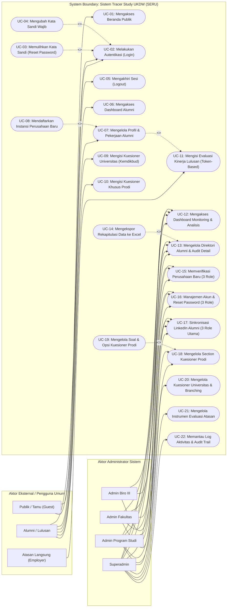

# Dokumen Spesifikasi Use Case Sistem Tracer Study (SERU - UKDW)

Dokumen ini merupakan spesifikasi lengkap Use Case (*Use Case Specification*) untuk sistem informasi **Tracer Study / SERU (Sistem Ekosistem Rekam Jejak Alumni)** pada **Universitas Kristen Duta Wacana (UKDW)**. Seluruh aktor, use case, alur kejadian (*flow of events*), prakondisi, pascakondisi, dan relasi disusun secara akurat berdasarkan arsitektur, rute, pengendali (*controller*), model, dan basis data aktual yang aktif pada aplikasi.

Sesuai prinsip pemodelan UML standar, proses bisnis yang identik antar-peran (seperti **Sinkronisasi Profil LinkedIn**, **Verifikasi Perusahaan Baru**, **Manajemen Akun & Reset Kata Sandi**, serta **Direktori Alumni**) dikonsolidasikan ke dalam **1 Use Case terpadu** dengan pembagian wewenang data (*data authorization scope*) yang terdefinisi secara presisi, serta dipresentasikan dalam **1 diagram proses tunggal yang utuh (tanpa terpisah)**.

---

## 1. Landasan Teori & Komponen UML Use Case

Berdasarkan standar Unified Modeling Language (UML), use case digunakan untuk memodelkan interaksi antara pengguna eksternal (*actor*) dengan fungsionalitas di dalam batas sistem (*system boundary*).

### Tabel 1.1 Daftar Diagram UML Terkait
| No | Diagram UML | Tujuan (*Purpose of the UML Diagram*) |
| :---: | :--- | :--- |
| 1 | **UML Use Case Diagram** | Memvisualisasikan fungsionalitas bisnis diskret sistem dari perspektif aktor eksternal serta menggambarkan batasan sistem (*system boundary*). |
| 2 | **UML Component Diagram** | Menunjukkan hubungan, ketergantungan (*dependencies*), dan organisasi antarkomponen perangkat lunak dalam sistem (seperti Controller, Service, Middleware, Provider LinkedIn API/MCP, dan Database). |
| 3 | **UML Deployment Diagram** | Menggambarkan topologi perangkat keras dan lingkungan *runtime* tempat komponen perangkat lunak dijalankan (Web Server Nginx/Apache, PHP 8.3 Runtime, MariaDB Database Server, dan Layanan Cloud). |

### Tabel 1.2 Komponen UML Use Case Diagram
| No | Nama Komponen | Notasi UML | Tujuan / Fungsi (*Purpose*) |
| :---: | :--- | :---: | :--- |
| 1 | **System Boundary** | Kotak Persegi Panjang (*Rectangle Box*) | • Mewakili batas dan cakupan (*scope*) dari sistem aplikasi Tracer Study. • Merangkum seluruh fungsionalitas diskret yang disediakan oleh sistem. • Memisahkan lingkungan internal sistem dari aktor eksternal. |
| 2 | **Actors** | *Stick Figure* | • Pengguna atau entitas luar yang berinteraksi dengan sistem. • Aktor dapat berupa manusia (Alumni, Admin, Pengguna Lulusan), organisasi, maupun sistem eksternal (LinkedIn Apify Provider). • Berinteraksi langsung dengan satu atau lebih use case melalui asosiasi. |
| 3 | **Usecases** | Elips / Oval | • Representasi visual dari fungsionalitas bisnis diskret dalam sistem. • Menjamin setiap proses bisnis terdefinisi secara independen, terukur, dan bermakna bagi pengguna. • Menjelaskan urutan tindakan yang menghasilkan nilai bagi aktor. |

### Tabel 1.3 Relasi Use Case UML (*Usecase Relationships*)
| No | Relasi Use Case | Notasi UML | Fungsionalitas & Penjelasan |
| :---: | :--- | :---: | :--- |
| 1 | **Association** | Garis Lurus Padat (*Solid Line*) | Menghubungkan aktor dengan use case yang diaksesnya tanpa arah spesifik. |
| 2 | **Directed Association** | Garis Panah Padat (*Solid Directed Line*) | Menunjukkan hubungan satu arah di mana aktor secara eksplisit memicu atau mengendalikan jalannya use case. |
| 3 | **Include** | Garis Putus-putus Berpanah dengan stereotipe `<<include>>` | Menunjukkan bahwa eksekusi use case dasar secara mutlak menyertakan fungsionalitas dari use case lain yang dituju (*mandatory inclusion*). |
| 4 | **Extend** | Garis Putus-putus Berpanah dengan stereotipe `<<extend>>` | Menunjukkan perluasan opsional di mana use case tambahan menyisipkan perilakunya ke use case dasar hanya jika kondisi tertentu terpenuhi (*optional branch*). |
| 5 | **Generalization** | Garis Panah Kosong / Segitiga (*Hollow Arrow*) | Hubungan hierarki antara use case induk (*parent*) dan satu atau lebih use case anak (*child*), di mana child mewarisi struktur dan menambahkan perilaku spesifik. |
| 6 | **Dependency** | Garis Putus-putus Berpanah (*Dashed Arrow*) | Menunjukkan dependensi fungsional di mana perubahan atau keberadaan suatu use case bergantung pada use case lain. |

---

## 2. Identifikasi Aktor Sistem (*Actors Identification*)

Sistem Tracer Study UKDW melibatkan 7 (tujuh) kategori aktor riil:

1. **Publik / Tamu (Guest)**  
   Pengunjung umum tanpa autentikasi yang dapat mengakses halaman utama (*Landing Page*), membaca informasi tracer study, dan mengakses halaman login.
2. **Alumni / Lulusan**  
   Mahasiswa UKDW yang telah lulus yudisium dan terdaftar di sistem. Bertugas memutakhirkan biodata, riwayat karir, mendaftarkan data instansi/atasan, serta mengisi kuesioner tracer study universitas dan program studi.
3. **Pengguna Lulusan / Atasan Langsung (Employer/Supervisor)**  
   Pimpinan atau atasan langsung di tempat alumni bekerja. Mengisi instrumen survei evaluasi kinerja lulusan secara aman melalui tautan khusus ber-token 64-karakter unik tanpa perlu proses pendaftaran akun.
4. **Admin Program Studi (Admin Prodi)**  
   Pengelola akademik pada masing-masing Program Studi. Bertugas mengelola instrumen kuesioner khusus prodi, memantau capaian alumni prodi, memverifikasi usulan perusahaan dari alumni prodi, mengelola akun mahasiswa se-prodi, dan menjalankan sinkronisasi profil LinkedIn untuk alumni prodinya.
5. **Admin Fakultas**  
   Pengelola tingkat Dekanat / Gugus Kendali Mutu Fakultas. Bertugas memantau statistik kelengkapan tracer study lintas program studi dalam fakultas, mengaudit direktori alumni fakultas, memverifikasi perusahaan se-fakultas, mengelola akun mahasiswa tingkat fakultas, dan menjalankan sinkronisasi profil LinkedIn untuk alumni se-fakultas.
6. **Admin Biro III (Kemahasiswaan, Alumni & Pengembangan Karir)**  
   Pengelola eksekutif universitas. Memantau KPI partisipasi dan *response rate* kampus, mengaudit data alumni se-universitas, mengekspor laporan, serta menjalankan integrasi sinkronisasi data karir alumni dari LinkedIn pada detail profil alumni.
7. **Superadmin**  
   Administrator sistem teknis tertinggi. Mengendalikan instrumen kuesioner universitas (Kemdikbudristek), kuesioner prodi, kuesioner evaluasi atasan, verifikasi perusahaan seluruh universitas, sinkronisasi massal (*batch*) LinkedIn se-kampus, manajemen akun seluruh peran, dan audit *log activities*.

---

## 3. Diagram UML Use Case Sistem

### 3.1 Visual Diagram UML Use Case Tunggal (Single Process Diagram)

Berikut adalah gambar visual UML Use Case Diagram sistem Tracer Study UKDW (SERU) dalam **1 gambar proses utuh**, yang memuat batas sistem (*system boundary*), aktor (*stick figure*), use case (*ellipse*), relasi (*association, include, extend, dependency*), dan catatan callout (*notes*) sesuai standar referensi:

> **File Asset Gambar Diagram**:
> - Format Gambar PNG (Resolusi Tinggi / Retina 2x): [docs/images/use_case_diagram.png](file:///c:/study/tracerstudy/docs/images/use_case_diagram.png)
> - Format Vektor SVG (Scalable Vector Graphics): [docs/images/use_case_diagram.svg](file:///c:/study/tracerstudy/docs/images/use_case_diagram.svg)

---

### 3.2 Diagram Use Case Interaktif (Mermaid Code Representation)

Diagram proses interaktif berikut memodelkan seluruh fungsionalitas sistem dalam **1 diagram alur tunggal**:

---

## 4. Daftar Ringkasan Use Case (*Use Case Master Index*)

Sistem Tracer Study UKDW merangkum **22 Use Case diskret** yang mencakup seluruh alur bisnis aplikasi:

| ID Use Case | Nama Use Case | Aktor Terlibat | Catatan & Relasi UML |
| :--- | :--- | :--- | :--- |
| **UC-01** | Mengakses Beranda Publik (*Landing Page*) | Publik / Tamu, Seluruh Pengguna | Association |
| **UC-02** | Melakukan Autentikasi Pengguna (*Login*) | Alumni, Seluruh Staf Admin | Association |
| **UC-03** | Memulihkan Kata Sandi (*Forgot & Reset Password*) | Alumni, Seluruh Staf Admin | `<<extend>>` ke UC-02 |
| **UC-04** | Mengubah Kata Sandi Bawaan Wajib (*Must Change Password*) | Alumni (Sandi Bawaan Tanggal Lahir) | `<<include>>` dari UC-02 |
| **UC-05** | Mengakhiri Sesi Akun (*Logout*) | Seluruh Pengguna Terautentikasi | Association |
| **UC-06** | Mengakses Dashboard Alumni | Alumni | Association |
| **UC-07** | Mengelola Profil Biodata & Riwayat Karir | Alumni | Memicu Token Evaluasi ke UC-11 |
| **UC-08** | Mendaftarkan Instansi Perusahaan Baru | Alumni | `<<extend>>` ke UC-07 |
| **UC-09** | Mengisi Kuesioner Tracer Study Universitas (Kemdikbud) | Alumni | Association |
| **UC-10** | Mengisi Kuesioner Khusus Program Studi | Alumni | Association |
| **UC-11** | Mengisi Evaluasi Kinerja Lulusan (Token-Based) | Pengguna Lulusan / Atasan Langsung | Dependency dari UC-07 (Tanpa Login) |
| **UC-12** | Mengakses Dashboard Monitoring & Analisis Kinerja | Admin Prodi, Fak, Biro III, Superadmin | Association (Multi-Role Scope) |
| **UC-13** | Mengelola Direktori Alumni & Audit Detail | Admin Prodi, Fak, Biro III, Superadmin | Association (Multi-Role Scope) |
| **UC-14** | Mengekspor Rekapitulasi Data Alumni ke Excel | Admin Prodi, Fak, Biro III, Superadmin | `<<extend>>` ke UC-13 |
| **UC-15** | Memverifikasi Pengajuan Perusahaan Baru | **Admin Prodi, Admin Fakultas, Superadmin** | Association (**1 Proses untuk 3 Role**) |
| **UC-16** | Mengelola Akun Alumni & Reset Sandi Default | **Admin Prodi, Admin Fakultas, Superadmin** | Association (**1 Proses untuk 3 Role**) |
| **UC-17** | Melakukan Sinkronisasi Profil LinkedIn Alumni | **Admin Prodi, Admin Fakultas, Superadmin**, Biro III | Association (**1 Proses untuk 3 Role Utama**) |
| **UC-18** | Mengelola Bagian (*Section*) Kuesioner Prodi | Admin Program Studi, Superadmin | Association |
| **UC-19** | Mengelola Butir Pertanyaan & Opsi Kuesioner Prodi | Admin Program Studi, Superadmin | `<<include>>` ke UC-18 |
| **UC-20** | Mengelola Kuesioner Universitas, Section & Branching | Superadmin | Association |
| **UC-21** | Mengelola Instrumen Evaluasi Atasan Langsung | Superadmin | Association |
| **UC-22** | Memantau Log Aktivitas & Audit Trail Sistem | Superadmin | Association |

---

## 5. Spesifikasi Rinci Deskripsi Use Case (*Use Case Specifications*)

---

### UC-01. Mengakses Beranda Publik (Landing Page)
- **Usecase ID**: UC-01
- **Usecase Name**: Mengakses Beranda Publik (*Landing Page*)
- **Actors Involved**: Publik / Tamu (Guest), Seluruh Pengguna
- **Description**: Menampilkan profil sistem informasi Tracer Study UKDW (SERU), statistik ringkas, pengumuman urgensi pelacakan jejak alumni bagi akreditasi, serta navigasi menuju halaman login.
- **Preconditions**: Perangkat pengguna terhubung ke jaringan internet dan dapat mengakses alamat URL sistem (`/`).
- **Main Flow (Basic Flow)**:
  1. Pengguna membuka URL utama aplikasi (`GET /`).
  2. Sistem merespons dengan menampilkan *Landing Page* beranda publik yang memuat sambutan, panduan pengisian, dan tombol "Masuk / Login".
  3. Pengguna membaca informasi yang disajikan.
- **Alternate Flow (Alternative Flow)**:
  - Jika pengguna memilih tombol "Masuk / Login", sistem mengarahkan pengguna ke halaman Login (`GET /login`) [Menuju UC-02].
  - Jika pengguna adalah atasan yang membuka tautan dari email, pengguna langsung diarahkan ke form evaluasi [Menuju UC-11].
- **Post Conditions**: Pengguna mendapatkan informasi umum mengenai kegiatan Tracer Study UKDW.

---

### UC-02. Melakukan Autentikasi Pengguna (Login)
- **Usecase ID**: UC-02
- **Usecase Name**: Melakukan Autentikasi Pengguna (*Login*)
- **Actors Involved**: Alumni / Lulusan, Admin Program Studi, Admin Fakultas, Admin Biro III, Superadmin
- **Description**: Memverifikasi identitas pengguna berdasarkan kredensial (Username/NIM dan Kata Sandi) untuk memberikan hak akses sesi ke menu dan modul sesuai perannya (*Role-Based Access Control*).
- **Preconditions**: Pengguna sudah memiliki akun terdaftar di sistem Tracer Study dan membuka halaman `/login`.
- **Main Flow (Basic Flow)**:
  1. Pengguna memasukkan `username` (NIM untuk alumni, NIP/Username untuk admin) dan `password`.
  2. Pengguna menekan tombol "Masuk".
  3. Sistem memvalidasi kredensial terhadap tabel `users`.
  4. Sistem memeriksa flag `must_change_password`:
     - Jika bernilai `false`, sistem mengarahkan pengguna ke Dashboard sesuai peran masing-masing:
       - Alumni $\rightarrow$ `/alumni/dashboard`
       - Admin Prodi $\rightarrow$ `/prodi/dashboard`
       - Admin Fakultas $\rightarrow$ `/fakultas/dashboard`
       - Admin Biro III $\rightarrow$ `/biro3/dashboard`
       - Superadmin $\rightarrow$ `/superadmin/dashboard`
  5. Sesi login pengguna resmi aktif.
- **Alternate Flow (Alternative Flow)**:
  - **A1. Kredensial Tidak Cocok**: Sistem menampilkan pesan kesalahan "Kombinasi username atau password salah" dan pengguna diminta mengisi ulang.
  - **A2. Password Bawaan Pertama Kali (`must_change_password = true`)**: Sistem mengarahkan paksa pengguna ke rute `/change-password` [Menuju UC-04].
  - **A3. Lupa Kata Sandi**: Pengguna mengklik tautan "Lupa Kata Sandi" [Menuju UC-03].
- **Post Conditions**: Pengguna berhasil masuk ke dalam sistem dengan token sesi yang valid dan diarahkan ke antarmuka kerja sesuai perannya.

---

### UC-03. Memulihkan Kata Sandi (Forgot & Reset Password)
- **Usecase ID**: UC-03
- **Usecase Name**: Memulihkan Kata Sandi (*Forgot & Reset Password*)
- **Actors Involved**: Alumni / Lulusan, Seluruh Pengguna Terdaftar
- **Description**: Fasilitas pemulihan kata sandi mandiri melalui pengiriman tautan token acak ke alamat email terdaftar pengguna.
- **Preconditions**: Pengguna berada pada halaman login (`/login`) dan tidak mengingat kata sandinya.
- **Main Flow (Basic Flow)**:
  1. Pengguna mengklik opsi "Lupa Kata Sandi" dan diarahkan ke form `/forgot-password`.
  2. Pengguna memasukkan alamat email terdaftar dan menekan tombol "Kirim Link Reset".
  3. Sistem memeriksa keberadaan email di database `users`.
  4. Sistem menghasilkan token reset acak, menyimpannya di tabel pemulihan sandi, dan mengirimkan email resmi berisi URL tautan reset (`/reset-password/{token}`).
  5. Pengguna membuka email, mengklik tautan, dan mengisi formulir kata sandi baru.
  6. Sistem memverifikasi token, mengupdate sandi terenkripsi di database, dan menghapus token reset yang telah dipakai.
  7. Sistem mengarahkan pengguna kembali ke halaman Login dengan pesan sukses.
- **Alternate Flow (Alternative Flow)**:
  - **A1. Email Tidak Ditemukan**: Sistem menampilkan notifikasi bahwa alamat email tidak terdaftar di sistem.
  - **A2. Token Kedaluwarsa / Tidak Valid**: Sistem menolak akses form reset sandi dan meminta pengguna mengirimkan ulang permintaan pemulihan.
- **Post Conditions**: Kata sandi akun berhasil diperbarui dan pengguna dapat login dengan kata sandi yang baru.

---

### UC-04. Mengubah Kata Sandi Bawaan Wajib (Force Change Password)
- **Usecase ID**: UC-04
- **Usecase Name**: Mengubah Kata Sandi Bawaan Wajib (*Must Change Password*)
- **Actors Involved**: Alumni / Lulusan
- **Description**: Memaksa alumni yang baru pertama kali login menggunakan password bawaan tanggal lahir (`DDMMYYYY`) atau setelah direset oleh admin untuk menentukan kata sandi pribadi yang aman sebelum dapat mengakses fitur aplikasi.
- **Preconditions**: Alumni berhasil login, namun atribut `must_change_password` pada akun bernilai `true`.
- **Main Flow (Basic Flow)**:
  1. Sistem mencegat akses alumni via middleware `must_change_password` dan mengarahkan ke form `/change-password`.
  2. Alumni memasukkan kata sandi saat ini (*current password*), kata sandi baru (*minimal 8 karakter*), dan konfirmasi kata sandi baru.
  3. Sistem memvalidasi kesesuaian input.
  4. Sistem memperbarui hash password baru di tabel `users` dan mengubah flag `must_change_password` menjadi `false`.
  5. Sistem mengarahkan alumni ke halaman `/alumni/dashboard`.
- **Alternate Flow (Alternative Flow)**:
  - Jika kata sandi saat ini keliru atau konfirmasi kata sandi tidak cocok, sistem menampilkan pesan peringatan dan formulir tetap terbuka.
- **Post Conditions**: Kata sandi akun alumni berubah menjadi kata sandi pribadi yang aman dan batasan middleware dihilangkan.

---

### UC-05. Mengakhiri Sesi Akun (Logout)
- **Usecase ID**: UC-05
- **Usecase Name**: Mengakhiri Sesi Akun (*Logout*)
- **Actors Involved**: Seluruh Pengguna Terautentikasi (Alumni, Admin Prodi, Fak, Biro III, Superadmin)
- **Description**: Menutup sesi autentikasi pengguna secara aman, membatalkan token sesi, meregenerasi CSRF token, dan mengembalikan pengguna ke halaman beranda publik.
- **Preconditions**: Pengguna dalam keadaan login aktif.
- **Main Flow (Basic Flow)**:
  1. Pengguna menekan tombol "Keluar / Logout" pada menu navigasi.
  2. Sistem menerima permintaan (`POST` / `GET /logout`).
  3. Sistem menghapus data sesi pengguna (`Auth::logout()`), membatalkan sesi (`$request->session()->invalidate()`), dan meregenerasi token CSRF (`$request->session()->regenerateToken()`).
  4. Sistem mengarahkan pengguna kembali ke halaman utama publik (`/`).
- **Alternate Flow (Alternative Flow)**: Tidak ada alur alternatif.
- **Post Conditions**: Sesi pengguna berakhir sepenuhnya dan hak akses ke menu internal dicabut.

---

### UC-06. Mengakses Dashboard Alumni
- **Usecase ID**: UC-06
- **Usecase Name**: Mengakses Dashboard Alumni
- **Actors Involved**: Alumni / Lulusan
- **Description**: Menyajikan ringkasan status kelengkapan pengisian tracer study alumni: persentase pengisian kuesioner universitas, kuesioner program studi, riwayat pekerjaan, status evaluasi atasan, serta tautan cepat ke modul yang belum lengkap.
- **Preconditions**: Alumni telah login dan menyelesaikan perubahan kata sandi bawaan (`/alumni/dashboard`).
- **Main Flow (Basic Flow)**:
  1. Alumni membuka dashboard.
  2. Sistem menghitung status kelengkapan data via `KelengkapanTracerService`:
     - Kuesioner Universitas (persentase & status selesai/belum).
     - Kuesioner Prodi (status selesai/belum).
     - Kelengkapan Profil & Data Karir.
     - Status konfirmasi atasan (apakah sudah mengisi evaluasi).
  3. Sistem menampilkan kartu status dan tombol aksi cepat (*call-to-action*) menuju pengisian formulir.
- **Alternate Flow (Alternative Flow)**:
  - Jika seluruh kuesioner telah lengkap 100%, sistem menampilkan badge "Tracer Study Selesai" dan pesan apresiasi.
- **Post Conditions**: Alumni memahami status kontribusinya pada tracer study kampus.

---

### UC-07. Mengelola Profil Biodata & Riwayat Karir
- **Usecase ID**: UC-07
- **Usecase Name**: Mengelola Profil Biodata & Riwayat Karir
- **Actors Involved**: Alumni / Lulusan
- **Description**: Memutakhirkan data identitas pribadi (email aktif, nomor HP, kontak darurat, alamat domisili), riwayat jabatan, instansi tempat bekerja, profil media sosial/LinkedIn, serta memasukkan nama dan email atasan langsung.
- **Preconditions**: Alumni berada pada menu `/alumni/profile`.
- **Main Flow (Basic Flow)**:
  1. Sistem menampilkan form profil biodata yang memuat data akademik (NIM, Nama, IPK, Tahun Lulus - *readonly*) dan data kontak/karir (*editable*).
  2. Alumni mengisi kontak terkini, tautan profil LinkedIn, status pekerjaan saat ini, memilih perusahaan dari daftar master, posisi jabatan, serta mengisi nama & email atasan langsung.
  3. Alumni menekan tombol "Simpan Perubahan" (`POST /alumni/profile`).
  4. Sistem memvalidasi kelengkapan data.
  5. Sistem memperbarui tabel `biodata` dan riwayat pekerjaan.
  6. **Pemicu Evaluasi Atasan**: Jika email atasan diisi dan instansi terdaftar, sistem membuat token evaluasi unik 64-karakter pada tabel `evaluasi_atasan` dan mengirimkan email undangan survei evaluasi kinerja ke atasan langsung [Memicu UC-11].
  7. Sistem menampilkan notifikasi sukses pembaruan profil.
- **Alternate Flow (Alternative Flow)**:
  - **A1. Perusahaan Belum Ada di Master**: Alumni memilih opsi "Tambah Perusahaan Baru" [Menuju UC-08].
- **Post Conditions**: Data profil dan pekerjaan alumni terbarui di basis data; token evaluasi atasan tercipta.

---

### UC-08. Mendaftarkan Instansi Perusahaan Baru
- **Usecase ID**: UC-08
- **Usecase Name**: Mendaftarkan Instansi Perusahaan Baru
- **Actors Involved**: Alumni / Lulusan
- **Description**: Fasilitas bagi alumni untuk mengusulkan nama instansi/perusahaan tempat ia bekerja jika belum tersedia pada basis data master perusahaan kampus.
- **Preconditions**: Alumni sedang membuka form profil pekerjaan dan perusahaan tidak ditemukan pada daftar pilihan.
- **Main Flow (Basic Flow)**:
  1. Alumni menekan tombol "Tambah Perusahaan Baru".
  2. Sistem menampilkan modal pop-up pendaftaran perusahaan baru.
  3. Alumni mengisi: Nama Perusahaan, Sektor Usaha (BUMN, Swasta, Pendidikan, Wirausaha, dll), Alamat, Kota/Kabupaten, Provinsi, dan Negara.
  4. Alumni menekan tombol "Kirim Pengajuan" (`POST /alumni/company`).
  5. Sistem menyimpan entitas baru ke tabel `perusahaan` dengan status `Menunggu Verifikasi` dan mengaitkan `created_by_prodi_id` sesuai prodi alumni.
  6. Sistem otomatis memilih perusahaan tersebut pada form profil alumni.
  7. Sistem menampilkan notifikasi bahwa pengajuan instansi berhasil dan akan diverifikasi oleh admin.
- **Alternate Flow (Alternative Flow)**:
  - Jika nama instansi mirip dengan yang sudah ada di master, sistem menyarankan nama instansi yang sudah terverifikasi.
- **Post Conditions**: Entitas perusahaan baru tercipta dengan status `Menunggu Verifikasi` dan masuk ke antrean verifikasi admin [UC-15].

---

### UC-09. Mengisi Kuesioner Tracer Study Universitas (Kemdikbudristek)
- **Usecase ID**: UC-09
- **Usecase Name**: Mengisi Kuesioner Tracer Study Universitas (Kemdikbud)
- **Actors Involved**: Alumni / Lulusan
- **Description**: Menjawab rangkaian butir pertanyaan kuesioner pelacakan jejak alumni standar nasional (Kemdikbudristek) dengan mekanisme otomatis percabangan alur logika (*dynamic branching logic*).
- **Preconditions**: Alumni membuka rute `/alumni/kuesioner`.
- **Main Flow (Basic Flow)**:
  1. Sistem memuat kuesioner universitas aktif beserta seksi-seksi pertanyaan (`kelompok_pertanyaan`).
  2. Alumni menjawab pertanyaan per bagian (pilihan tunggal, pilihan ganda, isian teks, angka gaji/penghasilan, waktu tunggu kerja, dan skala keselarasan).
  3. **Logika Branching**: Jika alumni memilih opsi tertentu (misal: "Belum Bekerja"), sistem secara dinamis melompati (*jump to*) pertanyaan mengenai detail instansi pekerjaan sesuai konfigurasi `jump_to`.
  4. Alumni menekan tombol "Simpan Jawaban" (`POST /alumni/kuesioner`).
  5. Sistem memvalidasi isian wajib (*is_required*), menyimpan jawaban ke tabel `jawaban`, dan memperbarui status kelengkapan kuesioner nasional.
  6. Sistem menampilkan pesan terima kasih dan memperbarui persentase dashboard alumni.
- **Alternate Flow (Alternative Flow)**:
  - Jika terdapat pertanyaan wajib yang terlewat, sistem memfokuskan layar ke butir pertanyaan bersangkutan dan menampilkan peringatan validasi.
- **Post Conditions**: Respon kuesioner nasional tersimpan secara permanen di database dan siap diolah untuk pelaporan Dikti.

---

### UC-10. Mengisi Kuesioner Khusus Program Studi
- **Usecase ID**: UC-10
- **Usecase Name**: Mengisi Kuesioner Khusus Program Studi
- **Actors Involved**: Alumni / Lulusan
- **Description**: Menjawab butir-butir instrumen survei mandiri yang dirancang khusus oleh program studi asal alumni untuk mengukur relevansi kurikulum, fasilitas lab, dan kompetensi spesifik prodi.
- **Preconditions**: Program studi alumni memiliki paket kuesioner aktif (`/alumni/kuesioner-prodi`).
- **Main Flow (Basic Flow)**:
  1. Sistem mengambil konfigurasi bagian (`prodi_question_section`) dan butir pertanyaan (`prodi_question`) khusus untuk `prodi_id` alumni yang login.
  2. Alumni mengisi respon kuesioner (pilihan ganda, skala likert kepuasan, masukan esai kurikulum).
  3. Alumni menekan tombol "Kirim Kuesioner Prodi" (`POST /alumni/kuesioner-prodi`).
  4. Sistem menyimpan respon ke tabel `prodi_response` dan detail pilihan ke `prodi_response_answer`.
  5. Sistem menandai status penyelesaian kuesioner prodi alumni menjadi selesai.
- **Alternate Flow (Alternative Flow)**:
  - Jika prodi alumni belum merilis pertanyaan kuesioner khusus, sistem menampilkan notifikasi ramah bahwa kuesioner prodi belum tersedia dan langsung menandai statusnya valid.
- **Post Conditions**: Respon survei prodi tersimpan rapi untuk kebutuhan evaluasi kurikulum dan akreditasi prodi (LAM Infokom, LAM Teknik, dll).

---

### UC-11. Mengisi Evaluasi Kinerja Lulusan (Token-Based Employer Survey)
- **Usecase ID**: UC-11
- **Usecase Name**: Mengisi Evaluasi Kinerja Lulusan (*Token-Based*)
- **Actors Involved**: Pengguna Lulusan / Atasan Langsung (Employer/Supervisor)
- **Description**: Pengisian instrumen survei evaluasi kepuasan pengguna lulusan oleh pimpinan/atasan tempat alumni bekerja melalui tautan token acak 64-karakter tanpa perlu melakukan registrasi akun atau login ke sistem.
- **Preconditions**: Atasan menerima email resmi berisi URL ber-token unik (`/evaluasi-atasan/{token}`).
- **Main Flow (Basic Flow)**:
  1. Atasan mengklik tautan evaluasi dari email.
  2. Sistem memvalidasi token terhadap tabel `evaluasi_atasan`:
     - Token valid, belum kedaluwarsa, dan belum pernah disubmit (`status_pengisian = false`).
  3. Sistem menampilkan formulir evaluasi yang menyajikan nama alumni, instansi, serta butir penilaian kinerja (etika, keahlian bidang ilmu, komunikasi, kerjasama tim, kepemimpinan, dan pengembangan diri).
  4. Atasan mengisi penilaian skala likert serta masukan kualitatif.
  5. Atasan menekan tombol "Kirim Evaluasi" (`POST /evaluasi-atasan/{token}`).
  6. Sistem menyimpan jawaban ke tabel `jawaban_evaluasi_atasan`, mengubah status token menjadi `true` (*closed*), dan mencatat stempel waktu pengisian.
  7. Sistem menampilkan ucapan terima kasih resmi dari Rektorat UKDW.
- **Alternate Flow (Alternative Flow)**:
  - **A1. Token Tidak Ditemukan**: Sistem menampilkan halaman error 404 (Token Tidak Valid).
  - **A2. Formulir Sudah Pernah Diisi**: Sistem menampilkan halaman informasi bahwa survei untuk alumni tersebut telah selesai diisi sebelumnya.
- **Post Conditions**: Hasil evaluasi atasan tersimpan aman dan token dinonaktifkan sehingga tidak dapat disubmit ulang.

---

### UC-12. Mengakses Dashboard Monitoring & Analisis Kinerja (Multi-Role Scope)
- **Usecase ID**: UC-12
- **Usecase Name**: Mengakses Dashboard Monitoring & Analisis Kinerja
- **Actors Involved**: Admin Program Studi, Admin Fakultas, Admin Biro III, Superadmin
- **Description**: Pusat analisis data visual dan pemantauan Indikator Kinerja Utama (KPI) Tracer Study kampus, menampilkan metrik keterisian responden, rasio respon (*response rate*), status alumni tersinkron LinkedIn, serta perbandingan kinerja antar-unit sesuai hak akses peran.
- **Scope & Role Authorization**:
  - **Admin Prodi** (`/prodi/dashboard`): Menampilkan total alumni prodi, jumlah alumni mengisi, persentase kelengkapan prodi, dan daftar kuesioner prodi aktif.
  - **Admin Fakultas** (`/fakultas/dashboard`): Menampilkan total agregat alumni fakultas, persentase keterisian fakultas, dan tabel komparasi capaian partisipasi per program studi dalam fakultas.
  - **Admin Biro III** (`/biro3/dashboard`): Menampilkan KPI Tracer Study universitas, total responden unik nasional, response rate kampus, dan status tautan LinkedIn alumni.
  - **Superadmin** (`/superadmin/dashboard`): Menampilkan ringkasan global universitas, status keaktifan paket kuesioner Kemdikbud, antrean verifikasi perusahaan se-kampus, dan log audit aktivitas terbaru.
- **Preconditions**: Aktor telah terautentikasi dan memiliki hak akses peran administrator terkait.
- **Main Flow (Basic Flow)**:
  1. Aktor mengakses rute dashboard perannya.
  2. Pengendali dashboard menghitung metrik agregat data secara otomatis dari database dengan membatasi cakupan filter peran (*role scoping*).
  3. Sistem menyajikan kartu metrik, grafik perkembangan, dan tabel perbandingan capaian.
- **Alternate Flow (Alternative Flow)**:
  - Pengguna dapat mengklik kartu metrik untuk berpindah langsung ke direktori alumni atau antrean verifikasi perusahaan.
- **Post Conditions**: Administrator memperoleh visualisasi analitik kinerja pelacakan alumni yang akurat dan *real-time*.

---

### UC-13. Mengelola Direktori Alumni & Audit Detail (Multi-Role Scope)
- **Usecase ID**: UC-13
- **Usecase Name**: Mengelola Direktori Alumni & Audit Detail
- **Actors Involved**: Admin Program Studi, Admin Fakultas, Admin Biro III, Superadmin
- **Description**: Menelusuri seluruh data alumni, melakukan pencarian dan penyaringan berjenjang (angkatan, prodi, status kerja), meninjau rincian biodata, riwayat karir (keahlian & pengalaman), lembar respon kuesioner nasional, respon kuesioner prodi, kuesioner atasan, serta navigasi terarah (*deep link*) ke modul sinkronisasi LinkedIn.
- **Scope & Role Authorization**:
  - **Admin Prodi** (`/prodi/alumni`): Terbatas pada alumni program studinya sendiri.
  - **Admin Fakultas** (`/fakultas/alumni`): Alumni seluruh prodi dalam naungan fakultasnya (disertai dropdown filter prodi fakultas).
  - **Admin Biro III** (`/biro3/alumni`): Seluruh alumni universitas lintas fakultas dan prodi.
  - **Superadmin** (`/superadmin/alumni`): Akses audit global seluruh alumni universitas dilengkapi deep link audit scraping LinkedIn.
- **Preconditions**: Aktor membuka modul direktori alumni sesuai perannya.
- **Main Flow (Basic Flow)**:
  1. Sistem menyajikan daftar tabel alumni sesuai batasan hak akses peran.
  2. Aktor menerapkan filter pencarian (NIM, Nama, Angkatan, Program Studi, Status Bekerja).
  3. Aktor mengklik salah satu nama alumni untuk membuka halaman detail audit (`{base_route}/alumni/{id}`).
  4. Sistem menampilkan tabulasi lengkap: Profil Biodata, Riwayat Karir (`skills` & `experience`), Lembar Jawaban Kuesioner Universitas, Jawaban Kuesioner Prodi, dan Evaluasi Atasan.
  5. Aktor dapat mengoreksi data profil jika ditemukan ketidaksesuaian (`POST {base_route}/alumni/{id}/profile`).
  6. **Deep Link ke LinkedIn Sync**: Pada halaman detail alumni, admin dapat mengklik logo LinkedIn / tombol sinkronisasi untuk langsung membuka modul sinkronisasi LinkedIn dengan parameter `alumni_id` dan `search` otomatis.
- **Alternate Flow (Alternative Flow)**:
  - Aktor dapat mengunduh berkas laporan dalam format Excel [UC-14].
- **Post Conditions**: Data direktori alumni terpantau, terverifikasi keabsahannya, dan siap diaudit.

---

### UC-14. Mengekspor Rekapitulasi Data Alumni ke Excel
- **Usecase ID**: UC-14
- **Usecase Name**: Mengekspor Rekapitulasi Data Alumni ke Excel
- **Actors Involved**: Admin Program Studi, Admin Fakultas, Admin Biro III, Superadmin
- **Description**: Mengunduh rekapitulasi data tracer study alumni dalam berkas spreadsheet Excel (`.xlsx`) resmi sesuai batasan wewenang unit kerja untuk keperluan akreditasi prodi/institusi atau pelaporan Dikti.
- **Preconditions**: Aktor berada pada direktori alumni atau detail alumni dan menekan tombol "Ekspor Excel".
- **Main Flow (Basic Flow)**:
  1. Aktor menekan tombol "Ekspor ke Excel" (`GET {base_route}/alumni/export-excel` atau per alumni `{id}/export-excel`).
  2. Sistem melalui `AlumniTracerExcelExporter` menyaring data alumni sesuai cakupan peran:
     - Admin Prodi $\rightarrow$ Rekap khusus prodi bersangkutan.
     - Admin Fakultas $\rightarrow$ Rekap seluruh prodi se-fakultas.
     - Admin Biro III / Superadmin $\rightarrow$ Rekap universitas menyeluruh.
  3. Sistem mengompilasi baris data (data diri, pekerjaan, instansi, detail jawaban kuesioner) ke lembar kerja Excel berformat standar Dikti.
  4. Browser mengunduh berkas file spreadsheet biner secara otomatis.
- **Alternate Flow (Alternative Flow)**:
  - Jika data kosong berdasarkan filter yang dipilih, berkas Excel yang diunduh hanya memuat baris header kolom.
- **Post Conditions**: File rekapitulasi data Excel tersimpan di komputer lokal pengguna.

---

### UC-15. Memverifikasi Pengajuan Perusahaan Baru (1 Proses untuk 3 Role)
- **Usecase ID**: UC-15
- **Usecase Name**: Memverifikasi Pengajuan Perusahaan Baru
- **Actors Involved**: **Admin Program Studi, Admin Fakultas, Superadmin**
- **Description**: Memvalidasi, mengoreksi, mengesahkan, menolak, atau mengalihkan pengajuan data entitas perusahaan baru dari alumni yang berstatus `Menunggu Verifikasi` agar basis data industri mitra kampus konsisten, valid, dan bebas dari duplikasi nama.
- **Scope & Role Authorization (3 Role)**:
  1. **Admin Program Studi** (`/prodi/perusahaan`): Memverifikasi pengajuan instansi dari alumni program studinya sendiri (`created_by_prodi_id = prodi admin`).
  2. **Admin Fakultas** (`/fakultas/perusahaan`): Memverifikasi pengajuan instansi dari alumni seluruh prodi dalam fakultasnya.
  3. **Superadmin** (`/superadmin/perusahaan`): Otoritas tertinggi verifikasi seluruh pengajuan instansi se-universitas dengan opsi filter per prodi.
- **Preconditions**: Terdapat entitas perusahaan berstatus `Menunggu Verifikasi` pada database `perusahaan` sesuai cakupan wewenang peran yang login.
- **Main Flow (Basic Flow)**:
  1. Aktor membuka menu verifikasi perusahaan (`{base_route}/perusahaan`).
  2. Sistem menampilkan daftar pengajuan instansi yang menunggu persetujuan (Nama, Sektor, Alamat, Alumni Pengaju).
  3. Sistem melalui algoritma *string similarity* secara otomatis menampilkan skor kemiripan dan merekomendasikan perusahaan master terverifikasi yang mirip jika terdeteksi indikasi duplikasi.
  4. Aktor memilih salah satu dari 4 opsi tindakan keputusan:
     - **Opsi A - Setujui Baru (Verify)**: Mengesahkan perusahaan menjadi entitas master terverifikasi (`POST {base_route}/perusahaan/{id}/verify`).
     - **Opsi B - Alihkan ke Master Terdaftar (Replace)**: Mengalihkan relasi tempat kerja alumni ke perusahaan master yang sudah ada, lalu menghapus data usulan duplikat (`POST {base_route}/perusahaan/{id}/replace`).
     - **Opsi C - Koreksi & Verifikasi (Update & Verify)**: Memperbaiki ejaan nama, sektor usaha, atau alamat perusahaan lalu langsung memverifikasi (`PUT {base_route}/perusahaan/{id}`).
     - **Opsi D - Tolak Pengajuan (Reject)**: Menolak pengajuan karena instansi fiktif atau tidak valid (`POST {base_route}/perusahaan/{id}/reject`).
  5. Sistem memperbarui basis data dan mencatat tindakan pada log audit aktivitas (`log_activities`).
  6. Sistem memunculkan notifikasi sukses keputusan verifikasi.
- **Alternate Flow (Alternative Flow)**:
  - Aktor menggunakan fitur pencarian master instansi (`GET {base_route}/perusahaan/search-verified`) untuk mencari nama perusahaan resmi sebelum menentukan aksi replace.
- **Post Conditions**: Status pengajuan perusahaan diperbarui menjadi `Terverifikasi`, `Ditolak`, atau dialihkan ke master perusahaan sah.

---

### UC-16. Mengelola Akun Alumni & Reset Sandi Default (1 Proses untuk 3 Role)
- **Usecase ID**: UC-16
- **Usecase Name**: Mengelola Akun Alumni & Reset Sandi Default
- **Actors Involved**: **Admin Program Studi, Admin Fakultas, Superadmin**
- **Description**: Mengelola akun pengguna (memperbarui email, username, nama) dan memfasilitasi pemulihan akses akun alumni yang mengalami kendala login dengan mereset kata sandi secara aman kembali ke standar tanggal lahir bawaan (`DDMMYYYY`), mengaktifkan flag wajib ganti sandi, serta mengirimkan notifikasi email resmi.
- **Scope & Role Authorization (3 Role)**:
  1. **Admin Program Studi** (`/prodi/manajemen-akun`): Khusus mengelola dan mereset akun alumni di bawah prodi admin.
  2. **Admin Fakultas** (`/fakultas/manajemen-akun`): Mengelola dan mereset akun alumni lintas prodi di bawah fakultas admin.
  3. **Superadmin** (`/superadmin/manajemen-akun`): Mengelola akun dari seluruh peran (`admin_fakultas`, `admin_prodi`, `alumni`) se-universitas.
- **Preconditions**: Aktor membuka menu manajemen akun pada rutenya masing-masing.
- **Main Flow (Basic Flow)**:
  1. Sistem menampilkan daftar akun pengguna sesuai cakupan filter peran.
  2. Aktor mencari akun berdasarkan NIM, Nama, atau Email.
  3. **Pembaruan Profil Akun**: Aktor dapat mengedit email atau nama pengguna lalu menyimpan (`PUT {base_route}/manajemen-akun/{id}`).
  4. **Reset Sandi Bawaan**: Jika alumni lupa akses, aktor menekan tombol "Reset Default & Notify" (`POST {base_route}/manajemen-akun/{id}/reset-default-notify`).
  5. Sistem mengambil tanggal lahir alumni dari tabel `data_akademik`, memformat menjadi `DDMMYYYY`, mengenkripsi menjadi hash password baru di tabel `users`, dan menyetel `must_change_password = true`.
  6. Sistem mengirimkan surat elektronik resmi ke alamat email alumni berisi pemberitahuan reset sandi default dan instruksi login.
  7. Sistem mencatat tindakan reset ke tabel `log_activities`.
  8. Sistem memunculkan notifikasi sukses reset akun.
- **Alternate Flow (Alternative Flow)**:
  - Jika tanggal lahir di tabel data akademik kosong, sistem menampilkan peringatan validasi agar admin melengkapi tanggal lahir terlebih dahulu.
- **Post Conditions**: Kata sandi akun alumni kembali ke tanggal lahir default, flag ganti sandi wajib aktif, dan alumni menerima notifikasi di email.

---

### UC-17. Melakukan Sinkronisasi Profil LinkedIn Alumni (1 Proses untuk 3 Role Utama)
- **Usecase ID**: UC-17
- **Usecase Name**: Melakukan Sinkronisasi Profil LinkedIn Alumni (Single & Batch Sync)
- **Actors Involved**: **Admin Program Studi, Admin Fakultas, Superadmin** *(Didukung oleh Admin Biro III)*
- **Description**: Mengambil data posisi jabatan terkini, nama instansi tempat bekerja, riwayat pengalaman kerja (*experience*), daftar keahlian (*skills*), dan foto profil fisik alumni dari LinkedIn secara otomatis menggunakan layanan scraper/provider terintegrasi (LinkedIn Profile Provider / Apify) secara satuan (*single sync*) maupun massal (*batch sync*), meninjau hasil ekstraksi pada modal peninjauan (*staging review*), menyetujui (*approve*) atau menolak (*reject*) hasil sinkronisasi, serta meninjau riwayat riil sinkronisasi (*history*).
- **Scope & Role Authorization (3 Role Utama & Biro III)**:
  1. **Admin Program Studi** (`/prodi/linkedin-sync`): Mengelola sinkronisasi direktori alumni khusus program studinya sendiri.
  2. **Admin Fakultas** (`/fakultas/linkedin-sync`): Mengelola sinkronisasi alumni dari seluruh program studi dalam naungan fakultasnya.
  3. **Superadmin** (`/superadmin/linkedin-sync`): Mengelola sinkronisasi alumni menyeluruh se-universitas lintas fakultas dan angkatan, lengkap dengan integrasi tombol aksi cepat buka audit alumni (`/superadmin/alumni/{id}`).
  4. **Admin Biro III** (`/biro3/alumni/{id}/sync-linkedin`): Menjalankan sinkronisasi satuan pada saat memeriksa detail profil alumni universitas.
- **Preconditions**: Alumni memiliki profil/username LinkedIn yang tersimpan di sistem, dan aktor membuka modul sinkronisasi LinkedIn pada rutenya masing-masing.
- **Main Flow (Basic Flow)**:
  1. Sistem menampilkan direktori alumni lengkap dengan filter Tahun Kelulusan, Target Periode, Semester, Prodi, dan Status Sinkronisasi (*Belum Sinkron, Menunggu Review, Disetujui, Ditolak, Gagal*).
     - *Jika diakses dari tautan detail audit alumni, sistem otomatis mengaktifkan tahun lulus yang sesuai, menerapkan filter pencarian, memberi sorotan hijau "Profil Dipilih", dan melakukan auto-scroll ke baris profil tersebut.*
  2. **Aksi Tombol Cepat Detail Alumni (Ikon Mata)**: Pada kolom Aksi di baris tabel, admin dapat mengklik tombol ikon mata untuk langsung membuka halaman detail profil lengkap alumni.
  3. **Eksekusi Sinkronisasi**:
     - **Alur Satuan (Single Sync)**: Aktor menekan tombol "Sinkronkan" pada salah satu baris alumni (`POST {base_route}/linkedin-sync/{id}`).
     - **Alur Massal (Batch Sync)**: Aktor menekan tombol "Sinkronisasi Massal" untuk memproses seluruh antrean alumni pada filter aktif secara simultan (`POST {base_route}/linkedin-sync/batch`).
  4. Sistem menghubungi penyedia penarikan data LinkedIn (Official API / Apify Third-Party Provider) untuk mengambil JSON profil karir publik alumni.
  5. Sistem menyimpan hasil ekstraksi ke tabel perantara peninjauan (`linkedin_sync_results`) dengan status `pending_review`.
  6. **Peninjauan Staging (Review Modal)**: Aktor mengklik tombol "Tinjau Hasil" (`GET {base_route}/linkedin-sync/results/{id}`). Sistem membuka modal pop-up yang menyajikan komparasi data saat ini vs data hasil LinkedIn: posisi jabatan, nama instansi kantor, periode bekerja, keahlian (*skills*), dan foto profil fisik alumni.
  7. **Keputusan Persetujuan**:
     - **Jika Disetujui**: Aktor menekan tombol "Setujui & Terapkan" (`POST {base_route}/linkedin-sync/results/{id}/approve`). Sistem otomatis memperbarui data jabatan, nama instansi, `skills`, `experience`, serta foto profil fisik pada tabel `biodata`, dan menandai status sinkronisasi sebagai `approved`.
     - **Jika Ditolak**: Aktor menekan tombol "Tolak Hasil" (`POST {base_route}/linkedin-sync/results/{id}/reject`). Sistem mempertahankan data lama di database dan menandai status sinkronisasi sebagai `rejected`.
  8. Aktor dapat melihat histori riil jejak sinkronisasi pada `{base_route}/linkedin-sync/alumni/{id}/history`.
  9. Sistem mencatat seluruh operasi ke `log_activities`.
- **Alternate Flow (Alternative Flow)**:
  - **A1. URL LinkedIn Tidak Valid / Profil Privat**: Sistem mencatat pesan kegagalan pada tabel sinkronisasi, menyetel status `failed`, dan menampilkan notifikasi kesalahan yang deskriptif kepada admin.
  - **A2. Kuota Provider Habis / Timeout**: Sistem menangani exception gracefully via `LinkedInSyncException` tanpa menghentikan aplikasi.
- **Post Conditions**: Riwayat karir alumni terbarui dengan data faktual dari LinkedIn, tersimpan pada rekam histori, dan tersinkronisasi dua arah dengan modul audit direktori alumni.

---

### UC-18. Mengelola Bagian (Section) Kuesioner Program Studi
- **Usecase ID**: UC-18
- **Usecase Name**: Mengelola Bagian (*Section*) Kuesioner Program Studi
- **Actors Involved**: Admin Program Studi, Superadmin
- **Description**: Menyusun, mengubah judul, mendeskripsikan, menghapus, serta mengatur nomor urutan (*reorder*) kelompok seksi pada instrumen kuesioner khusus program studi.
- **Preconditions**: Aktor membuka modul kelola section prodi (`/prodi/sections` untuk Admin Prodi, atau `/superadmin/prodi-kuesioner` untuk Superadmin).
- **Main Flow (Basic Flow)**:
  1. Sistem menampilkan daftar section yang ada pada tabel `prodi_question_section`.
  2. Aktor dapat melakukan:
     - **Tambah**: Mengisi judul section dan deskripsi lalu menyimpan (`POST /prodi/sections`).
     - **Ubah**: Mengedit judul atau deskripsi section (`PUT /prodi/sections/{id}`).
     - **Reorder**: Menyeret atau mengatur urutan bobot nomor urut section (`POST /prodi/sections/reorder`).
     - **Hapus**: Menghapus section yang tidak lagi dipakai (`DELETE /prodi/sections/{id}`).
  3. Sistem memperbarui database dan menampilkan notifikasi berhasil.
- **Alternate Flow (Alternative Flow)**:
  - Hapus dibatalkan jika terdapat butir pertanyaan yang masih aktif di dalam section tersebut.
- **Post Conditions**: Struktur kelompok seksi kuesioner prodi terorganisasi dengan rapi di database.

---

### UC-19. Mengelola Butir Pertanyaan dan Opsi Jawaban Kuesioner Prodi
- **Usecase ID**: UC-19
- **Usecase Name**: Mengelola Butir Pertanyaan dan Opsi Jawaban Kuesioner Prodi
- **Actors Involved**: Admin Program Studi, Superadmin
- **Description**: Mengonfigurasi butir-butir pertanyaan survei mandiri prodi (kode unik soal, teks pertanyaan, tipe input: pilihan tunggal, pilihan ganda, isian teks, angka, rating skala 5) beserta pilihan opsinya.
- **Preconditions**: Section kuesioner prodi telah dibuat sebelumnya (`/prodi/pertanyaan`).
- **Main Flow (Basic Flow)**:
  1. Aktor memilih section induk tempat pertanyaan bernaung.
  2. Aktor menambahkan butir pertanyaan baru: mengisi kode unik, teks pertanyaan, memilih tipe input, status wajib diisi (*is_required*), dan urutan (`POST /prodi/pertanyaan`).
  3. Untuk tipe pilihan ganda/checkbox: Aktor menambahkan pilihan opsi pada tabel `prodi_question_option` (`POST /prodi/opsi`).
  4. Aktor dapat mengubah, menyusun ulang (*reorder*), atau menghapus butir pertanyaan.
  5. Sistem menyimpan seluruh konfigurasi ke tabel `prodi_question` dan `prodi_question_option`.
- **Alternate Flow (Alternative Flow)**:
  - Penghapusan butir pertanyaan dicegah jika sudah memiliki relasi data pada `prodi_response`.
- **Post Conditions**: Butir instrumen kuesioner prodi siap disajikan kepada alumni saat mengisi kuesioner prodi.

---

### UC-20. Mengelola Kuesioner Universitas & Logika Percabangan (Branching)
- **Usecase ID**: UC-20
- **Usecase Name**: Mengelola Kuesioner Universitas & Logika Percabangan (*Branching*)
- **Actors Involved**: Superadmin
- **Description**: Pengelolaan menyeluruh kuesioner tracer study universitas (standar Kemdikbudristek): mengaktifkan paket kuesioner tahunan, mengelola grup bagian (*section*), butir pertanyaan, pilihan opsi, dan aturan logika percabangan loncat soal (*branching jump_to*).
- **Preconditions**: Superadmin membuka modul kuesioner universitas (`/superadmin/sections`, `/superadmin/kuesioner`, `/superadmin/pertanyaan`).
- **Main Flow (Basic Flow)**:
  1. **Kelola Paket Kuesioner Induk**: Superadmin membuat paket kuesioner tahunan baru atau mengaktifkan/menonaktifkan kuesioner aktif (`PATCH /superadmin/kuesioner/{id}/toggle-active`).
  2. **Kelola Section**: Superadmin membuat, mengedit, dan mengatur nomor urutan bagian kuesioner pada tabel `kelompok_pertanyaan`.
  3. **Kelola Pertanyaan**: Superadmin menambah/mengubah pertanyaan pada tabel `ref_subpertanyaan2021` (kode unik, teks pertanyaan, tipe input, penanda wajib, tampil di profil/kuesioner, dan nomor urut).
  4. **Kelola Opsi & Branching**: Superadmin memasukkan opsi jawaban pada tabel `ref_subpertanyaan_detil` dan menyetel kode pertanyaan tujuan percabangan (`jump_to`) jika responden memilih opsi tertentu.
  5. Sistem memvalidasi integritas relasi dan menyimpan perubahan.
- **Alternate Flow (Alternative Flow)**:
  - Jika kode pertanyaan duplikat, sistem menampilkan validasi error kode unik.
- **Post Conditions**: Konfigurasi instrumen kuesioner universitas diperbarui dan langsung terefleksi pada formulir kuesioner yang diisi alumni.

---

### UC-21. Mengelola Instrumen Evaluasi Pengguna Lulusan / Atasan Langsung
- **Usecase ID**: UC-21
- **Usecase Name**: Mengelola Instrumen Evaluasi Pengguna Lulusan / Atasan Langsung
- **Actors Involved**: Superadmin
- **Description**: Mengelola butir-butir pertanyaan survei penilaian kinerja lulusan yang akan dijawab oleh pimpinan/atasan tempat alumni bekerja melalui tautan token publik.
- **Preconditions**: Superadmin membuka rute `/superadmin/evaluasi-atasan`.
- **Main Flow (Basic Flow)**:
  1. Sistem menampilkan daftar butir penilaian pada tabel `pertanyaan_evaluasi_atasan`.
  2. Superadmin dapat:
     - Menambah pertanyaan baru: mengisi teks pertanyaan, tipe (likert matriks, teks, pilihan), dan urutan (`POST /superadmin/evaluasi-atasan/pertanyaan`).
     - Mengubah teks pertanyaan yang sudah ada (`PUT /pertanyaan/{id}`).
     - Mengaktifkan atau menonaktifkan status pertanyaan (`PATCH /pertanyaan/{id}/toggle`).
     - Mengatur ulang urutan butir pertanyaan (`POST /pertanyaan/reorder`).
     - Menghapus butir pertanyaan yang tidak relevan (`DELETE /pertanyaan/{id}`).
  3. Sistem memvalidasi dan menyimpan struktur baru.
- **Alternate Flow (Alternative Flow)**:
  - Pertanyaan yang telah memiliki riwayat jawaban ditandai nonaktif alih-alih dihapus permanen untuk menjaga integritas data historis.
- **Post Conditions**: Formulir evaluasi atasan (`/evaluasi-atasan/{token}`) akan menyajikan butir penilaian sesuai konfigurasi terbaru ini.

---

### UC-22. Memantau Log Aktivitas & Audit Trail Sistem
- **Usecase ID**: UC-22
- **Usecase Name**: Memantau Log Aktivitas & Audit Trail Sistem
- **Actors Involved**: Superadmin
- **Description**: Meninjau rekaman jejak audit sistem (*system audit logs*) terhadap seluruh aksi kritis pengguna (seperti verifikasi perusahaan, reset sandi default, persetujuan sinkronisasi LinkedIn, pembaruan kuesioner, dan aktivitas autentikasi) untuk akuntabilitas dan keamanan sistem.
- **Preconditions**: Superadmin membuka rute `/superadmin/logs`.
- **Main Flow (Basic Flow)**:
  1. Sistem mengambil catatan dari tabel `log_activities`.
  2. Sistem menampilkan tabel audit trail yang memuat: nama pengguna, peran, aksi (`action`), model yang terpengaruh (`model_type` & `model_id`), deskripsi perubahan, nilai lama & nilai baru (`old_values` & `new_values` dalam format JSON), alamat IP (`ip_address`), *user agent*, serta stempel waktu (*timestamp*).
  3. Superadmin dapat memfilter log berdasarkan tipe aksi atau mencari entri spesifik.
- **Alternate Flow (Alternative Flow)**:
  - Jika tidak ada aktivitas yang cocok dengan filter, sistem menampilkan informasi bahwa entri log tidak ditemukan.
- **Post Conditions**: Superadmin memperoleh kepastian audit dan rekam jejak transparansi atas setiap modifikasi data di sistem.

---

## 6. Matriks Keterlacakan Use Case terhadap Peran (*Use Case Traceability Matrix*)

Matriks berikut mengonfirmasi pemetaan antara use case yang dimodelkan dengan hak akses pengguna pada basis kode Tracer Study UKDW:

| ID Use Case | Nama Use Case | Tamu / Publik | Alumni | Atasan (Token) | Admin Prodi | Admin Fakultas | Admin Biro III | Superadmin |
| :---: | :--- | :---: | :---: | :---: | :---: | :---: | :---: | :---: |
| **UC-01** | Mengakses Beranda Publik | **X** | **X** | - | **X** | **X** | **X** | **X** |
| **UC-02** | Melakukan Autentikasi (Login) | **X** | **X** | - | **X** | **X** | **X** | **X** |
| **UC-03** | Memulihkan Kata Sandi | **X** | **X** | - | **X** | **X** | **X** | **X** |
| **UC-04** | Mengubah Kata Sandi Wajib | - | **X** | - | - | - | - | - |
| **UC-05** | Mengakhiri Sesi (Logout) | - | **X** | - | **X** | **X** | **X** | **X** |
| **UC-06** | Dashboard Alumni | - | **X** | - | - | - | - | - |
| **UC-07** | Kelola Profil & Pekerjaan Alumni | - | **X** | - | - | - | - | - |
| **UC-08** | Tambah Perusahaan Baru | - | **X** | - | - | - | - | - |
| **UC-09** | Isi Kuesioner Universitas | - | **X** | - | - | - | - | - |
| **UC-10** | Isi Kuesioner Prodi | - | **X** | - | - | - | - | - |
| **UC-11** | Evaluasi Kinerja Lulusan (Atasan) | - | - | **X** | - | - | - | - |
| **UC-12** | Dashboard Monitoring & Analisis Kinerja | - | - | - | **X** | **X** | **X** | **X** |
| **UC-13** | Kelola Direktori Alumni & Audit Detail | - | - | - | **X** | **X** | **X** | **X** |
| **UC-14** | Ekspor Rekap Alumni ke Excel | - | - | - | **X** | **X** | **X** | **X** |
| **UC-15** | Verifikasi Perusahaan Baru (3 Role) | - | - | - | **X** | **X** | - | **X** |
| **UC-16** | Manajemen Akun & Reset Sandi (3 Role) | - | - | - | **X** | **X** | - | **X** |
| **UC-17** | Sinkronisasi Profil LinkedIn Alumni | - | - | - | **X** | **X** | **X** | **X** |
| **UC-18** | Kelola Section Kuesioner Prodi | - | - | - | **X** | - | - | **X** |
| **UC-19** | Kelola Soal & Opsi Prodi | - | - | - | **X** | - | - | **X** |
| **UC-20** | Kelola Kuesioner Universitas & Branching | - | - | - | - | - | - | **X** |
| **UC-21** | Kelola Soal Evaluasi Atasan | - | - | - | - | - | - | **X** |
| **UC-22** | Log Aktivitas & Audit Trail | - | - | - | - | - | - | **X** |

---

*Catatan: Dokumen spesifikasi Use Case ini disinkronkan secara presisi dengan arsitektur rute di `routes/web.php`, struktur basis data di `ERD.md`, dan hak akses middleware sistem Tracer Study UKDW (SERU).*
