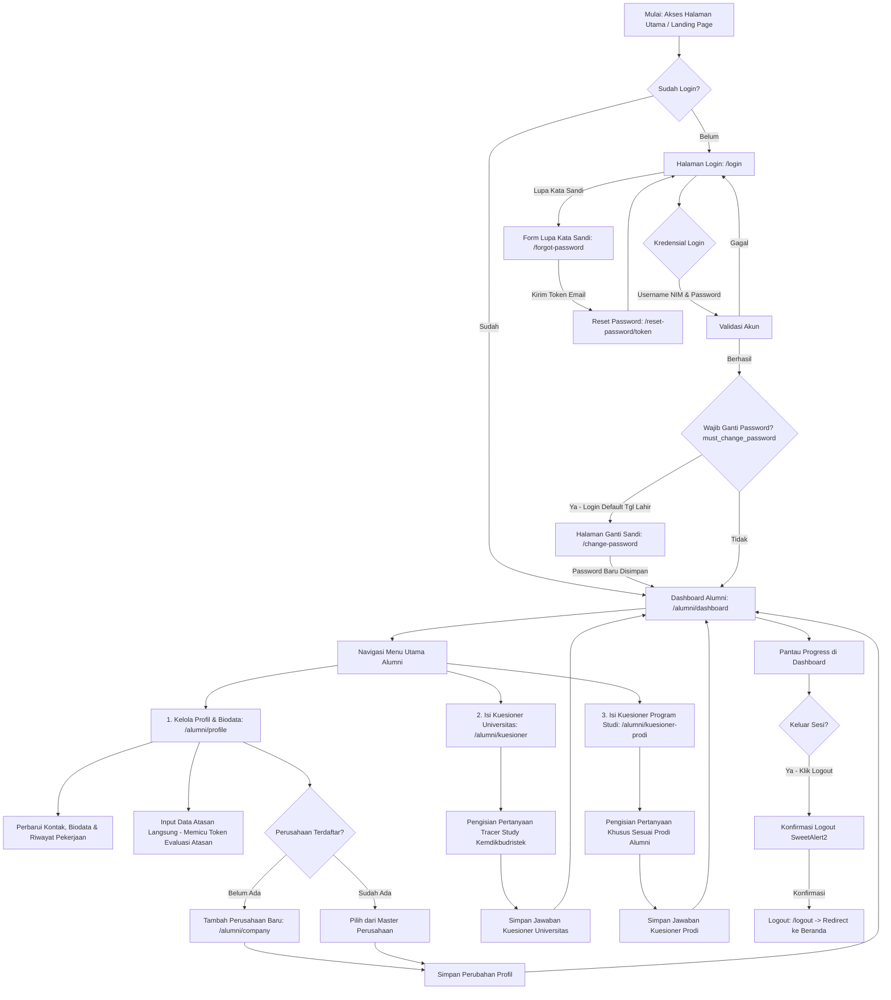
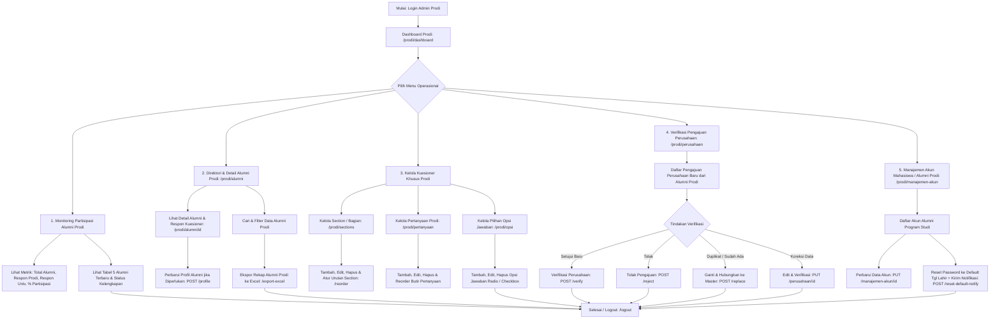
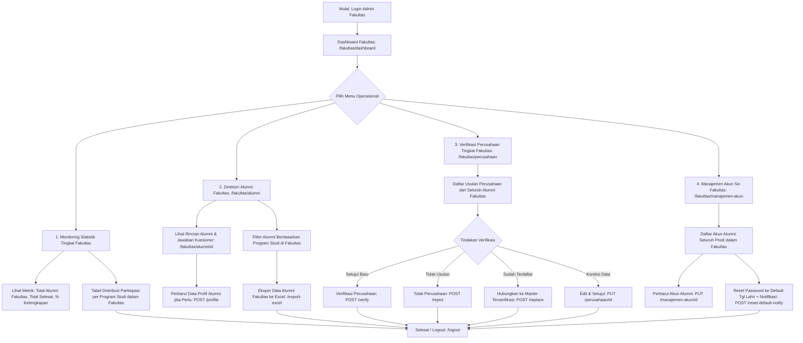
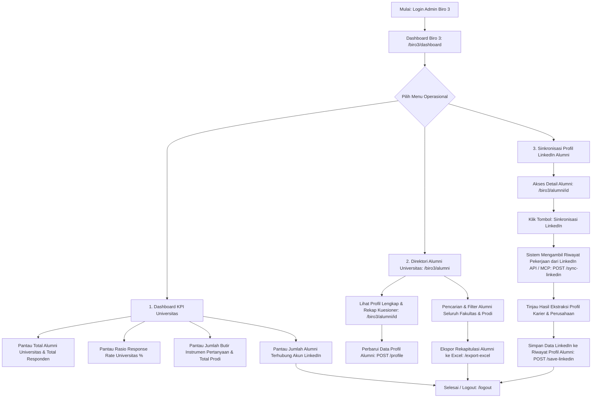
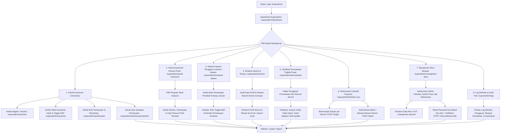
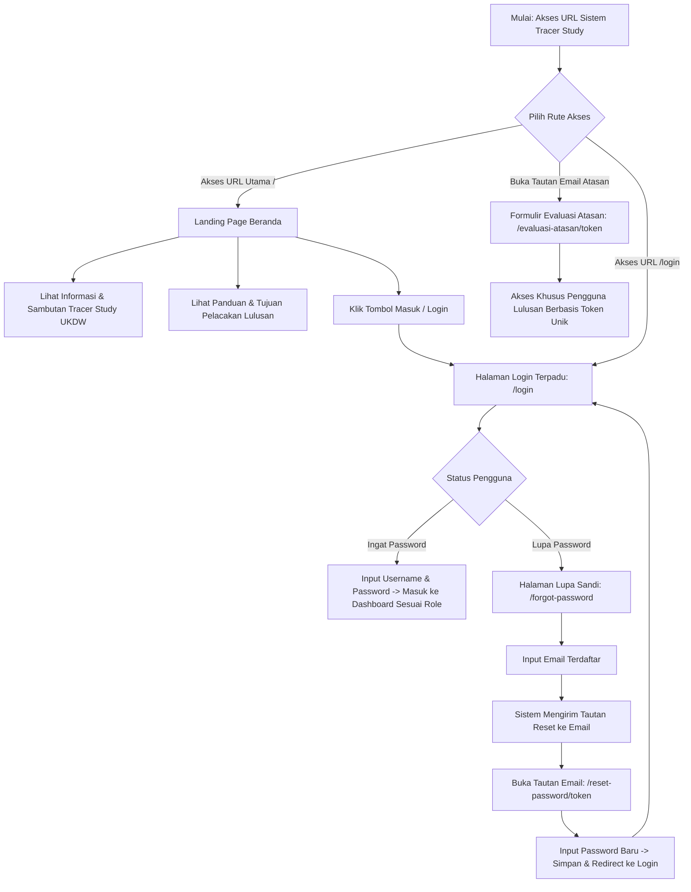

# User Flow Sistem Tracer Study per Peran Pengguna

Dokumen ini berisi alur pengguna (*User Flow*) lengkap untuk setiap peran (*user role*) yang terdapat pada Sistem **Tracer Study**.

---

## Daftar Peran Pengguna (User Roles)

1. [1. User Flow: Alumni / Lulusan](#1-user-flow-alumni--lulusan)
2. [2. User Flow: Admin Program Studi (Admin Prodi)](#2-user-flow-admin-program-studi-admin-prodi)
3. [3. User Flow: Admin Fakultas](#3-user-flow-admin-fakultas)
4. [4. User Flow: Admin Biro III / Kemahasiswaan & Alumni](#4-user-flow-admin-biro-iii--kemahasiswaan--alumni)
5. [5. User Flow: Superadmin](#5-user-flow-superadmin)
6. [6. User Flow: Publik / Tamu (Guest)](#6-user-flow-publik--tamu-guest)
7. [7. User Flow: Atasan Langsung / Pengguna Lulusan](#7-user-flow-atasan-langsung--pengguna-lulusan-public-token-based-evaluation-flow)

---

## 1. User Flow: Alumni / Lulusan

Alumni adalah pengguna yang mengisi data biodata & profil pekerjaan, kuesioner tracer study universitas (Kemdikbudristek), serta kuesioner khusus program studi.

### Diagram Mermaid: Alumni Flow

### Rincian Alur Alumni Sebenarnya (Sesuai Program):
1. **Otentikasi & Keamanan Akun**:
   - **Login Akun**: Alumni masuk melalui `/login` menggunakan **Username (NIM)** dan **Password**.
   - **Password Bawaan (Default Password)**: Alumni yang baru pertama kali masuk dapat menggunakan tanggal lahir dengan format `DDMMYYYY` (contoh: `15082001`).
   - **Wajib Ganti Password (`must_change_password`)**: Pengguna yang masuk menggunakan password bawaan otomatis diwajibkan mengganti kata sandi terlebih dahulu di rute `/change-password` sebelum diperbolehkan mengakses fitur dashboard.
   - **Lupa Password**: Tersedia alur pemulihan kata sandi via email (`/forgot-password` dan `/reset-password/{token}`).
2. **Dashboard Alumni (`/alumni/dashboard`)**:
   - Menyajikan 3 kartu monitoring status kelengkapan data:
     1. **Kelengkapan Profil & Biodata** (persentase & jumlah field terisi).
     2. **Kuesioner Universitas** (persentase & jumlah soal wajib Kemdikbudristek yang sudah dijawab).
     3. **Kuesioner Program Studi** (persentase & jumlah soal khusus prodi yang sudah dijawab).
3. **Pengelolaan Profil & Pekerjaan (`/alumni/profile`)**:
   - Mengubah biodata pribadi, nomor kontak, serta riwayat pekerjaan/posisi saat ini.
   - Mengisi data atasan langsung (nama dan email atasan), yang secara otomatis menerbitkan data `evaluasi_atasan` untuk dinilai oleh pengguna lulusan via tautan ber-token.
   - Mendaftarkan entitas perusahaan baru (`/alumni/company`) apabila tempat kerja belum ada pada data master universitas.
4. **Pengisian Kuesioner Universitas / Tracer Study (`/alumni/kuesioner`)**:
   - Mengisi butir-butir pertanyaan standar tracer study (pendapatan, masa tunggu kerja, relevansi keilmuan, dsb.).
   - Menyimpan jawaban ke sistem (`POST /alumni/kuesioner`).
5. **Pengisian Kuesioner Program Studi (`/alumni/kuesioner-prodi`)**:
   - Mengisi kuesioner evaluasi kurikulum dan fasilitas spesifik yang dikelola oleh Program Studi masing-masing alumni.
   - Menyimpan respon ke database (`POST /alumni/kuesioner-prodi`).
6. **Logout / Keluar**:
   - Alumni dapat keluar dari sistem melalui tombol Logout di Navbar dengan konfirmasi SweetAlert2 (`POST /logout`), yang menghapus sesi dan mengarahkan kembali ke Landing Page.

---

## 2. User Flow: Admin Program Studi (Admin Prodi)

Admin Program Studi bertanggung jawab mengelola kuesioner khusus prodi, memantau tingkat partisipasi alumni prodi, memvalidasi pengajuan perusahaan baru dari alumni, mengelola akun mahasiswa/alumni prodi, dan mengekspor data tracer prodi.

### Diagram Mermaid: Admin Prodi Flow

### Rincian Alur Admin Prodi Sebenarnya:
1. **Dashboard Prodi (`/prodi/dashboard`)**:
   - Menampilkan metrik: Total Alumni Prodi, Responden Kuesioner Prodi, Responden Kuesioner Universitas, dan Persentase Partisipasi.
   - Tabel ringkasan 5 alumni terbaru beserta status kelengkapan kuesioner universitas dan prodi.
2. **Kelola Alumni Prodi (`/prodi/alumni`)**:
   - Menampilkan direktori alumni khusus program studi yang bersangkutan.
   - Melihat rincian profil biodata dan seluruh riwayat jawaban tracer study alumni (`/prodi/alumni/{id}`).
   - Memperbarui data profil alumni jika terdapat koreksi informasi.
   - Mengunduh rekap data alumni prodi ke format Excel (`/prodi/alumni/{id}/export-excel`).
3. **Instrumen Kuesioner Khusus Prodi**:
   - **Section Kuesioner Prodi (`/prodi/sections`)**: Menambah, mengedit, menghapus, dan mengatur urutan tampilan bagian soal (*reorder*).
   - **Pertanyaan Prodi (`/prodi/pertanyaan`)**: Menambah, mengedit, menghapus, dan mengatur urutan butir pertanyaan prodi.
   - **Opsi Jawaban Prodi (`/prodi/opsi`)**: Mengelola pilihan opsi respon untuk tipe pertanyaan pilihan ganda atau checkbox.
4. **Verifikasi Perusahaan (`/prodi/perusahaan`)**:
   - Memeriksa nama instansi/perusahaan baru yang dimasukkan alumni prodi saat memperbarui profil pekerjaan.
   - Aksi: Setujui perusahaan baru (`verify`), tolak (`reject`), edit lalu verifikasi (`update`), atau ganti/hubungkan ke data perusahaan master yang sudah terverifikasi sebelumnya (`replace`).
5. **Manajemen Akun Alumni Prodi (`/prodi/manajemen-akun`)**:
   - Melihat akun login mahasiswa/alumni pada program studi tersebut.
   - Mengubah username, nama, atau email akun alumni.
   - Mereset password akun alumni ke tanggal lahir bawaan (`DDMMYYYY`) disertai notifikasi email resmi (`reset-default-notify`).

---

## 3. User Flow: Admin Fakultas

Admin Fakultas bertugas memantau kinerja tracer study lintas program studi di lingkungan fakultasnya, memeriksa direktori alumni, memvalidasi pengajuan perusahaan alumni se-fakultas, dan mengelola akun mahasiswa/alumni tingkat fakultas.

### Diagram Mermaid: Admin Fakultas Flow

### Rincian Alur Admin Fakultas Sebenarnya:
1. **Dashboard Fakultas (`/fakultas/dashboard`)**:
   - Menampilkan ringkasan metrik fakultas: Total alumni se-fakultas, total alumni yang telah menyelesaikan seluruh instrumen tracer study, dan persentase kelengkapan fakultas.
   - Tabel komparasi respons dan tingkat partisipasi alumni untuk setiap Program Studi di bawah naungan fakultas.
2. **Direktori & Detail Alumni Fakultas (`/fakultas/alumni`)**:
   - Melihat daftar seluruh alumni dalam lingkup fakultas dengan filter program studi.
   - Meninjau data detail profil dan lembar jawaban tracer study alumni (`/fakultas/alumni/{id}`).
   - Melakukan koreksi/perubahan profil alumni bila diperlukan.
   - Mengekspor data profil dan isian kuesioner alumni ke format Excel (`/export-excel`).
3. **Verifikasi Perusahaan Lingkup Fakultas (`/fakultas/perusahaan`)**:
   - Meninjau pengajuan perusahaan baru yang diinput oleh alumni dari prodi-prodi di fakultas terkait.
   - Fitur approval: Verifikasi (`verify`), tolak (`reject`), edit & setujui (`update`), atau tautkan ke perusahaan terverifikasi (`replace`).
4. **Manajemen Akun Mahasiswa / Alumni Se-Fakultas (`/fakultas/manajemen-akun`)**:
   - Mengelola akun alumni pada semua prodi di fakultas bersangkutan.
   - Mengedit informasi akun serta mereset kata sandi ke tanggal lahir bawaan (`DDMMYYYY`) via tombol *Reset Default & Notify*.

---

## 4. User Flow: Admin Biro III / Kemahasiswaan & Alumni

Admin Biro 3 (Biro Kemahasiswaan, Alumni, dan Pengembangan Karir) memantau metrik pelacakan alumni di tingkat universitas, mengelola direktori alumni seluruh program studi, mengekspor laporan ke Excel, dan menjalankan sinkronisasi data karier alumni dari LinkedIn.

### Diagram Mermaid: Admin Biro III Flow

### Rincian Alur Admin Biro III Sebenarnya:
1. **Dashboard Eksekutif Biro 3 (`/biro3/dashboard`)**:
   - Menyajikan Indikator Kinerja Utama (KPI) Tracer Study tingkat kampus:
     - Total keseluruhan alumni di database universitas.
     - Total responden unik yang telah berpartisipasi mengisi kuesioner.
     - Persentase rasio partisipasi (*Response Rate*) universitas.
     - Total instrumen pertanyaan aktif dan total program studi.
     - Total alumni yang profilnya telah tertaut dengan akun LinkedIn.
2. **Kelola Direktori Alumni Universitas (`/biro3/alumni`)**:
   - Memantau basis data alumni dari seluruh angkatan, fakultas, dan program studi.
   - Meninjau lembar jawaban kuesioner dan data riwayat pekerjaan alumni (`/biro3/alumni/{id}`).
   - Memperbarui data profil alumni secara langsung.
   - Mengunduh rekapitulasi data profil dan tracer alumni ke format Excel (`/export-excel`).
3. **Integrasi & Sinkronisasi LinkedIn Alumni (`/biro3/alumni/{id}/sync-linkedin`)**:
   - Menjalankan sinkronisasi profil LinkedIn alumni untuk melacak posisi kerja, jabatan, dan instansi terkini secara otomatis via LinkedIn Profile Provider / MCP.
   - Meninjau data riwayat pengalaman kerja hasil sinkronisasi.
   - Menyimpan data riwayat pekerjaan hasil sinkronisasi ke tabel biodata/pekerjaan alumni (`POST /save-linkedin`).

---

## 5. User Flow: Superadmin

Superadmin memegang kendali penuh atas seluruh modul sistem Tracer Study: instrumen kuesioner universitas, kuesioner khusus prodi, instrumen evaluasi atasan, verifikasi perusahaan tingkat kampus, sinkronisasi massal LinkedIn, manajemen akun seluruh role, dan log audit sistem.

### Diagram Mermaid: Superadmin Flow

### Rincian Alur Superadmin Sebenarnya:
1. **Dashboard Superadmin (`/superadmin/dashboard`)**:
   - Pusat pemantauan menyeluruh: Statistik pengisian tracer, ringkasan instrumen kuesioner, status approval perusahaan, dan peringatan operasional.
2. **Kelola Kuesioner Universitas (Kemdikbudristek)**:
   - **Section Kuesioner (`/superadmin/sections`)**: CRUD dan reorder bagian-bagian kuesioner.
   - **Kuesioner Induk (`/superadmin/kuesioner`)**: Mengatur instrumen kuesioner dan toggle status aktif/nonaktif.
   - **Pertanyaan & Opsi (`/superadmin/pertanyaan`)**: CRUD pertanyaan, konfigurasi percabangan soal (*branching logic*), serta kelola opsi pilihan jawaban.
3. **Kelola Kuesioner Prodi Override (`/superadmin/prodi-kuesioner`)**:
   - Memilih prodi mana saja dan mengelola section, pertanyaan, dan opsi kuesioner spesifik prodi tersebut.
4. **Kelola Instrumen Evaluasi Atasan (`/superadmin/evaluasi-atasan`)**:
   - Menambah, mengubah, mengaktifkan/menonaktifkan, dan mengatur urutan butir pertanyaan pada formulir evaluasi pengguna lulusan.
5. **Verifikasi Perusahaan Terpusat (`/superadmin/perusahaan`)**:
   - Memvalidasi seluruh usulan perusahaan baru dari alumni semua fakultas dan program studi.
6. **Sinkronisasi LinkedIn Terpusat (`/superadmin/linkedin-sync`)**:
   - Menjalankan sinkronisasi profil LinkedIn baik per alumni maupun secara massal (*batch sync*).
7. **Manajemen Akun Terpadu (`/superadmin/manajemen-akun`)**:
   - Mengelola akun seluruh peran: Admin Fakultas, Admin Prodi, dan Akun Alumni.
   - Mereset password akun ke tanggal lahir default serta mengirimkan email notifikasi.
8. **Log Aktivitas & Audit Trail (`/superadmin/logs`)**:
   - Melihat rekam jejak aktivitas (*action logs*) seluruh pengguna untuk keamanan dan audit sistem.

---

## 6. User Flow: Publik / Tamu (Guest)

Pengunjung umum dapat mengakses halaman depan (Landing Page), formulir Evaluasi Pengguna Lulusan (via tautan token khusus), halaman login, serta fitur pemulihan kata sandi tanpa perlu registrasi akun mandiri.

### Diagram Mermaid: Publik Flow

### Rincian Alur Publik / Tamu Sebenarnya:
1. **Landing Page Beranda (`/`)**:
   - Menampilkan profil sistem Tracer Study UKDW, sambutan resmi, informasi urgensi tracer study bagi peningkatan mutu dan akreditasi kampus, serta tautan menuju halaman login.
2. **Evaluasi Atasan Publik Berbasis Token (`/evaluasi-atasan/{token}`)**:
   - Tautan langsung dari email undangan resmi untuk pimpinan tempat alumni bekerja tanpa perlu membuat akun atau login.
3. **Halaman Login Terpadu (`/login`)**:
   - Satu pintu masuk otentikasi yang mengarahkan pengguna secara otomatis ke dashboard perannya masing-masing (Alumni, Admin Prodi, Admin Fakultas, Admin Biro 3, Superadmin).
4. **Lupa & Reset Kata Sandi (`/forgot-password` & `/reset-password/{token}`)**:
   - Alur mandiri untuk memulihkan kata sandi akun melalui email yang terdaftar.

---

## 7. User Flow: Atasan Langsung / Pengguna Lulusan (Public Token-Based Evaluation Flow)

Pimpinan/atasan langsung di perusahaan tempat alumni bekerja dapat memberikan evaluasi kepuasan dan penilaian kinerja lulusan secara aman melalui tautan publik ber-token unik tanpa perlu registrasi atau login akun.

### Diagram Mermaid: Evaluasi Atasan Flow

### Rincian Alur Atasan:
1. **Pemicu Undangan**: Setiap kali alumni menyimpan data riwayat pekerjaan yang mencakup nama dan email atasan langsung di halaman profil (`/alumni/profile`), sistem secara otomatis menerbitkan record `evaluasi_atasan` dengan token 64 karakter unik dan mengirimkan surat undangan evaluasi resmi via email.
2. **Akses Formulir Tanpa Hambatan**: Atasan membuka tautan langsung dari email (`/evaluasi-atasan/{token}`). Tidak dibutuhkan proses registrasi atau login akun.
3. **Penyempurnaan Profil Instansi (Bagian I)**: Atasan dapat memverifikasi atau melengkapi nama instansi, alamat, no telp/fax, website, bentuk perusahaan, skala usaha, jumlah pegawai, jumlah alumni UKDW, dan standar gaji pertama. Data perusahaan dan atasan disinkronkan ke tabel master `perusahaan` dan `atasan`.
4. **Penilaian Kesiapan & Kinerja (Bagian II)**:
   - Menilai tingkat kesiapan alumni dalam bekerja (pilihan ganda).
   - Menilai butir aspek kinerja lulusan pada tabel ber-header lengket (*sticky header*) yang memuat nama alumni.
   - Menyampaikan saran/masukan konstruktif untuk universitas.
5. **Konfirmasi & Audit**: Respon tersimpan ke tabel `respon_evaluasi_atasan` dan status berubah menjadi *"Sudah Selesai Diisi"*.

---

## Ringkasan Matriks Akses Peran (RBAC Matrix)

Matriks berikut mencerminkan hak akses aktual berdasarkan middleware peran (`role:superadmin`, `role:admin_biro3`, `role:admin_fakultas`, `role:admin_prodi`, `role:alumni`, dan rute publik) pada aplikasi:

| Modul / Fitur Sistem | Alumni | Admin Prodi | Admin Fakultas | Admin Biro III | Superadmin | Atasan (Token) | Publik |
| :--- | :---: | :---: | :---: | :---: | :---: | :---: | :---: |
| **Landing Page & Beranda** (`/`) | ✅ | ✅ | ✅ | ✅ | ✅ | ❌ | ✅ |
| **Otentikasi Login & Reset Password** | ✅ | ✅ | ✅ | ✅ | ✅ | ❌ | ✅ |
| **Kelola Profil & Riwayat Kerja Sendiri** | ✅ | ❌ | ❌ | ❌ | ❌ | ❌ | ❌ |
| **Isi Kuesioner Tracer Universitas** | ✅ | ❌ | ❌ | ❌ | ❌ | ❌ | ❌ |
| **Isi Kuesioner Khusus Prodi** | ✅ | ❌ | ❌ | ❌ | ❌ | ❌ | ❌ |
| **Isi Evaluasi Kinerja Lulusan (Token Publik)** | ❌ | ❌ | ❌ | ❌ | ❌ | ✅ | ❌ |
| **Dashboard Pemantauan Partisipasi** | Status Pribadi | Khusus Prodi | Khusus Fakultas | Universitas (KPI) | Universitas (Audit) | ❌ | ❌ |
| **Direktori & Detail Data Alumni** | ❌ | Khusus Prodi | Khusus Fakultas | Seluruh Kampus | Seluruh Kampus | ❌ | ❌ |
| **Ekspor Rekap Alumni ke Excel** | ❌ | Khusus Prodi | Khusus Fakultas | Seluruh Kampus | Seluruh Kampus | ❌ | ❌ |
| **Kelola Kuesioner Khusus Prodi (Section/Soal)** | ❌ | ✅ (Prodi Sendiri) | ❌ | ❌ | ✅ (Semua Prodi) | ❌ | ❌ |
| **Kelola Kuesioner Universitas & Section** | ❌ | ❌ | ❌ | ❌ | ✅ | ❌ | ❌ |
| **Kelola Soal Evaluasi Atasan** | ❌ | ❌ | ❌ | ❌ | ✅ | ❌ | ❌ |
| **Verifikasi Pengajuan Perusahaan Alumni** | ❌ | Khusus Prodi | Khusus Fakultas | ❌ | Seluruh Kampus | ❌ | ❌ |
| **Sinkronisasi Profil LinkedIn Alumni** | ❌ | ❌ | ❌ | ✅ (Satuan) | ✅ (Satuan & Batch) | ❌ | ❌ |
| **Manajemen Akun Alumni (Reset Sandi Default)** | ❌ | Khusus Prodi | Khusus Fakultas | ❌ | Seluruh Pengguna | ❌ | ❌ |
| **Audit Trail & Log Aktivitas Sistem** | ❌ | ❌ | ❌ | ❌ | ✅ | ❌ | ❌ |

---
*Dokumen ini diperbarui sesuai dengan konfigurasi rute, controller, dan hak akses riil pada basis kode Sistem Tracer Study.*

