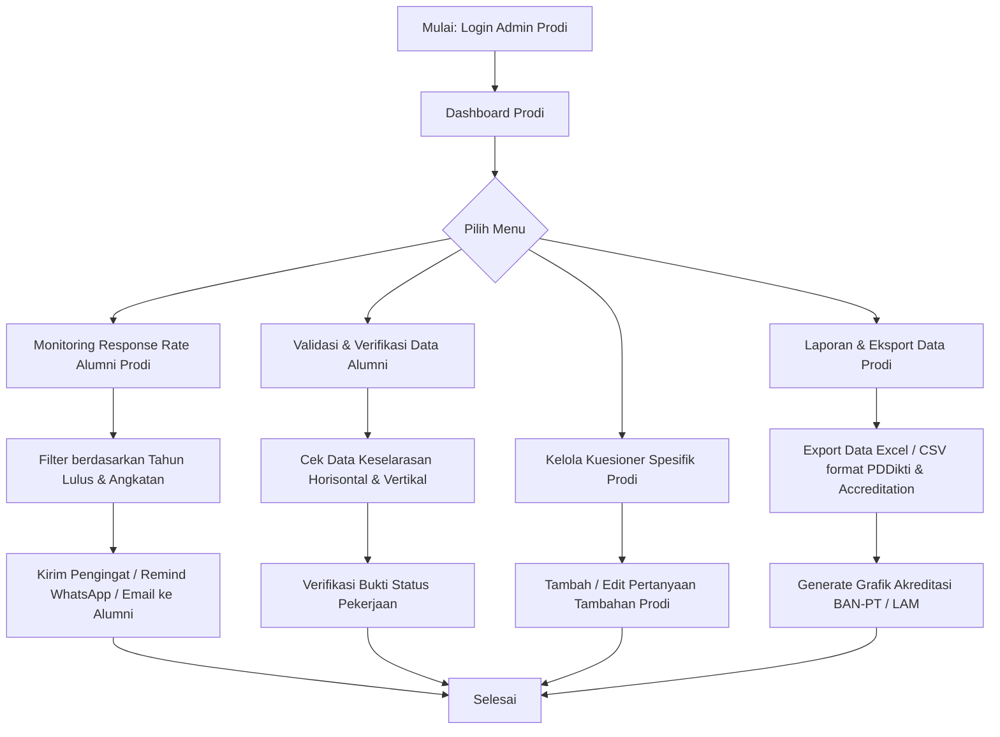
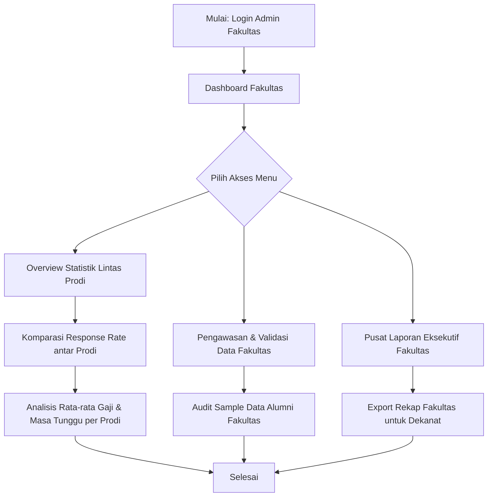
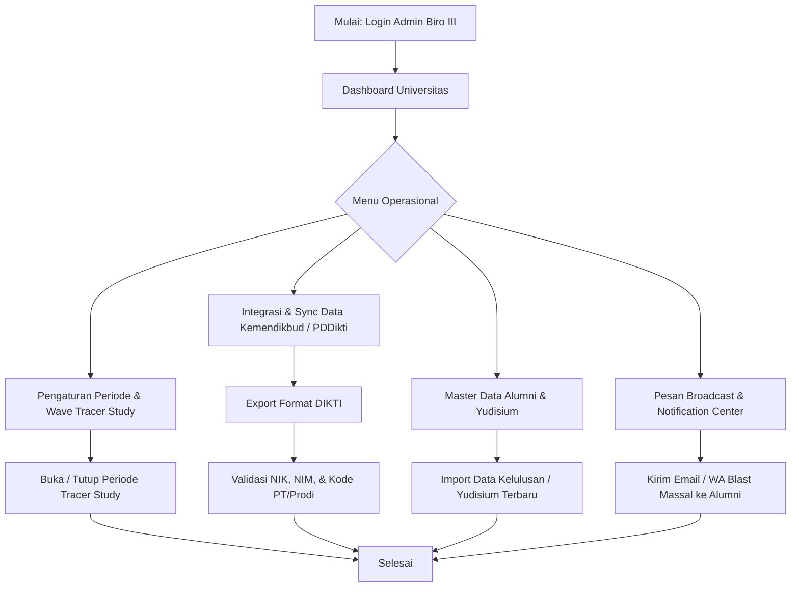
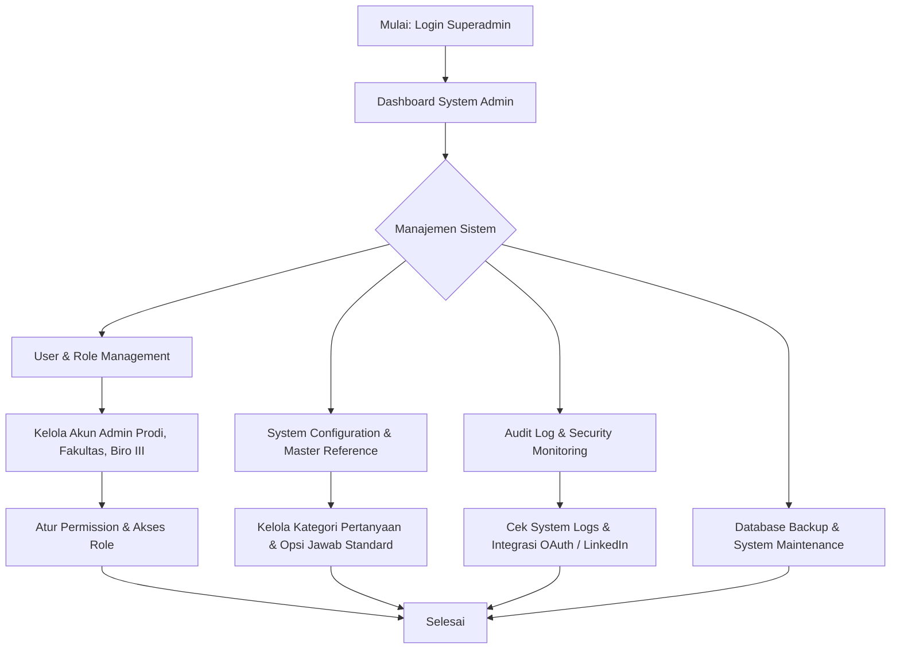
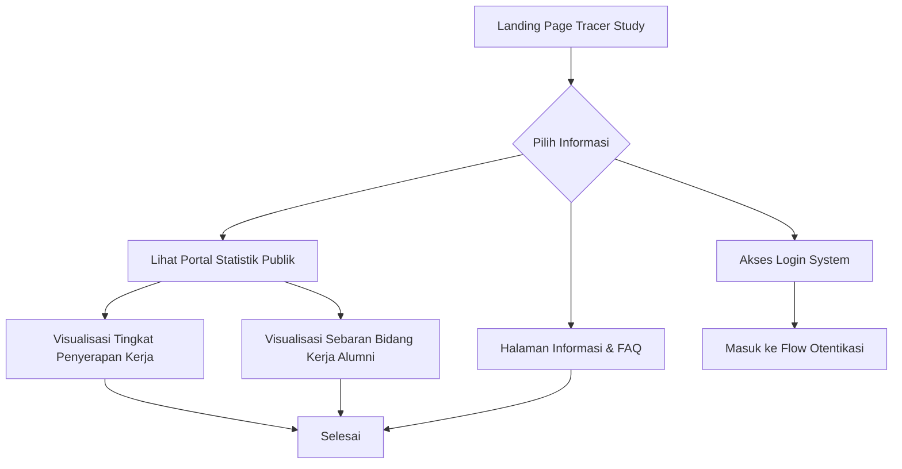
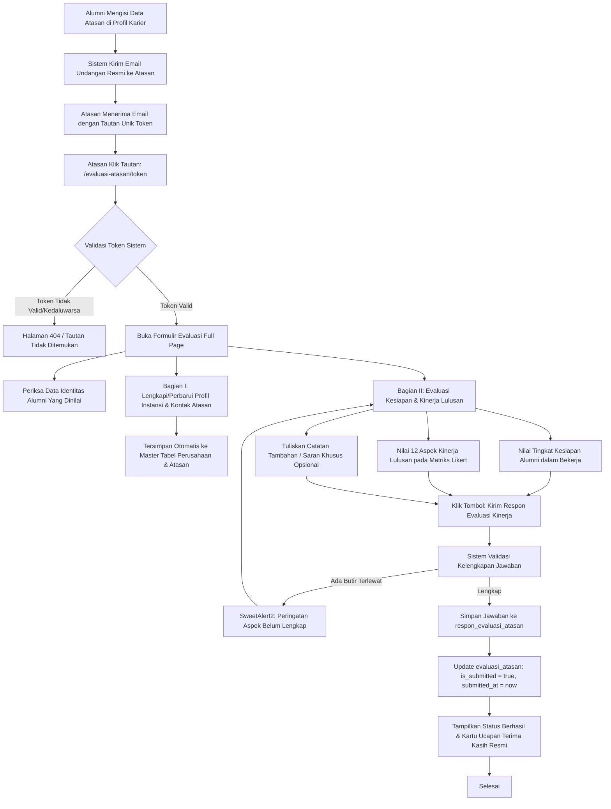

# User Flow Sistem Tracer Study per Peran Pengguna

Dokumen ini berisi alur pengguna (*User Flow*) lengkap untuk setiap peran (*user role*) yang terdapat pada Sistem **Tracer Study**.

---

## Daftar Peran Pengguna (User Roles)

1. [1. User Flow: Alumni / Lulusan](#1-user-flow-alumni--lulusan)
2. [2. User Flow: Admin Program Studi (Admin Prodi)](#2-user-flow-admin-program-studi-admin-prodi)
3. [3. User Flow: Admin Fakultas](#3-user-flow-admin-fakultas)
4. [4. User Flow: Admin Biro III / Kemahasiswaan & Alumni](#4-user-flow-admin-biro-iii--kemahasiswaan--alumni)
5. [5. User Flow: Superadmin](#5-user-flow-superadmin)
6. [6. User Flow: Publik / Anonim](#6-user-flow-publik--anonim)

---

## 1. User Flow: Alumni / Lulusan

Alumni adalah pengguna utama pengisi kuesioner tracer study, pembaru data akademik/pekerjaan, serta pengguna fitur integrasi seperti LinkedIn.

### Diagram Mermaid: Alumni Flow

```mermaid
flowchart TD
    A[Mulai: Akses Halaman Utama] --> B{Sudah Login?}
    B -- Belum --> C[Halaman Login]
    C --> D{Metode Login}
    D -- NIM/SSO -- E[Otentikasi Akun Alumni]
    D -- LinkedIn OAuth -- F[Otentikasi via LinkedIn]
    E --> G[Dashboard Alumni]
    F --> G

    G --> H[Check Status Pengisian Kuesioner]
    H --> I{Kuesioner Selesai?}
    I -- Belum --> J[Pengisian Kuesioner Wajib Kemdikbud / Diktiristek]
    J --> K[Pengisian Kuesioner Spesifik Prodi]
    K --> L[Simpan & Submit Kuesioner]
    L --> M[Update Status Kuesioner: Completed]

    I -- Sudah --> N[Lihat Ringkasan & Hasil Kuesioner]

    G --> O[Fitur Tambahan Alumni]
    O --> P[Update Profil & Riwayat Pekerjaan]
    O --> Q[Sinkronisasi LinkedIn Profile / MCP]
    O --> R[Lihat Rekomendasi Karir / Lowongan]
    O --> S[Unduh Bukti Pengisian Kuesioner]

    M --> N
    P --> T[Selesai / Logout]
    Q --> T
    R --> T
    S --> T
    N --> T
```

### Rincian Alur Alumni:
1. **Otentikasi & Akses**: Alumni melakukan login menggunakan NIM/Password atau akun LinkedIn (OAuth).
2. **Pengisian Kuesioner Utama**:
   - Sistem memeriksa kelayakan pengisian berdasarkan tahun kelulusan/yudisium.
   - Pengisian kuesioner standar Kemendikbudristek (status pekerjaan, pendapatan, jeda cari kerja, relevansi kurikulum).
   - Pengisian pertanyaan tambahan khusus Program Studi.
3. **Manajemen Profil & LinkedIn**:
   - Memperbarui data biodata, kontak, dan riwayat pekerjaan terkini.
   - Melakukan sinkronisasi data dari LinkedIn.
4. **Output & Bukti**:
   - Mengunduh sertifikat/bukti pengisian kuesioner.

---

## 2. User Flow: Admin Program Studi (Admin Prodi)

Admin Prodi berfokus pada pemantauan pengisian tracer study alumni di tingkat prodi, validasi data, serta analisis statistik prodi.

### Diagram Mermaid: Admin Prodi Flow



### Rincian Alur Admin Prodi:
1. **Dashboard & Monitoring**: Melihat persentase partisipasi alumni (*Response Rate*) pada prodi yang dikelola.
2. **Blasting & Reminder**: Mengirimkan notifikasi pengingat ke alumni yang belum mengisi kuesioner.
3. **Verifikasi Data**: Memeriksa validitas data pekerjaan dan gaji alumni untuk keperluan borang akreditasi prodi.
4. **Custom Questions**: Mengelola kuesioner internal khusus prodi.
5. **Reporting**: Menghasilkan file ekspor data standar borang akreditasi.

---

## 3. User Flow: Admin Fakultas

Admin Fakultas bertugas memantau kinerja tracer study lintas program studi di lingkungan fakultas.

### Diagram Mermaid: Admin Fakultas Flow



---

## 4. User Flow: Admin Biro III / Kemahasiswaan & Alumni

Admin Biro III bertanggung jawab mengelola tracer study secara keseluruhan di tingkat universitas, integrasi ke PDDikti/Kemendikbud, serta administrasi tingkat pusat.

### Diagram Mermaid: Admin Biro III Flow



---

## 5. User Flow: Superadmin

Superadmin mengelola konfigurasi sistem, peran & hak akses pengguna, log aktivitas, serta infrastruktur aplikasi.

### Diagram Mermaid: Superadmin Flow



---

## 6. User Flow: Publik / Anonim

Pengunjung publik (calon mahasiswa, stakeholder, atau pengguna umum) dapat mengakses statistik publik tanpa perlu login.

### Diagram Mermaid: Publik Flow



---

## 7. User Flow: Atasan Langsung / Pengguna Lulusan (Public Token-Based Evaluation Flow)

Pimpinan/atasan langsung di perusahaan tempat alumni bekerja dapat memberikan evaluasi kepuasan dan penilaian kinerja lulusan secara aman melalui tautan publik ber-token unik tanpa perlu registrasi atau login.

### Diagram Mermaid: Evaluasi Atasan Flow



### Rincian Alur Atasan:
1. **Pemicu Undangan**: Setiap kali alumni menyimpan data riwayat pekerjaan yang mencakup nama dan email atasan langsung di halaman profil, sistem secara otomatis menerbitkan record `evaluasi_atasan` dengan token 64 karakter unik dan mengirimkan surat undangan evaluasi resmi via email.
2. **Akses Formulir Tanpa Hambatan**: Atasan membuka tautan langsung dari email (`/evaluasi-atasan/{token}`). Tidak dibutuhkan proses registrasi atau login akun.
3. **Penyempurnaan Profil Instansi (Bagian I)**: Atasan dapat memverifikasi atau melengkapi nama instansi, alamat, no telp/fax, website, bentuk perusahaan, skala usaha, jumlah pegawai, jumlah alumni UKDW, dan standar gaji pertama. Data perusahaan dan atasan disinkronkan ke tabel master `perusahaan` dan `atasan`.
4. **Penilaian Kesiapan & Kinerja Dinamis (Bagian II)**:
   - Menilai tingkat kesiapan alumni dalam bekerja (pilihan ganda).
   - Menilai 12 aspek kinerja utama (Integritas, Keahlian Ilmu, Komunikasi, Kerjasama Tim, Pengembangan Diri, Kreativitas, Bahasa Asing, Penggunaan Teknologi, Manajerial, Analisis, Laporan, Inovasi) pada tabel ber-header lengket (*sticky header*) yang tetap memuat nama alumni saat discroll.
   - Menyampaikan saran/masukan konstruktif untuk universitas.
5. **Konfirmasi & Audit**: Respon tersimpan ke tabel `respon_evaluasi_atasan` dan status berubah menjadi *"Sudah Selesai Diisi"*.

---

## Ringkasan Matriks Akses Peran (RBAC Matrix)

| Fitur / Modul | Alumni | Admin Prodi | Admin Fakultas | Admin Biro III | Superadmin | Atasan (Token) | Publik |
| :--- | :---: | :---: | :---: | :---: | :---: | :---: | :---: |
| **Landing Page & Stats Publik** | ✅ | ✅ | ✅ | ✅ | ✅ | ❌ | ✅ |
| **Isi Kuesioner Alumni** | ✅ | ❌ | ❌ | ❌ | ❌ | ❌ | ❌ |
| **Update Profile & Data Atasan** | ✅ | ❌ | ❌ | ❌ | ❌ | ❌ | ❌ |
| **Isi Form Evaluasi Kinerja (Token)** | ❌ | ❌ | ❌ | ❌ | ❌ | ✅ | ❌ |
| **Monitoring Response Rate Prodi**| ❌ | ✅ | ✅ | ✅ | ✅ | ❌ | ❌ |
| **Audit & Kelola Evaluasi Atasan** | ❌ | ❌ | ❌ | ❌ | ✅ | ❌ | ❌ |
| **Validasi & Borang Akreditasi** | ❌ | ✅ | ✅ | ✅ | ✅ | ❌ | ❌ |
| **Pengaturan Wave / Periode** | ❌ | ❌ | ❌ | ✅ | ✅ | ❌ | ❌ |
| **Export Data Format DIKTI** | ❌ | ❌ | ❌ | ✅ | ✅ | ❌ | ❌ |
| **User & Role Management** | ❌ | ❌ | ❌ | ❌ | ✅ | ❌ | ❌ |

---
*Dokumen ini dibuat untuk referensi alur pengguna (UX) Sistem Tracer Study.*
